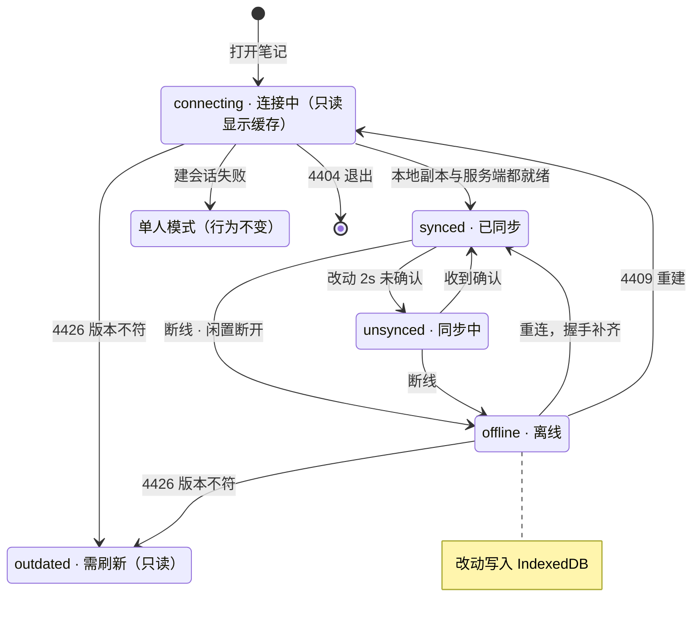
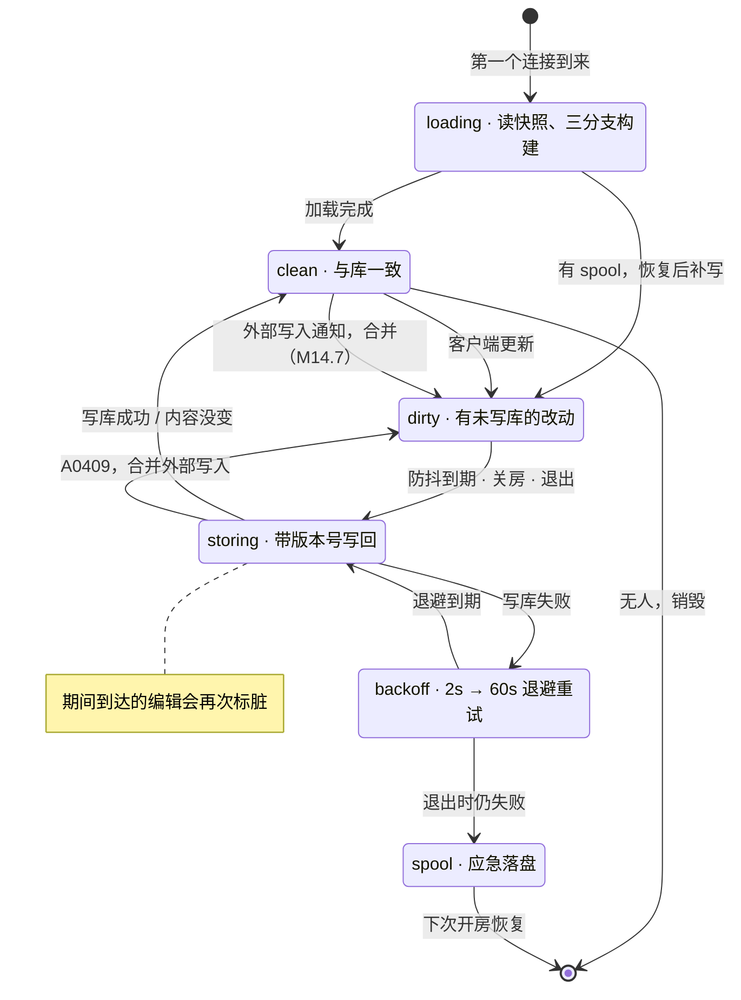

# 协同服务落库方案（路线 B）

> 文档版本：v1.3 | 创建 2026-09-25 | 更新 2026-09-25（v1.3：实施记录与偏差，见附录 H） | 状态：**已实施 M14.P、M14.0–M14.5、M14.7（本机 Docker 栈验收）；M14.6 待灰度观察一周后执行**
> 关联文档：[`CLAUDE.md`](../../CLAUDE.md) · [`docs/collab/notes-collab-merge-plan.md`](../collab/notes-collab-merge-plan.md)（v2.0；本方案落地后取代其 D3 / D4 / D5 / D6 与 §7.3，对照见附录 C） · [`openapi/WORKFLOW.md`](../../openapi/WORKFLOW.md) · [`.claude/openspec/`](../../.claude/openspec/) · [`docs/deployment-network.md`](../deployment-network.md)
> 本文是**方案 + 代码骨架 + 里程碑**。§1.3 的现状事实均在 2026-09-25 对照代码核对过，附文件位置，实施时不必重新考古。里程碑编号接在 M13（笔记协同合并）之后，为 **M14.0 – M14.7**，另有一条可以立即开工的并行修复线 **M14.P**（单人模式缺陷，附录 E）。

---

## 0. 一句话结论

把“谁负责把正文写进 MySQL”从**在场的每个浏览器**移到**协同服务**：房间打开时由协同服务从 note 服务加载，编辑经 WebSocket 进入房间，由协同服务防抖落库。协同模式下浏览器不再发保存请求。

| 关注点 | 现状（v2.0） | 目标态 |
|---|---|---|
| 谁落库 | 在场每个浏览器各自 `PATCH /notes/{id}` | 协同服务，房间级防抖 2 秒、最长 10 秒 |
| 冷启动 | 客户端确定性选举注入 + `meta.seeded` + 正文就位前只读 | 协同服务开房时加载，客户端同步完成即可编辑 |
| 版本号 | 客户端持有；`meta.savedVersion` 广播；A0409 覆盖式重发 | 协同服务持有并做原子比较；客户端不接触版本号 |
| 卸载兜底 | `pagehide` / `beforeunload` / `visibilitychange` / keepalive / 在飞草稿补发 | 协同模式不需要：改动在击键时已经离开浏览器 |
| 外部写入（CLI、历史恢复、降级客户端） | 被下一次协同保存覆盖 | 按三方合并并入房间，两边改动都保留；M14.7 起即时并入 |
| 断线期间的改动 | 只在内存里，关页时尝试 keepalive | 写进浏览器 IndexedDB，关页、刷新都不丢，下次打开自动补齐（D7） |
| 状态徽标 | 6 态状态机，协同时把“已保存”改显示为“已同步” | 连接中 / 已同步 / 同步中 / 离线 / 需刷新（§8.3），判据是服务端确认（D12） |

单人模式（开关关闭、只读用户、协同连不上时的降级）**保持现状**，仍走 `useSaveNote`；它的既有缺陷由并行修复线 M14.P 处理（附录 E）。

**范围说明**：方案 B **不新增协同能力**，只改变“协同模式下谁来写库”。协同编辑本身在 M13 已经实现。另外，“两位不同用户共编同一篇笔记”目前受笔记权限缺口阻塞（`createNote` 把权限写死为 `70000`，全仓没有修改笔记权限的端点），协同实际只覆盖“同一用户多标签页 / 多设备”。方案 B 不解决这个缺口，它需要单独立项（§2.3）。

---

## 1. 背景

### 1.1 为什么要改

2026-09-25 的调研结论：前端保存链路的复杂度主要来自“持久化放在浏览器”这一架构选择，而不是需求本身。

- **代码量**：`use-save-note.ts` 521 行，测试 759 行、31 条用例；协同侧 `use-collab-note.ts` 207 行、`injection.ts` 116 行、`inject.ts` 36 行，另有对应测试约 450 行。
- **修改频率**：`use-save-note.ts` 在 10 天里改了 5 次（`adf30f0` 初版 → `a7fb39b` 误报冲突 → `3f5679d` 两个卸载窗口 → `f0587ce` 修上一次引入的回归 → `66a132d` 接入协同），随后又有冷启动四处缺陷的修复批次（`fix/notes-collab-cold-start`）。每次修复都在给同一类根因打补丁：浏览器既要对抗页面生命周期，又要用秒级版本号做整篇覆盖。
- **业界做法**：Hocuspocus（TipTap 官方协同后端）由服务端 `onStoreDocument` 落库，默认防抖 2 秒、最长 10 秒；Outline、Docmost 基于它由服务端持久化；Figma 由服务端写检查点加写前日志；ot.js 的客户端一共只有 3 个状态。这些产品的客户端都没有“保存”状态机。

### 1.2 v2.0 为什么没这么做，这次凭什么可以

v2.0 §13 砍掉“服务端权威写回”的理由是：共享序列化包要保证同一份 TipTap JSON 在两侧序列化得逐字节一致，是长期维护负担。本方案的回应：

1. **不重写序列化器。** 服务端跑的是**同一份** `tiptap-markdown` 和同一份扩展定义（抽到 `packages/editor-core`），只是换成无界面的编辑器实例加 jsdom。逐字节一致靠“同一份代码”保证，再由对拍测试兜底（§5.4）。
2. **新增的维护约束很窄**：扩展的“定义”（schema 与 Markdown 规则）和“界面”（节点视图、上传插件、斜杠菜单）要分文件。前者本来就要维护。
3. **前端省掉的是一整套和页面生命周期对抗的逻辑**，这部分的维护成本已经实际发生（§1.1）。

### 1.3 现状事实（已核对）

| # | 事实 | 位置 | 对本方案的影响 |
|---|---|---|---|
| 1 | 协同服务已有房间级持久化抽象 `CollabPersistence { read, write }`、2 秒防抖、房间清空与 SIGTERM 前 flush；当前挂的是 `memoryOnlyPersistence` | [`apps/collab/src/doc-manager.ts`](../../apps/collab/src/doc-manager.ts)、[`server.ts`](../../apps/collab/src/server.ts) | 新实现挂在同一套生命周期上，接口需扩展以承载版本号与合并 |
| 2 | 客户端的更新以**连接对象**作为事务 origin | [`protocol.ts`](../../apps/collab/src/protocol.ts) `readSyncMessage(decoder, encoder, shared.doc, conn)` | 服务端能据此记录“谁改了”，作为落库的操作者 |
| 3 | `attach` 先 `await manager.open(room)`，再挂 `message` 监听；`addConnection` 只发 syncStep1，客户端要等服务端对它的 step1 回 step2 才算同步完成 | `server.ts` `attach`、`protocol.ts` `addConnection` | 开房改为走 HTTP 加载后，握手后立刻到达的消息会在监听器注册前丢失，**必须先挂监听并缓冲**（§6.5） |
| 4 | 协同令牌的 `sub` 是用户数字 id | [`apps/web/src/app/api/auth/collab-token/route.ts`](../../apps/web/src/app/api/auth/collab-token/route.ts) `setSubject(userId)` | 可直接作为操作者 id |
| 5 | `@InnerAuth` 只校验 `from-source: inner` 与 `HMAC-SHA256(secret, timestamp)`（Base64，5 分钟窗口）；**密钥是代码常量** `SecurityConstants.INTERNAL_SECRET` | `InnerAuthAspect.java`、`HmacUtils.java`、`SecurityConstants.java:39` | Node 侧要用同一密钥签名；这个常量已随仓库公开，本方案前置把它改成可配置（§7.1） |
| 6 | Gateway 会剥掉外部请求的 `from-source` 头 | `services/gateway/.../AuthFilter.java:97` | 内部端点无法经 Gateway 从外部调用 |
| 7 | `@InnerAuth` 端点也会进 OpenAPI baseline（例如 `managerList`） | `openapi/specs/note.json` | 新内部端点同样要跑 `pnpm openapi:generate` 并提交 baseline |
| 8 | note 服务在 compose 网络里的地址是 `anynote-modules-note:18091` | [`infra/docker-compose.yaml`](../../infra/docker-compose.yaml) | 协同服务直连，不经 Gateway |
| 9 | 版本号就是 `update_time` 的毫秒值（秒级精度），`n_note` 没有 version 列；`editNote` 先查后写，UPDATE 不带版本条件 | `NoteVersionUtil.java`、`NoteServiceImpl#editNote`、`NoteMapper.xml` `updateNote` | 新端点的比较做成原子 UPDATE，并保证版本号严格递增（§7.3） |
| 10 | 公开 `PATCH /notes/{id}` 允许省略 `version`，省略即跳过冲突检测 | `NoteVersionUtil.isStale` | 不带 version 的外部写入会让合并以写入方看到的旧内容为准（风险 R5，§13 Q5） |
| 11 | `n_note.title` 是 `varchar(80)`，`NoteEditDTO.title` 没有长度校验 | `infra/sql/anynote.sql`、`NoteEditDTO.java` | 服务端从 H1 取标题时必须截断到 80 |
| 12 | 前端 Markdown 双向转换基于 `tiptap-markdown`；解析走 markdown-it → HTML → DOM（`elementFromString`），需要 DOM 环境；前端单测用 jsdom | [`apps/web/src/lib/editor/markdown.ts`](../../apps/web/src/lib/editor/markdown.ts)、`apps/web/vitest.config.*` | 服务端用 jsdom，与前端单测的 DOM 实现一致 |
| 13 | 扩展里带界面的部分：`code-block-shiki.tsx`（React 节点视图 + 高亮插件）、`anynote-math.ts`（KaTeX 节点视图）、`anynote-image.ts`（上传插件）、`slash-command` / `slash-items`（纯界面） | [`apps/web/src/components/editor/extensions/`](../../apps/web/src/components/editor/extensions/) | 拆包时这几项要把“定义”和“界面”分开（§5.2） |
| 14 | `@tiptap/y-tiptap@3.0.9` 导出 `updateYFragment`、`prosemirrorJSONToYXmlFragment`、`yXmlFragmentToProsemirrorJSON` | 包的类型声明 | 服务端能做 Markdown ↔ Y.Doc 转换，以及“按差异更新到目标内容” |
| 15 | y-websocket 3.1.0 的 `provider.messageHandlers` 是实例级数组，0–3 已被占用；遇到未知类型只打日志、不抛错 | y-websocket 源码 | 可以扩展一个自定义消息类型（§6.6） |
| 16 | `Dockerfile.collab` 用 npm 单包安装，注释写明“不依赖任何 workspace 包” | [`infra/Dockerfile.collab`](../../infra/Dockerfile.collab) | 引入 `packages/editor-core` 后要改成 pnpm workspace 安装加打包（§6.8） |
| 17 | `createNote` 把笔记权限写死为 `70000`，全仓没有修改笔记权限的端点，两位库成员无法共编同一篇笔记 | `CLAUDE.md` 协同冷启动修复一节登记的前置缺口 | 方案 B 不解决，列为非目标并单独立项（§2.3） |
| 18 | 单人模式的保存链路有 8 处缺陷，其中 3 处会丢数据或让笔记存不进去（2026-09-25 检查） | 附录 E（逐条附代码位置） | 单人模式是协同的降级路径，M14.5 灰度前必须先修掉高优先级的 3 处（M14.P） |

### 1.4 参照实现：Outline

[Outline](https://github.com/outline/outline)（开源团队知识库，GitHub 4 万余 star，持续维护）与本项目技术栈最接近：ProseMirror 编辑器、Y.js、Hocuspocus 协同服务、服务端落库。2026-09-25 按提交 `9562738` 通读了它的协同与落库源码（索引见附录 F），结论如下：

| Outline 的做法 | 本方案的处置 |
|---|---|
| 正文只经协同通道保存，服务端 `onStoreDocument` 防抖 3 秒、最长 10 秒落库；浏览器不发正文保存请求 | **一致**（D1） |
| 数据库同时存正文与 Y 状态（`documents.state`）；第一次打开旧文档时，服务端加行锁由正文构建 Y 状态 | **一致**（D2、§6.3 分支 C） |
| 写库前比较规范化后的正文，没变就不写，避免“打开即改写” | **一致**（D10） |
| 浏览器用 IndexedDB 保存 Y 文档，离线改动关页不丢；IndexedDB 不可用（无痕模式、配额不足）时自动停用 | **采纳**（D7，v1.1 的 Q1 由此定案） |
| 服务端对每条更新回确认，客户端改动 2 秒内没被确认才算“未同步”；界面上不显示“已保存”，只在断线时显示 Offline | **采纳**（D12；删掉 v1.1 的“已落库 + 状态向量”判据） |
| 有未确认改动时拦截站内跳转与关页，文案按“有没有本地缓存”区分 | **采纳**（D7、§8.3） |
| 客户端连接时带编辑器版本，版本不符就关闭连接，页面只读并提示刷新 | **采纳**（D11，取代 v1.1 的 `proto=2`） |
| 标签页隐藏且闲置时主动断开，回到前台重连 | **采纳**（D13） |
| 加载期间先只读显示上次缓存的正文 | **采纳**（§8.2） |
| API 写入直接改库里的 Y 状态，再经 Redis 通知在线房间拉取差异 | **部分采纳**：note 服务是 Java，没有 Yjs，改不了 Y 状态；保留协同服务内的三方合并（D5），通知机制作为 M14.7（D14） |
| 用 Redis 有序集合记录会话内全部协作者，用于归属 | **暂不采纳**，作为 §13 Q3 的备选 |
| 写库连续失败 5 次后放弃，且异常在扩展内被吞掉 | **不采纳**：本方案退避重试并在退出时应急落盘（D8） |

---

## 2. 目标与非目标

### 2.1 目标

1. 协同模式下浏览器不再发保存请求，删除附录 D 列出的前端代码。
2. 真相源仍是 MySQL 里的 Markdown（v2.0 D1 不变）：ES、历史、CLI、移动端对本次改动无感知。
3. 不丢数据：浏览器关闭（含断线期间关闭）、协同服务崩溃或重启、note 服务不可用、外部写入这几类路径都有明确兜底（§9）。
4. **打开笔记不写库**：不会因为序列化规范化而改写老笔记。
5. **上线顺序无关**：新旧前端 × 开关开 / 关的任意组合都不丢数据（D9）。
6. 服从仓库约束：contract-first、改动必带单测、修 bug 先写复现用例、中文 commit、一次只动一个 service / package。

### 2.2 非目标

| 不做 | 原因 |
|---|---|
| 单人模式也改走协同房间 | 先把协同模式收敛；统一成一条路径是后续演进（§13 Q6） |
| 协同服务多实例 / 按 noteId 分片 | 与 v2.0 相同，单实例；房间名含主键，将来分片可行（届时开房需像 Outline 一样加行锁，§6.3） |
| 多人共编同一篇笔记 | 受笔记权限缺口阻塞（事实 17），与方案 B 相互独立，见 §2.3 |
| 保存改为增量操作 | 仍整篇 Markdown 写回，历史与 ES 链路不动 |
| 只读用户进房间 | v2.0 D8 不变 |
| 公开 `PATCH /notes/{id}` 的语义改动 | 只建议把原子比较一并用上、并把 version 改为必填（§13 Q5），不列为必做项 |

### 2.3 与相关工作的关系

| 工作 | 与方案 B 的关系 | 安排 |
|---|---|---|
| **单人模式缺陷修复（M14.P）** | 单人模式是协同连不上时的降级路径，方案 B 落地后仍然在用；其中 ①②③ 会丢数据或让笔记存不进去 | 可以立即开工，与 M14.0–M14.4 并行；①②③ 必须在 M14.5 灰度前完成（附录 E） |
| **笔记权限（多人共编的前提）** | 相互独立：方案 B 改的是“谁写库”，权限决定“谁能进房间”；两者都做完后，多人共编才可用 | 单独立项，需要补修改笔记权限的端点与前端入口，并复核 `getNotePermissions` 与 `collab-grant` 的推导 |
| **公开 PATCH 收紧（§13 Q5）** | 决定不带 version 的外部写入会不会回退房间里的改动（风险 R5） | 另开提案 |

---

## 3. 目标架构

### 3.1 组件

```
浏览器（TipTap + Y.Doc）
   ├─ IndexedDB：本地持久化 Y 文档与谱系标识（D7）
   │  WebSocket：Yjs sync / awareness / 自定义消息 100（hello、确认、谱系不符）
   ▼
apps/collab（单实例）
   ├─ CollabDocManager：开房、防抖（2s / 最长 10s）、原子比较写回、外部写入合并、退避、应急落盘
   ├─ NoteStore：调用 note 服务的 HTTP 客户端，按 @InnerAuth 规则签名
   ├─ Converter：无界面 TipTap 实例 + jsdom + packages/editor-core
   └─ （M14.7）订阅 Redis 的外部写入通知
   │  HTTP（容器网络，@InnerAuth）
   ▼
services/note
   ├─ GET /notes/{noteId}/collab-snapshot
   ├─ PUT /notes/{noteId}/collab-snapshot   （原子比较，同一事务写正文、标题与 Y 状态）
   ├─ （M14.7）公开 PATCH 成功后发布 Redis 通知
   └─ MySQL：n_note / n_note_text / n_note_collab_state（新）──RocketMQ──▶ ES、历史

CLI / 单人模式前端 / 历史恢复 ──Gateway──▶ PATCH /notes/{id}（不变）
```

### 3.2 端到端数据流

1. **打开**：浏览器先从 IndexedDB 载入本地副本（有的话），同时只读显示 REST 拿到的正文；握手带上编辑器版本与谱系（D3、D11）。
2. **开房**：第一个连接到来 → `manager.open(room)` → `GET collab-snapshot` → 按 §6.3 的三个分支构造 Y.Doc（以 `LOCAL_ORIGIN` 写入，不算脏）→ 校验编辑器版本与谱系 → 向连接发 hello → 进入 Yjs 同步。
3. **编辑**：客户端事务经 WebSocket 进入房间 → 服务端向发送方回确认（D12）→ 广播给其他连接 → 记录编辑者 → 标脏并排防抖。浏览器同时把改动写进 IndexedDB。
4. **落库**：防抖到期 / 距首次变脏满 10 秒 / 最后一人离开 / SIGTERM → 序列化为 Markdown 并取 H1 作标题 → 与上次落库内容相同则跳过 → `PUT collab-snapshot`（带 baseVersion）→ 成功：推进 baseVersion；A0409：合并外部写入后再写；其他失败：退避重试。
5. **关房**：最后一人离开 → flush → 成功后销毁房间；失败则保留房间继续重试（§6.5）。
6. **外部写入（M14.7）**：公开 PATCH 成功后 note 服务发布通知 → 房间在线时协同服务立即回读并合并（D14），不必等下一次落库才发现。

### 3.3 写冲突矩阵

| 场景 | 现状（v2.0） | 目标态 |
|---|---|---|
| 两人在同一房间编辑 | 两个浏览器各自 PATCH，A0409 后覆盖式重发 | CRDT 合并，协同服务单点写库 |
| 房间在线时 CLI 写入（带 version） | CLI 成功，随后被协同保存覆盖 | 协同服务下次落库时比较失败 → 三方合并 → 再写，两边改动都在；M14.7 起收到通知即合并，房间里的人立刻看到 |
| 房间在线时恢复历史版本 | 同上 | 同上；恢复在房间里表现为一次编辑 |
| 房间关闭期间发生外部写入 | 下次冷启动从库注入 | 开房时发现 Y 状态过期 → 按差异更新到库里的内容（§6.3 分支 B） |
| 降级客户端（连不上协同）与房间里的人同时编辑 | 降级端弹冲突框；房间里的人覆盖式重发 | 降级端不变；房间侧比较失败后合并 |
| 协同服务重启，客户端带着旧状态重连 | 房间是空的，客户端把状态推回，`seeded` 防止重复注入 | 服务端从 `n_note_collab_state` 恢复同一谱系，推回的是同谱系增量，不会翻倍；谱系不一致时由 epoch 拒绝（D3） |
| 断线期间编辑后关页，之后在同一浏览器重新打开 | 断线期间的改动丢失（除非 keepalive 碰巧发出去） | 改动在 IndexedDB 里，重新打开时随握手补齐（D7） |

### 3.4 保存状态机

实现后，一篇笔记的保存由两台状态机分工完成：

- **浏览器（协同模式）**：只负责显示和本地持久化。状态完全由连接状态和服务端的确认消息（§6.6）推导，不发保存请求，也不处理冲突；唯一的定时器是“2 秒确认宽限”（D12）。
- **协同服务（每个房间一份）**：负责真正的保存。防抖、写库、外部写入合并、退避重试、应急落盘都在这里。

单人模式（开关关闭、只读用户、协同连不上时的降级）继续使用 `useSaveNote` 现有的状态机。M14.6 之后它只剩单人这一种用途，协同相关的分支会一并删除（附录 D）。

#### 3.4.1 浏览器（协同模式）



- 每个状态的判定条件与徽标文案见 §8.3。
- **本地副本与服务端都就绪**：IndexedDB 载入完成（或不可用），且与服务端完成首次同步。本地有同谱系的副本时可以提前放开编辑（D7）。
- **改动 2s 未确认 / 收到确认**：服务端对每条写方向的同步消息回确认（D12）。连接正常时确认在几毫秒内到达，所以只有超过 2 秒还没确认才进入 `unsynced`。
- **闲置断开**：标签页隐藏且闲置一段时间后主动断开，回到前台自动重连（D13）。
- **重连，握手补齐**：Yjs 同步握手会把离线期间的全部本地改动交给服务端，完成后确认计数清零（D12）。
- **4409 重建**：谱系不符，丢弃本地 Y.Doc 与该笔记的 IndexedDB 后重新建会话。本地有未同步改动时先提示用户，并附上本地 Markdown 供复制。4409 只会出现在本地已有副本的连接上（重连，或从 IndexedDB 载入后首连）（D3）。
- **4426 版本不符**：前端的编辑器版本与协同服务不一致，停止重连、编辑器只读并提示刷新（D11）。
- **4404 退出**：笔记已删除或不存在，退出协同模式并清掉该笔记的 IndexedDB。
- **建会话失败**：令牌签发或建立会话失败，降级到单人模式，由 `useSaveNote` 接管保存。
- **离开拦截**：`unsynced`，或 `offline` 且断线后有过编辑时，拦截站内跳转与关页，文案按有没有本地缓存区分（D7）。
- 与现状的 6 态状态机相比，这里没有 `pending`（编辑经 WebSocket 即时发出，没有防抖）、没有 `error` 和 5 秒重试（写库失败由服务端退避）、也没有 `conflict`（外部写入由服务端合并）。“已写入数据库”不在浏览器展示（D12、§13 Q7）。

#### 3.4.2 协同服务（每个房间一份）



- **加载完成**：开房的三个分支都不标脏，打开笔记本身不写库（D10，§6.3）。
- **防抖到期 · 关房 · 退出**：最后一次更新后静默 2 秒、首次变脏满 10 秒、最后一个连接离开、进程收到 SIGTERM，四者任一触发（D1）。
- **外部写入通知，合并（M14.7）**：note 服务发布的外部写入通知到达时，房间在线就立即回读并三方合并（D14）；合并出的差异照常广播并标脏。
- **写库成功 / 内容没变**：写库成功时推进 baseVersion；序列化结果与上次落库相同则跳过，不发请求（§6.4）。
- **A0409，合并外部写入**：回读库里的内容，基于 `baseState` 三方合并后重新标脏；连续超过 3 次改走退避（D5，§6.4）。
- **写库失败**：网络错误、5xx、超时或转换失败。按 2 秒 → 60 秒退避；转换失败重试无效，由 `/healthz` 告警后人工处理（§6.5）。
- **期间到达的编辑会再次标脏**：写库请求在路上时房间照常接收编辑，写完后如果仍是脏状态，就自动再排一次。
- `dirty` 与 `backoff` 状态下房间不会被销毁：最后一人离开时如果写库失败，房间保留并在后台继续重试（§6.5）。
- 两台状态机的总状态数并不比现状少，复杂度是**从每个浏览器标签页搬到了协同服务**。搬过去的好处是：同一篇笔记只有一个写入者；服务端不用对抗 `pagehide`、切后台、keepalive 的 64 KiB 上限这类页面生命周期问题；这些逻辑都能在 Node 里用真实实例加假的 note 服务测试（M14.3）。

---

## 4. 关键决策

### D1 协同服务落库，房间级防抖 2 秒、最长 10 秒

落库触发条件：最后一次更新后静默 2 秒；持续编辑时距首次变脏满 10 秒；最后一个连接离开；进程收到 SIGTERM。数值对齐 Hocuspocus 的默认值（`debounce: 2000`、`maxDebounce: 10000`），可用环境变量调整。Outline 生产配置是 3 秒 / 10 秒（`server/services/collaboration.ts`），同一量级。

v2.0 协同模式把客户端防抖放宽到 3 秒，是为了压住“人头数份请求”的写放大。服务端单点写库没有这个问题，间隔只影响崩溃时可能丢失的窗口，所以取更短的值。

### D2 Y 状态与 Markdown 一起存（`n_note_collab_state`）

不存 Y 状态的话，协同服务一重启，房间只能从 Markdown 重建，产生一批全新的 Yjs 条目。在线客户端重连时会把自己的旧条目推回来，正文就翻倍了。这正是 v2.0 用 `meta.seeded` 挡住的那条路径，改为服务端加载后它会变成必然发生。

所以落库时把 `Y.encodeStateAsUpdate` 一起写进新表，并记下它对应的笔记版本号 `md_version`。Outline 也是把 Y 状态和正文一起存（`documents.state`），第一次打开没有状态的旧文档时由服务端加行锁构建（`PersistenceExtension.onLoadDocument`）。本方案单实例开房由 `CollabDocManager.open` 串行化，不需要行锁；将来多实例时要补上。

浏览器侧的 IndexedDB 副本（D7）同样依赖这条谱系连续性：服务端的 Y 状态只要不重建，本地副本就能在任何时候安全地合并回去。

**Y 状态不是真相源**，只用于保证会话的连续性。它与 Markdown 不一致时一律以 Markdown 为准（§6.3 分支 B）。

### D3 谱系标识 epoch：拒绝不同谱系的客户端状态

epoch 标识房间 Y 状态的“谱系”，是一个 UUID，在“从 Markdown 全新构建”时生成，随 Y 状态一起存。

- 客户端握手时带 `lineage` 参数：本地文档为空时传 `fresh`；已知 epoch 时传 `epoch:<uuid>`；本地文档非空但不知道 epoch 时（例如来自 v2.0 模式的房间）传 `unknown`。epoch 从 hello 获得，并与本地副本一起存进 IndexedDB（D7），所以从 IndexedDB 载入的副本首连时也能带上正确的 epoch。
- 服务端在处理这条连接的任何同步消息**之前**先判断：`fresh` 放行；`epoch:<uuid>` 与房间当前 epoch 一致才放行；其余情况发“谱系不符”消息，再以关闭码 **4409** 断开。
- 客户端收到 4409 就丢弃本地 Y.Doc 与该笔记的 IndexedDB、重建会话。如果丢弃前有未同步的本地改动，就提示用户，并附上本地 Markdown 供复制。

只有在 Y 状态丢失（表被清空、行被删除、R4 的体积重建）或灰度切换的那一刻才会走到这里，属于兜底路径。

开启服务端落库后，握手不带编辑器版本的连接（v2.0 旧页面）以关闭码 **4426** 断开（D11）。旧页面会继续用自己的客户端保存链路写库，不会丢数据，影响见风险 R6。

### D4 版本号由协同服务持有，写回做原子比较

协同服务在内存里为每个房间记住 `baseVersion`（最近一次加载或落库成功时库里的版本号）和 `baseState`（与该版本对应的 Y 状态）。写回时带上 `baseVersion`，note 服务用一条 `UPDATE ... WHERE id = ? AND update_time = ?` 完成比较和写入（§7.3）。客户端不再接触版本号。

### D5 外部写入：基于 `baseState` 的三方合并

比较失败说明 `baseVersion` 之后库里有了别人写的内容 X。协同服务用 `baseState` 复制出一份临时文档，调用 `updateYFragment` 把它按差异更新成 X，再把“这份差异”作为一次普通的 Yjs 更新应用到房间里（§6.4）。房间里在此期间的编辑和 X 的改动由 CRDT 自然合并，然后再写一次库。

- **正确性前提**：外部写入方带着正确的 version，也就是它基于的内容等于 `baseState` 的投影。CLI 的 `note set`、历史恢复、单人模式前端都满足这个前提。
- **不满足时**（公开 PATCH 省略 version，或者灰度期的旧页面覆盖式重发），差异里会包含“删除房间已落库的改动”，这些改动需要从历史版本找回。见风险 R5、R6 与 §13 Q5。

### D6 操作者归属：最近一次写入房间的用户

协同服务用 update 的 origin（连接对象）记下房间里最近一次编辑者的用户 id，落库时作为 `operatorId`，编辑日志与历史记到这个人名下。只有外部写入合并、没有客户端编辑的落库，`operatorId` 传 null，由 note 服务沿用外部写入者（`n_note.update_by`）。这与 v2.0 §12 Q3“记落库那一刻的人”的结论一致；想记下全部参与者，见 §13 Q3。

记录要在 `doc.on("update")` 里**同步**完成，不能放进异步钩子：Outline 在 `afterLoadDocument` 里专门这样做，注释说明异步链路可能在断开连接触发落库时还没记上编辑者。

### D7 断线与关页：浏览器用 IndexedDB 做本地持久化（参照 Outline）

v1.1 的做法是断线期间改动只留在内存里、关页时靠 `beforeunload` 提示兜底，这比 v2.0 还退了一步。v1.2 改为照搬 Outline 的做法：

- **本地持久化**：协同模式下为每篇笔记建一个 IndexedDB 库（库名 `anynote-note-<noteId>`），用 `y-indexeddb` 把 Y 文档的每次更新写进去，并用它的键值存储（`set` / `get`）保存该副本所属的 epoch。只读用户不进房间（v2.0 D8），因此不建本地库。
- **打开时先载入本地副本**：本地有同谱系副本时可以直接显示并放开编辑，服务端同步完成后自然合并；没有副本时，先只读显示 REST 拿到的正文（§8.2）。
- **不可用时自动停用**：无痕模式、配额不足、数据库打不开时停用本地持久化，并把“有无本地缓存”暴露给界面。Outline 为此自带了一份带停用语义的实现（`app/utils/multiplayer/IndexeddbPersistence.ts`）；M14.0 验证 `y-indexeddb` 在这些情况下的失败方式，不满足时参照 Outline 自行封装。
- **离开拦截**：有未确认改动（`unsynced`，或 `offline` 且断线后有过编辑）时，拦截站内跳转与关页。文案按有无本地缓存区分：有缓存时提示“改动尚未同步，已保存在本设备”，没有时提示“改动尚未同步，离开后会丢失”。这两条文案与判据都来自 Outline 的 `Document.tsx`。
- **清理**：退出登录时删除全部 `anynote-note-*` 库，避免共用电脑上留下笔记正文；收到 4409（谱系不符）或 4404（笔记已删除）时删除该笔记的库；另设保留期（例如 30 天未打开）后清理。

在线时改动在击键时经 WebSocket 发出，断线时改动进 IndexedDB，所以协同模式在两种情况下关页都不丢数据。剩下的窗口只有“换设备”与“清空浏览器数据”，见风险 R7。

### D8 应急落盘：note 服务不可用时不丢房间状态

写回失败时房间保持脏状态，并按退避重试。进程需要退出（SIGTERM）而写回仍然失败时，把 Y 状态写进 `COLLAB_PERSISTENCE_DIR/spool/`，复用现有的 `createFilePersistence` 与目录穿越防护。下次开房时优先恢复 spool 文件（它与库里的 Y 状态同谱系），并立刻补写一次。

### D9 能力协商与两步上线

- 服务端 hello 里带 `serverPersist: true`。客户端**只有收到它**才停用自己的保存链路；没收到（旧服务端，或服务端开关关着）就按 v2.0 的行为继续由客户端保存。
- 所以上线分两步：① 先发前端（M14.4，兼容两种服务端）；② 旧页面基本退场后，再打开协同服务的 `COLLAB_SERVER_PERSIST`。
- 回滚：关掉 `COLLAB_SERVER_PERSIST` 并重启协同服务，M14.4 之后的前端会自动回到客户端保存。
- M14.6 删除客户端保存的协同分支之后，回滚手段就只剩关闭 `NEXT_PUBLIC_COLLAB_NOTES`。它是构建参数，需要重新构建 web 镜像。

### D10 开房不写库

开房时的三个分支都以 `LOCAL_ORIGIN` 写入，不标脏。落库前再比较一次序列化结果和上次落库的 Markdown，相同就跳过。所以“打开一篇从没在新编辑器里存过的老笔记”不会触发任何写入。这条规则继承了 v2.0 冷启动修复里“打开老笔记即改写”那一条的结论。Outline 在写库前同样先把内容规范化再比较，注释写明是为了避免“假编辑”（`documentCollaborativeUpdater.ts`）。

### D11 编辑器版本检查（参照 Outline，取代 v1.1 的 `proto=2`）

`packages/editor-core` 导出一个整数常量 `EDITOR_SCHEMA_VERSION`，schema 或 Markdown 规则一变就递增。

- 客户端握手时带 `editorVersion=<n>`；协同服务把它与自己打包进来的版本比较，**不相等**就以关闭码 **4426** 断开，关闭原因里带上服务端版本。
- 客户端版本较低：停止重连，编辑器只读，提示“有新版本，请刷新页面”；客户端版本较高（协同服务还没升级）：同样只读，提示“服务正在升级，请稍后刷新”。
- 防止忘记递增：§5.4 的 schema 对拍测试额外保存一份 schema 摘要的快照，快照变了而 `EDITOR_SCHEMA_VERSION` 没变时测试失败。

它同时覆盖两类风险：前后端 schema 不一致时新旧版本互相写入对方不认识的节点（R1），以及灰度期 v2.0 旧页面连进服务端落库的房间（R6，旧页面不带这个参数，按版本 0 处理）。Outline 的 `EditorVersionExtension` 与前端 `EditorUpdateError` 关闭码是同一思路。

### D12 同步确认与 2 秒宽限（参照 Outline，取代 v1.1 的“已落库”判据）

v1.1 用“已落库消息 + 状态向量”让浏览器判断“我的改动是否已写进数据库”。v1.2 改为只判断“服务端是否已收到”，与 Outline / Hocuspocus 一致：

- **服务端**：每处理完一条来自可写连接的写方向同步消息（step2 或 update），就向该连接回一条确认（§6.6 的 `ACK`）。
- **客户端**：本地事务经 provider 发出时未确认计数加一，收到确认减一；本地编辑的判定要排除两种 origin：provider 自己（远端更新）和 IndexedDB 持久化实例（载入本地副本）。断线期间只记“断线后有过编辑”。重连并完成同步握手后计数清零，因为握手已经把全部本地改动交给了服务端。
- **2 秒宽限**：连接正常时确认在几毫秒内到达，只有超过 2 秒仍有未确认改动才报告为“同步中”，避免徽标在每次按键时闪烁。

这套逻辑与 Outline 的 `CollaborationProvider.ts` 逐条对应，可以直接参照它的实现与测试。服务端“收到”之后的持久性由 D2 / D8 与客户端 IndexedDB 共同保证；写库本身失败时只在 `/healthz` 告警，不打扰编辑者。是否还要向用户展示“已写入数据库”，见 §13 Q7。

### D13 闲置断开（参照 Outline）

标签页隐藏且闲置满一段时间（默认 5 分钟）后，主动调用 `provider.disconnect()`；回到前台或有操作时重新连接。这样房间会在无人真正使用时关闭并触发落库，协同服务也不必为后台标签页保留连接。断开期间的任何编辑都会进 IndexedDB（D7），所以主动断开不会丢数据。Outline 在 `MultiplayerEditor.tsx` 里以“闲置且不可见”为条件做同样的事。

### D14 外部写入即时并入（M14.7，参照 Outline 的通知机制）

没有 D14 时，外部写入要等房间下一次落库、比较失败才被发现（D5），在此之前房间里的人看不到它。D14 让 note 服务在公开 `PATCH /notes/{id}` 成功后发布一条 Redis 通知（频道 `collab:note-updated:<noteId>`，负载只有操作者与时间）。协同服务订阅这个频道，房间在线时立即走与 A0409 相同的“回读快照 + 三方合并”（§6.4），合并出的差异照常广播给在线客户端。

Outline 的做法更进一步：它的 API 写入直接改库里的 Y 状态，在线房间只需按状态向量拉取差异，不需要三方合并（`APIUpdateExtension.ts`）。本项目的 note 服务是 Java，没有 Yjs，做不到这一点，因此只借用它的通知机制。通知只是加速，丢了也没关系：下一次落库时的原子比较仍会兜底。

---

## 5. 共享编辑器内核 `packages/editor-core`

### 5.1 包的职责

扩展的**定义**（schema 与 Markdown 规则）和少量纯函数放在这个包里，web 与协同服务共用；**界面**（节点视图、上传插件、斜杠菜单、占位符、字数统计）留在 web。

```
packages/editor-core/
├─ package.json            # 像 packages/api-core 一样直接导出 TS 源码
├─ src/
│  ├─ index.ts
│  ├─ extensions/          # 从 apps/web 迁入的扩展定义（见 §5.2）
│  ├─ core-extensions.ts   # coreExtensions()：schema + Markdown 所需的完整扩展列表
│  ├─ markdown.ts          # MarkdownBridge、getMarkdown（原 apps/web/src/lib/editor/markdown.ts）
│  ├─ leading-heading.ts   # ensureLeadingHeading、stripLeadingHeading、leadingHeadingOf(doc)、截断到 80 字的取标题函数
│  └─ version.ts           # EDITOR_SCHEMA_VERSION（D11）
├─ fixtures/               # 覆盖全部节点类型的 Markdown 语料（§5.4）
└─ src/__tests__/
```

### 5.2 扩展拆分表

| 扩展 | 放进 core 的部分 | 留在 web 的部分 |
|---|---|---|
| StarterKit | 配置对象（`codeBlock: false`、`underline: false`、link 配置） | 协同模式关 `undoRedo` 的开关 |
| `AnynoteUnderline` / `AnynoteHighlight` / `AnynoteTightTaskList` / `AnynoteCallout` / `AnynoteWikilink` | 整个扩展 | — |
| `AnynoteAiBlock` | schema + Markdown 规则 | 流式写入由 web 的命令驱动，不在扩展定义里（M14.1 核对） |
| `AnynoteInlineMath` / `AnynoteBlockMath` | schema + Markdown 规则 | KaTeX 节点视图（`addNodeView`） |
| `CodeBlockShiki` | 基于 `@tiptap/extension-code-block` 的 schema + Markdown 规则 | React 节点视图 + shiki 高亮插件 |
| `AnynoteImage` | schema + Markdown 规则 | 上传插件（`addProseMirrorPlugins`，依赖 `uploadFn`） |
| Table / TaskList / TaskItem / TextAlign / Typography | 配置 | — |
| Placeholder / CharacterCount / SlashCommand | — | 全部（纯界面） |
| `MarkdownBridge` / `getMarkdown` | 全部 | — |
| `leading-heading` | `ensureLeadingHeading` / `stripLeadingHeading`，新增 `leadingHeadingOf(doc)`（取自 `use-note-title.ts`） | `bodyCharCount` 等界面计数 |

web 侧用 `.extend()` 在 core 定义上叠加界面，名称、schema 与 `addStorage().markdown` 会原样继承：

```ts
// apps/web/src/components/editor/extensions/code-block-shiki.tsx
import { CoreCodeBlock } from "@anynote/editor-core";

export const CodeBlockShiki = CoreCodeBlock.extend({
  addNodeView() {
    return ReactNodeViewRenderer(CodeBlockShikiView);
  },
  addProseMirrorPlugins() {
    return [...(this.parent?.() ?? []), shikiHighlightPlugin()];
  },
});
```

```ts
// packages/editor-core/src/core-extensions.ts
export function coreExtensions(options: { undoRedo?: boolean } = {}): Extensions {
  return [
    StarterKit.configure({
      codeBlock: false,
      underline: false,
      link: { openOnClick: false, autolink: true, linkOnPaste: true },
      ...(options.undoRedo === false ? { undoRedo: false as const } : {}),
    }),
    AnynoteUnderline, AnynoteHighlight, Typography,
    TextAlign.configure({ types: ["heading", "paragraph"] }),
    TaskList, TaskItem.configure({ nested: true }), AnynoteTightTaskList,
    Table.configure({ resizable: false }), TableRow, TableHeader, TableCell,
    CoreInlineMath, CoreBlockMath, CoreCodeBlock, CoreImage,
    AnynoteCallout, AnynoteWikilink, AnynoteAiBlock,
    MarkdownBridge,
  ];
}
```

### 5.3 构建与依赖

- 与 `packages/api-core` 一样直接导出 TS 源码：web 由 Next 转译，协同服务由打包器处理（§6.8）。
- 定义相关的依赖（`@tiptap/core`、`@tiptap/pm`、`@tiptap/starter-kit` 与各扩展、`tiptap-markdown`、markdown-it 插件）从 `apps/web/package.json` 移到这个包；web 只保留界面需要的依赖。
- 改依赖后必须同步 `pnpm-lock.yaml`，并手动跑一次 `anynote-web` 的镜像构建（CLAUDE.md 禁止清单）。
- 代码只是换了位置，web 首屏体积应当不变；用 `pnpm --filter web bundle:budget` 确认。

### 5.4 对拍测试（防止两侧不一致的核心手段）

1. **schema 对拍**：`getSchema(web 的 full 预设)` 与 `getSchema(coreExtensions())` 的节点 / mark 名称、属性默认值、content 表达式逐项相等。放在 web 侧（jsdom）。
2. **语料往返**：`fixtures/*.md` 覆盖全部节点类型（多级标题、有序 / 无序 / 任务列表、表格、代码块、行内与块级公式、图片、callout、wikilink、AI 块、高亮、下划线、链接）。断言 parse→serialize 一次之后稳定，也就是再做一次结果不变。
3. **跨端一致**：同一份语料分别在 web（jsdom，完整预设）和协同服务的 Converter（jsdom，core 扩展）下序列化，结果逐字节相等。
4. **Y 往返**：Markdown → Y 状态 → Markdown 的结果，与直接 parse→serialize 的结果相等。
5. **版本快照**：保存 `getSchema(coreExtensions())` 规格的摘要快照；快照变化而 `EDITOR_SCHEMA_VERSION` 没有递增时失败（D11）。

五组测试都进默认的 `pnpm test`。以后新增扩展时，漏拆界面、漏注册 Markdown 规则或忘了递增版本，都会在这里失败。

取标题的函数放在这个包里，web（单人模式）与协同服务共用同一条“截断到 80 字”的规则。附录 E 的缺陷 ② 由 M14.P 先在 web 内修掉，M14.1 再把这条规则搬进包里。

---

## 6. 协同服务改动（`apps/collab`）

### 6.1 Converter

进程级只装一次 DOM：用 jsdom 的 `window` 填充 `globalThis` 上的 `window`、`document`、`DOMParser` 等。再持有**一个**无界面编辑器实例。TipTap 的命令都是同步执行的，单线程下不会交错，所以不需要排队。

```ts
// apps/collab/src/converter.ts
import { Editor } from "@tiptap/core";
import type { Node as PMNode } from "@tiptap/pm/model";
import {
  coreExtensions, ensureLeadingHeading, getMarkdown, leadingHeadingOf,
} from "@anynote/editor-core";
import {
  prosemirrorJSONToYXmlFragment, updateYFragment, yXmlFragmentToProsemirrorJSON,
} from "@tiptap/y-tiptap";
import * as Y from "yjs";
import { installDom } from "./dom.ts";

/** 与前端 `COLLAB_FRAGMENT_NAME` 一致，两侧改名即破坏既有状态。 */
export const FRAGMENT = "default";
/** 对应 `n_note.title varchar(80)`。 */
export const TITLE_MAX_LENGTH = 80;

export function createConverter() {
  installDom();
  const editor = new Editor({
    element: document.createElement("div"),
    extensions: coreExtensions({ undoRedo: false }),
  });

  /** Markdown → ProseMirror 文档（走与浏览器相同的 tiptap-markdown 解析）。 */
  function parse(markdown: string): PMNode {
    editor.commands.setContent(markdown, { emitUpdate: false });
    return editor.state.doc;
  }

  return {
    /** 从 Markdown 全新构建一份 Y 状态（新谱系）。 */
    buildState(markdown: string): Uint8Array {
      const doc = new Y.Doc();
      prosemirrorJSONToYXmlFragment(editor.schema, parse(markdown).toJSON(), doc.getXmlFragment(FRAGMENT));
      return Y.encodeStateAsUpdate(doc);
    },

    /** 把 doc 按差异更新成 markdown 表示的内容，保留未改动部分的 Yjs 条目身份。 */
    applyMarkdown(doc: Y.Doc, markdown: string): void {
      updateYFragment(doc, doc.getXmlFragment(FRAGMENT), parse(markdown), {
        mapping: new Map(),
        isOMark: new Map(),
      });
    },

    /** Y.Doc → { Markdown, 标题 }；顶部 H1 为空时标题返回 null（沿用前端「不清空标题」的规则）。 */
    serialize(doc: Y.Doc): { markdown: string; title: string | null } {
      const json = yXmlFragmentToProsemirrorJSON(doc.getXmlFragment(FRAGMENT));
      editor.commands.setContent(json, { emitUpdate: false });
      const heading = leadingHeadingOf(editor.state.doc);
      return {
        markdown: getMarkdown(editor),
        title: heading ? heading.slice(0, TITLE_MAX_LENGTH) : null,
      };
    },

    normalize: (markdown: string, title: string | null) => ensureLeadingHeading(markdown, title),
  };
}
```

转换失败（例如遇到 schema 里没有的节点）时直接抛错。落库因此失败、房间保持脏状态并告警，**绝不写入残缺的 Markdown**。

### 6.2 NoteStore：调用 note 服务

```ts
// apps/collab/src/note-store.ts
import { createHmac } from "node:crypto";

export type NoteSnapshot = {
  title: string;
  content: string;
  version: string;
  state: Uint8Array | null;
  stateVersion: string | null;
  epoch: string | null;
};

export type StoreInput = {
  title: string | null;
  content: string;
  state: Uint8Array;
  epoch: string;
  baseVersion: string;
  operatorId: number | null;
};

export type StoreResult = { ok: true; version: string } | { ok: false; reason: "conflict" };

/** 与 Java `HmacUtils.sign(secret, timestamp)` 一致：HMAC-SHA256 后标准 Base64。 */
export function internalHeaders(secret: string, now = Date.now()): Record<string, string> {
  const timestamp = String(now);
  return {
    "from-source": "inner",
    "X-Internal-Timestamp": timestamp,
    "X-Internal-Sign": createHmac("sha256", secret).update(timestamp).digest("base64"),
  };
}

export function createNoteStore(options: { baseUrl: string; secret: string; timeoutMs?: number }) {
  // load：GET  {baseUrl}/notes/{id}/collab-snapshot；ResData.code !== "00000" 一律抛错
  // store：PUT {baseUrl}/notes/{id}/collab-snapshot；"A0409" → { ok: false, reason: "conflict" }
  // state 在 JSON 里用 Base64 传输；请求超时默认 10 秒
}
```

签名要做**跨语言对拍**：固定一组 `secret + timestamp`，Java 的 `HmacUtilsTest` 与 collab 的 `note-store.test.ts` 断言得到同一个签名。

### 6.3 开房的三个分支

```ts
async function load(noteId: number): Promise<RoomState> {
  const snap = await store.load(noteId);
  const markdown = converter.normalize(snap.content, snap.title); // 补顶部 H1，与前端现行规则一致
  const doc = new Y.Doc({ gc: true });
  let epoch: string;

  if (snap.state && snap.stateVersion === snap.version) {
    // 分支 A：Y 状态与库里的正文对应 → 直接恢复（同谱系）
    Y.applyUpdate(doc, snap.state, LOCAL_ORIGIN);
    epoch = snap.epoch!;
  } else if (snap.state) {
    // 分支 B：房间关闭期间有外部写入 → 恢复旧状态后按差异更新到库里的内容，谱系不变
    Y.applyUpdate(doc, snap.state, LOCAL_ORIGIN);
    doc.transact(() => converter.applyMarkdown(doc, markdown), LOCAL_ORIGIN);
    epoch = snap.epoch!;
  } else {
    // 分支 C：从没存过 Y 状态 → 从 Markdown 全新构建（新谱系）
    Y.applyUpdate(doc, converter.buildState(markdown), LOCAL_ORIGIN);
    epoch = randomUUID();
  }
  // 之后：若 spool 里有该房间的应急状态，先应用（非 LOCAL_ORIGIN，标脏）再补写（D8）
  return {
    doc, epoch,
    baseVersion: snap.version,
    baseState: Y.encodeStateAsUpdate(doc),
    lastMarkdown: converter.serialize(doc).markdown,
  };
}
```

三个分支都**不标脏**（D10）。分支 B 不回写 Y 状态表，所以下次开房会重复一次差异更新，代价是一次转换。等真正有人编辑并落库时，表就更新了。

### 6.4 落库与合并

```ts
async function store(entry: Entry): Promise<void> {
  if (!entry.dirty) return;
  entry.dirty = false;
  const state = Y.encodeStateAsUpdate(entry.doc);        // 快照：库里写成功后，它就是新的 baseState
  const { markdown, title } = converter.serialize(entry.doc);
  if (markdown === entry.lastMarkdown && (title === null || title === entry.lastTitle)) return; // 内容没变不写库

  const result = await noteStore.store(entry.noteId, {
    title, content: markdown, state, epoch: entry.epoch,
    baseVersion: entry.baseVersion, operatorId: entry.lastEditor,
  });

  if (result.ok) {
    Object.assign(entry, { baseVersion: result.version, baseState: state, lastMarkdown: markdown, lastTitle: title ?? entry.lastTitle, failures: 0 });
    return;
  }
  // A0409：baseVersion 之后库里有外部写入
  const snap = await noteStore.load(entry.noteId);
  mergeExternal(entry, snap);                             // 标脏
  if (++entry.conflictStreak <= 3) return store(entry);   // 有上限，超出后按退避重试
}

function mergeExternal(entry: Entry, snap: NoteSnapshot): void {
  const base = new Y.Doc();
  Y.applyUpdate(base, entry.baseState);
  const before = Y.encodeStateVector(base);
  converter.applyMarkdown(base, converter.normalize(snap.content, snap.title));
  const diff = Y.encodeStateAsUpdate(base, before);       // 只包含「baseState → 外部内容」的那部分改动
  Y.applyUpdate(entry.doc, diff, EXTERNAL_ORIGIN);        // 广播给在线客户端，并标脏
  entry.baseState = Y.encodeStateAsUpdate(base);
  entry.baseVersion = snap.version;
  entry.lastMarkdown = converter.serialize(base).markdown;
}
```

`EXTERNAL_ORIGIN` 不是 `LOCAL_ORIGIN`，所以会照常广播并标脏。差异里的删除引用的是房间和 `baseState` 共有的条目，Yjs 会把它与房间里的并发编辑合并：落在被删区间里的并发插入会保留下来，这是可接受的语义。

### 6.5 生命周期、失败与退避

房间状态之间的转移见 §3.4.2 的状态机图，下表逐项说明各种情况的处理。

| 情况 | 处理 |
|---|---|
| 握手后立刻到达的消息 | 在 `handleUpgrade` 回调里**先**挂 `message` 监听并缓冲，开房完成、谱系判定通过后再按序处理（事实 3）。需补一条“开房耗时 300ms 时客户端仍能完成同步”的服务端测试 |
| 持续编辑 | 首次变脏时启动 10 秒的最长计时器，与 2 秒防抖取先到者 |
| 网络错误 / 5xx / 超时 | 保持脏状态，按 2s → 4s → … → 60s 退避重试；`/healthz` 暴露 `pendingStores`、`failingRooms`、`lastStoreError` |
| 转换失败 | 同上，但重试无效：日志与 `/healthz` 标出房间号，等人工处理 |
| 最后一人离开但写回失败 | **不销毁房间**，标记为无人房间继续后台重试；有人再进来直接复用 |
| SIGTERM | `flushAll`，总超时 20 秒；仍失败的房间写 spool（D8）。compose 设 `stop_grace_period: 30s` |
| 笔记已删除或不存在 | 加载时 note 服务返回“不存在”，以关闭码 4404 断开，客户端提示后退出协同模式 |
| 记录编辑者 | `doc.on("update", (_, origin))` 里 origin 是连接对象时，**同步**记下 `origin.identity.userId`（D6） |
| 回确认 | `handleMessage` 处理完可写连接的 step2 / update 后，向该连接发 `ACK`（D12）；只读连接的写消息被丢弃，不回确认 |
| 编辑器版本 | 握手参数 `editorVersion` 与服务端打包的 `EDITOR_SCHEMA_VERSION` 不相等时，在处理任何同步消息前以 4426 断开（D11） |
| 外部写入通知（M14.7） | 房间在线时立即回读并合并；房间不在内存里就忽略，下次开房走分支 B（D14） |
| 连续失败的上限 | **不设放弃上限**：只要房间是脏的就一直退避重试，退出时写 spool。Outline 连续失败 5 次后会丢弃待写标记，这一点不学 |

### 6.6 协议扩展：自定义消息类型 100（只由服务端发往客户端）

| 子类型 | 何时发送 | 负载（JSON） |
|---|---|---|
| `HELLO = 0` | 版本与谱系判定通过后、`addConnection` 之前 | `{ serverPersist: true, epoch, editorVersion }` |
| `ACK = 1` | 每处理完一条来自该连接的写方向同步消息 | `{}`（D12） |
| `EPOCH_MISMATCH = 2` | 谱系不符，发送后立刻以 4409 关闭 | `{}` |
| `STORED = 3` | 写库成功后广播给房间里的所有连接（实施时新增，见附录 H.3 第 9 条） | `{ version, title }` |

编码为 `varUint(100) · varUint(子类型) · varString(JSON)`。y-websocket 已占用 0–3，选 100 以避开将来的扩展。客户端在创建 provider 后、连接前注册 `provider.messageHandlers[100]`。v2.0 前端收到这类消息只会打一行日志，不影响使用。

v1.1 的 `PERSISTED`（已落库 + 状态向量）在 v1.2 删除：浏览器只判断“服务端是否已收到”（D12）。实施时以子类型 3 加回的 `STORED` 只用于刷新笔记列表与详情缓存，不改变徽标语义，Q7 的结论不变。

### 6.7 配置

| 环境变量 | 默认值 | 说明 |
|---|---|---|
| `COLLAB_SERVER_PERSIST` | `false` | 总开关。M14.5 验收通过前默认关 |
| `NOTE_SERVICE_URL` | —（开关打开时必填） | compose 内为 `http://anynote-modules-note:18091`；IDEA 模式为 `http://host.docker.internal:18091` |
| `ANYNOTE_INTERNAL_SECRET` | —（开关打开时必填，至少 16 位） | 必须与 note 服务的 `anynote.internal.secret` 一致（§7.1） |
| `COLLAB_STORE_DEBOUNCE_MS` | `2000` | D1 |
| `COLLAB_STORE_MAX_DEBOUNCE_MS` | `10000` | D1 |
| `COLLAB_PERSISTENCE_DIR` | `/data`（已有） | 用途改为 spool 目录（D8） |
| `COLLAB_REDIS_URL` | 空（M14.7） | 外部写入通知的订阅地址；为空时不订阅，只靠落库时的原子比较兜底（D14） |

`readConfig` 在开关打开时校验 `NOTE_SERVICE_URL` 与 `ANYNOTE_INTERNAL_SECRET` 必填，缺失就拒绝启动，与现有 `COLLAB_TOKEN_SECRET` 的处理一致。编辑器版本不走配置，由打包进来的 `packages/editor-core` 决定（D11）。

### 6.8 构建与部署

- **打包**：`packages/editor-core` 是 TS 源码包，`tsc -p` 无法直接产出可运行的产物。协同服务改用 `tsup`（`apps/cli` 已在用）把 `src/main.ts` 打成单文件；`jsdom` 作为 external，在运行时安装。
- **Dockerfile.collab**：从 npm 单包安装改为 pnpm workspace 安装（参照 `Dockerfile.web`），构建阶段执行 `pnpm --filter @anynote/collab build`，运行阶段用 `pnpm deploy --filter @anynote/collab --prod` 产出精简的 `node_modules`。改完核对镜像体积。
- **部署顺序**：web 与协同服务来自同一次构建，须一起发布；两者的 `EDITOR_SCHEMA_VERSION` 不一致时，所有协同连接都会被 4426 拒绝（D11）。
- **compose**：`anynote-collab` 增加 `depends_on: anynote-modules-note (service_healthy)`、`stop_grace_period: 30s` 与 §6.7 的环境变量（M14.7 另加对 Redis 的依赖）；`docker-compose.middleware-idea.yaml` 里覆盖 `NOTE_SERVICE_URL`；`infra/.env.example` / `.env.idea.example` 同步。启动步骤的单一来源仍是 README，要一并更新。

---

## 7. note 服务改动（`services/note` 与 `services/common`）

### 7.1 前置：内部调用密钥改为可配置

`SecurityConstants.INTERNAL_SECRET` 是写死的常量，内容已随仓库公开。新端点能绕过笔记权限写任意笔记，而协同服务作为非 Java 进程又需要拿到同一个密钥，所以先把它改成配置项：

- `services/common` 新增 `anynote.internal.secret`（放 Nacos 公共配置），由 `InnerAuthAspect`、`InnerAuthWebfluxAspect`、`FeignRequestInterceptor` 通过同一个持有类读取；
- 未配置时回落到旧常量，保证 dev 可用，但在非 dev profile 下启动时打 WARN；
- 这一步单独提交（只动 common），用现有的切面单测做回归，并补“配置值生效”的用例。

### 7.2 新表 `n_note_collab_state`

`infra/sql/migrations/<实施日期>-note-collab-state.sql`，同时追加到 `infra/sql/anynote.sql`：

```sql
CREATE TABLE IF NOT EXISTS `n_note_collab_state` (
  `note_id`     bigint      NOT NULL COMMENT '笔记id（n_note.id）',
  `state`       longblob    NOT NULL COMMENT 'Y.encodeStateAsUpdate 全量状态',
  `md_version`  varchar(20) NOT NULL COMMENT '该状态对应的笔记版本号（NoteVersionUtil.toVersion）',
  `epoch`       char(36)    NOT NULL COMMENT '状态谱系标识，从 Markdown 全新构建时生成',
  `update_time` datetime    NOT NULL DEFAULT CURRENT_TIMESTAMP ON UPDATE CURRENT_TIMESTAMP COMMENT '更新时间',
  PRIMARY KEY (`note_id`)
) ENGINE=InnoDB DEFAULT CHARSET=utf8mb4 COLLATE=utf8mb4_unicode_ci
  COMMENT='笔记协同状态：仅用于会话连续性，真相源仍是 n_note_text';
```

删除笔记时一并删掉对应行（放在现有删除路径里）。状态体积纳入监控，处置见风险 R4。

### 7.3 两个内部端点

```java
@InnerAuth
@Operation(summary = "读取笔记协同快照（内部）",
        description = "仅协同服务调用。返回标题、正文、版本号，以及与之对应的 Y.Doc 状态（可能过期或为空）")
@GetMapping("{noteId}/collab-snapshot")
public ResData<CollabSnapshotVO> getCollabSnapshot(@NotNull @PathVariable Long noteId) { ... }

@InnerAuth
@Operation(summary = "写回笔记协同快照（内部）",
        description = "仅协同服务调用。按 baseVersion 原子比较，版本过期返回 A0409；"
                + "成功时在同一事务里写标题、正文与 Y.Doc 状态，并照常触发索引与编辑日志消息")
@PutMapping("{noteId}/collab-snapshot")
public ResData<NoteSaveResultVO> saveCollabSnapshot(@NotNull @PathVariable Long noteId,
                                                    @Validated @RequestBody CollabSnapshotSaveDTO dto) { ... }
```

`CollabSnapshotSaveDTO`：`title`（可空，`@Size(max = 80)`）、`content`（非空）、`state`（Base64，非空）、`epoch`（36 位）、`baseVersion`（非空）、`operatorId`（可空）。每个字段都写 `@Schema(description = ...)`。

服务实现要点（`NoteCollabServiceImpl#saveSnapshot`，`@Transactional`）：

1. 读出旧笔记，用于存在性校验和编辑日志里的 `oldNote`。
2. 新时间取 `max(当前时间截断到秒, baseVersion 对应时间 + 1 秒)`，保证**版本号严格递增**。同一秒内连续写回时，旧实现会得到同一个版本号，这一步把它排除掉。
3. 原子比较并更新 `n_note`，影响行数为 0 就抛 A0409：

   ```xml
   <update id="updateNoteIfVersion">
       UPDATE n_note
       SET update_time = #{updateTime}, update_by = #{updateBy}
       <if test="title != null and title != ''">, title = #{title}</if>
       WHERE id = #{id} AND update_time = #{baseUpdateTime} AND is_delete = 0
   </update>
   ```

4. 更新 `n_note_text.content`，并以 `ON DUPLICATE KEY UPDATE` 写入 `n_note_collab_state`（`md_version` 取新版本号）。
5. 照常发 ES 索引与编辑日志两条 RocketMQ 消息。`userId` 取 `operatorId`，为空时沿用 `n_note.update_by`（D6）。
6. 返回现有的 `NoteSaveResultVO`。

`editNote` 的核心写入逻辑抽成公共私有方法供两条路径复用。公开 PATCH 是否也换成原子比较，见 §13 Q5。

### 7.4 契约与测试（强制）

- 先写 OpenSpec 提案 `.claude/openspec/changes/<实施日期>-collab-server-persistence.md`，再实现。
- 改完跑 `pnpm openapi:generate`，提交 `openapi/specs/*.json` 的 baseline（事实 7）。
- `NoteCollabServiceImplTest`（Mockito 纯单测）覆盖：比较成功、比较失败抛 A0409、标题为空时保持原标题、标题超长时校验失败、同一秒写回时版本号仍递增、`operatorId` 为空时回落到 `update_by`、状态表写入、两条 MQ 消息的 `userId`、笔记不存在。
- `HmacUtilsTest` 增加与 collab 共用的签名测试向量（§6.2）。

### 7.5 外部写入通知（M14.7，可选）

- `editNote`（公开 PATCH）在事务**提交之后**，用现有的 Redis 连接向 `collab:note-updated:<noteId>` 发布 `{ actorId, at }`。发布失败只记日志，不影响本次写入（D14：通知只是加速）。
- 协同服务自己的写回（`PUT collab-snapshot`）**不发布**，否则会触发一次无意义的自我合并。
- 单测：发布发生在提交之后；发布失败不回滚；内部写回路径不发布。

---

## 8. 前端改动（`apps/web`）

### 8.1 会话与握手（`lib/collab/session.ts`、`features/collab/use-collab-room.ts`）

- 创建 provider **之前**先打开该笔记的 IndexedDB 并载入本地副本（D7），读出其中保存的 epoch。
- provider 的 `params` 增加 `editorVersion`（取 `EDITOR_SCHEMA_VERSION`）和 `lineage`。`lineage` 在首连前、以及每次 `connection-close` 后按 D3 的规则重算：本地文档为空时为 `fresh`，已知 epoch 时为 `epoch:<uuid>`，否则为 `unknown`。
- 注册 `messageHandlers[100]`：`HELLO` 更新 `serverPersist` 与 epoch（并写回 IndexedDB）；`ACK` 递减未确认计数（D12）；`EPOCH_MISMATCH` 进入重建流程。
- 关闭码处理：4409 → 本地有未同步改动时先取出本地 Markdown 暂存用于提示，再删除该笔记的 IndexedDB、销毁 provider 与 Y.Doc，递增 attempt 重建会话；4426 → 停止重连，编辑器只读并提示刷新（D11）；4404 → 删除该笔记的 IndexedDB 并退出协同模式。
- 闲置断开（D13）：标签页隐藏且闲置满 5 分钟调用 `provider.disconnect()`，回到前台或有操作时 `connect()`。

### 8.2 `useCollabNote` 分成两条路径

- **`serverPersist === true`**：不再有注入守卫、`meta` map、origin 过滤和 `onLocalEdit`。
  - **可写条件**：本地副本已载入且非空、并且已知 epoch（本地优先，参照 Outline），或已与服务端完成首次同步；断线后仍然可写（D7）；4426 后只读。
  - **加载期间**：两个条件都不满足时，只读显示 REST 拿到的正文，而不是空白编辑器（Outline 的 `showCache`）。
- **`serverPersist !== true`**（旧服务端或开关关着）：维持 v2.0 的全部行为不变，直到 M14.6 删除。
- 编辑器接线（桌面端与移动端）在服务端落库时不再调用 `scheduleSave`。借这次机会把两端逐行相同的接线抽成 `useNoteEditorSession(noteId)`，避免同一处修改要改两遍。

### 8.3 保存状态徽标

协同模式且服务端落库时，改用一套独立的状态（状态之间的转移见 §3.4.1）：

| 状态 | 条件 | 文案 |
|---|---|---|
| `connecting` | 本地副本与服务端都未就绪 | 连接中 |
| `synced` | 已连接，没有超过 2 秒未确认的改动 | 已同步 |
| `unsynced` | 已连接，有改动超过 2 秒未确认（D12） | 同步中 |
| `offline` | 断线（含闲置断开） | 离线；断线后有过编辑时补一句：有本地缓存“改动已保存在本设备”，没有“改动尚未保存” |
| `outdated` | 收到 4426 | 有新版本，请刷新页面（服务端较旧时为“服务正在升级，请稍后刷新”） |

界面上不再显示“已保存 hh:mm”，也没有 5 秒重试：服务端收到即视为已同步，写库的可靠性由服务端保证（D12）。单人模式的 6 态徽标不变。

### 8.4 本地持久化与离开拦截

- **库与键**：库名 `anynote-note-<noteId>`；Y 更新由 `y-indexeddb` 写入并自动压缩；epoch 存在它的键值存储里（D7）。
- **不可用**：打开失败、配额不足、中途事务中止时停用本地持久化，`hasLocalPersistence = false`，徽标与离开提示随之切换文案。
- **离开拦截**：`unsynced`，或 `offline` 且断线后有过编辑时，站内路由跳转弹确认框，关页挂 `beforeunload`。文案按 `hasLocalPersistence` 区分（D7）。
- **清理**：退出登录时删除全部 `anynote-note-*` 库；4409 / 4404 时删除该笔记的库；超过保留期未打开的库在下次启动时清理。
- **体积**：`y-indexeddb` 与协同运行时一起动态加载，不进首屏；改完跑 `pnpm --filter web bundle:budget`。

### 8.5 其他写入方

| 写入方 | 是否改动 | 说明 |
|---|---|---|
| CLI `note set` | 不改 | 房间里有人持续编辑时，库里的版本号大约每 2–10 秒前进一次，CLI 撞 A0409 的概率会上升，走现有的冲突提示；成功的写入会被房间合并（D5），M14.7 起即时合并 |
| 历史恢复 | 不改 | 恢复在房间里表现为一次编辑 |
| `apps/web-legacy` | 不改 | 行为与 CLI 相同 |
| 单人模式 / 降级客户端 | 不改协议，修缺陷 | 仍走 `useSaveNote` 的 prompt 策略；附录 E 的缺陷由 M14.P 修复 |

### 8.6 测试

- `session.test.ts`：`lineage` 三种取值的计算（含从 IndexedDB 载入后首连）；4409 删除本地库并重建；4426 停止重连；hello 更新 epoch 并写回本地库。
- `sync-state.test.ts`（未确认计数，可参照 Outline 的 `CollaborationProvider.test.ts`）：本地编辑计数加一、确认减一；远端更新与本地库载入不计数；2 秒宽限内不报告；断线期间只记“有过编辑”；重连同步后清零。
- `use-collab-note.test.tsx`：两条路径的分流；服务端落库路径下不调用保存；可写条件（本地优先 / 首次同步 / 4426 只读）；加载期间只读显示 REST 正文。
- `local-persistence.test.ts`：IndexedDB 不可用时停用并暴露 `hasLocalPersistence = false`；退出登录清理全部库；保留期清理。
- `save-status.test.tsx`：五种协同状态与离开提示的文案。
- 编辑器接线测试：服务端落库时编辑不触发 `PATCH`；降级后恢复 `PATCH`；离开拦截在 `unsynced` 与“离线且有编辑”时生效。
- Playwright：见 M14.5。

---

## 9. 数据安全分析

| 场景 | 结果 | 可能丢失的内容 | 与 v2.0 比较 |
|---|---|---|---|
| 在线时关闭或刷新页面 | 改动在击键时已发出 | 仅最后不到 100ms 内尚未交给 socket 的缓冲 | 更好（不再依赖 keepalive 与 64 KiB 上限） |
| 断线期间关闭页面 | 改动已写进 IndexedDB；关页时提示“已保存在本设备” | 无（同一浏览器下次打开时补齐） | 更好（v2.0 只能碰运气发 keepalive） |
| 断线期间关闭页面，且本地持久化不可用（无痕模式、配额不足） | 关页时提示“改动尚未保存” | 断线期间的改动 | 相当，见 R7 |
| 断线期间编辑后换设备打开，或清空了浏览器数据 | 本地副本不在当前设备上 | 断线期间的改动（原设备上的副本仍在，回到原设备打开即补齐） | 相当，见 R7 |
| 协同服务被 `kill -9` | 在线客户端本地仍持有状态，重连后把增量推回，房间自愈（D2 保证同谱系、不翻倍） | 全员同时离线且进程崩溃时，最多 10 秒 | 相当 |
| 协同服务正常重启（SIGTERM） | `flushAll`；失败写 spool | 无 | 更好 |
| note 服务不可用 | 房间保持脏状态并退避重试；退出时写 spool | 无（除非 spool 所在的卷同时丢失） | 更好（v2.0 各客户端各自重试） |
| 带 version 的外部写入 | 三方合并 | 无 | 更好（v2.0 会覆盖外部写入） |
| 不带 version 的外部写入 / 灰度期的旧页面 | 以写入方看到的旧内容为准回退房间里已落库的改动 | 可从历史版本找回 | 相当（v2.0 也会互相覆盖），见 R5 / R6 |
| 前后端编辑器版本不一致 | 4426 拒绝连接，页面只读并提示刷新 | 无（不会写入对方不认识的节点） | 更好（v2.0 没有这层保护） |
| 序列化失败 | 不写库，告警 | 无（房间状态保留） | 更好（不会写入残缺内容） |

---

## 10. 里程碑（M14.P、M14.0 – M14.7）

分支：M14.P 用 `fix/single-note-save`，M14.1 用 `feat/editor-core`，M14.2–M14.4 用 `feat/collab-server-persist`，M14.7 用 `feat/collab-external-notify`，各自 `--no-ff` 合并 `dev`。提交粒度遵守 README 的 Git 工作流：一次只动一个 service / package，跨语言不混提交。

```
M14.P ─────────────────────────────┐（①②③ 必须在 M14.5 前完成）
M14.0 → M14.1 → M14.2 → M14.3 → M14.4 → M14.5 → M14.6
                                           └──→ M14.7（可选）
```

### M14.P 单人模式缺陷修复（并行，可立即开工）

- 范围：附录 E 的 8 处缺陷。按仓库规范，每一处都**先写能复现的失败用例，再改代码**。
- 顺序：① → ② → ③ 为高优先级，必须在 M14.5 灰度前合入；④–⑧ 可以随后分批。
- 验收：`use-save-note` 与两端编辑器的单测全部通过；② 的修复同时覆盖前端截断与后端 `@Size(max = 80)`；Playwright 增加“选放弃后离开页面不会回写”“标题超过 80 字仍能保存”两条用例。

### M14.0 拍板与技术验证

- 交付：§13 未定项拍板；OpenSpec 提案；一个验证脚本（放 `apps/collab/scripts/spike/`，不进产物）。
- 验证项：
  1. 用 web 的完整扩展列表（去掉界面部分）在 Node + jsdom 下创建无界面编辑器，`tiptap-markdown` 能双向转换，输出与浏览器一致；
  2. `updateYFragment` 在 Node 下完成 §6.4 的三方合并场景：并发编辑与外部写入都保留；
  3. y-websocket 3.1.0 能收到自定义类型 100 的消息（`HELLO`、`ACK`），且能读到关闭码 4409 / 4426；
  4. `y-indexeddb`：同谱系副本离线编辑后重连能补齐；无痕模式、配额不足时的失败方式能被捕获并停用；
  5. 性能：200KB Markdown 的加载与序列化耗时、常驻内存。在这里定下 M14.5 的性能门槛。
- 退出条件：五项全部通过，数据记入本文附录。任何一项不通过就回到本方案修订，不进入 M14.1。

### M14.1 `packages/editor-core`（纯重构，web 行为不变）

- 交付：§5 的包结构（含 `EDITOR_SCHEMA_VERSION`）；web 改为从包中引入；五组对拍测试。
- 验收：web 全部单测通过；`bundle:budget` 通过；Playwright 编辑器相关用例全部通过；`anynote-web` 镜像能构建成功。

### M14.2 note 服务

- 交付：§7.1 密钥可配置（common，单独提交）；§7.2 迁移脚本；§7.3 两个内部端点与原子比较；OpenAPI baseline。
- 验收：§7.4 列出的单测全部通过；`pnpm openapi:check` 无漂移；在真实栈上用 curl 签名调用两个端点成功，不带签名返回内部鉴权失败。

### M14.3 协同服务

- 交付：§6.1–§6.8 全部内容：Converter、NoteStore、DocManager 改造（缓冲、最长计时、比较写回、合并、退避、spool、编辑者记录）、消息类型 100（`HELLO` / `ACK` / `EPOCH_MISMATCH`）、编辑器版本与谱系握手、配置、打包、Dockerfile 与 compose。
- 测试（Vitest，node 环境；`server.test.ts` 按现有方式用端口 0 起真实实例，并**同时起一个假的 note 服务 HTTP 服务器**，不依赖任何中间件）：
  - 开房三个分支、开房不写库；
  - 防抖与最长 10 秒；内容没变时不写库；
  - 比较失败后合并，并发编辑与外部写入都保留；合并的重试有上限；
  - 5xx 时退避、房间不销毁；SIGTERM 时写 spool，下次开房恢复并补写；
  - 开房耗时 300ms 时客户端仍能完成同步；
  - `lineage` 放行与 4409；编辑器版本不符时 4426（含不带参数的旧客户端）；
  - 可写连接的写消息回 `ACK`，只读连接不回；`HELLO` 的编码；
  - HMAC 签名测试向量。
- 验收：`pnpm --filter @anynote/collab test` 全部通过；镜像能构建成功并通过健康检查。

### M14.4 web

- 交付：§8.1–§8.4（握手参数、确认计数、IndexedDB 本地持久化、离开拦截、闲置断开、加载期间只读显示缓存、新徽标）；`useNoteEditorSession` 抽取；旧服务端路径保持不变。
- 验收：§8.6 的单测全部通过；在开关关闭的协同服务上，现有 Playwright 协同用例全部通过（证明兼容旧服务端）。

### M14.5 联调、故障演练与灰度

Playwright 与演练清单：

1. 两个浏览器上下文同时编辑同一篇笔记 → 10 秒内 `GET /notes/{id}` 包含双方内容；协同模式下网络日志里**没有** `PATCH /notes/{id}`。
2. 打开一篇老笔记不编辑就关闭 → `update_time` 不变。
3. 编辑过程中用 CLI 带 version 写入 → 房间里出现 CLI 的改动，房间里的编辑也保留，库里两者都在。
4. 房间在线时恢复历史版本 → 房间内容变为恢复后的版本，之后的编辑正常落库。
5. 编辑中 `docker kill -s KILL anynote-collab` → 容器重启、客户端重连 → 内容不翻倍、不丢失。
6. `docker stop anynote-collab` → 最后 2 秒内的内容已经落库。
7. 停掉 note 服务 60 秒并持续编辑 → 徽标保持“已同步”（服务端已收到），`/healthz` 的 `failingRooms` 报出该房间 → 恢复后正常落库；停机期间再重启一次协同服务 → 从 spool 恢复。
8. `context.setOffline(true)` 后继续编辑 → 徽标显示离线，提示“已保存在本设备” → 关闭页面 → 恢复网络后重新打开同一笔记 → 断线期间的改动出现在库里。
9. 删除某笔记的 `n_note_collab_state` 行后，让在线客户端重连 → 收到 4409 → 删除本地库并重建会话，不翻倍。
10. 用旧版本号的前端连接（改 `editorVersion` 参数模拟）→ 收到 4426 → 编辑器只读并提示刷新。
11. 标签页切到后台并等待闲置时长 → 连接断开、房间关闭并落库 → 切回前台自动重连。
12. 200KB 长文：开房和落库耗时满足 M14.0 定下的门槛。
13. 移动端视口跑 1、2、8、11 四条。

灰度前置条件：M14.P 的 ①②③ 已合入。灰度（D9）：dev → 预发 → 生产，依次打开 `COLLAB_SERVER_PERSIST`。生产在低峰期操作，提前通知用户刷新页面；打开后观察 `/healthz` 的 `failingRooms` 与写回耗时至少一周。

### M14.6 清理与文档同步

- 删除附录 D 的 v2.0 客户端保存协同分支，以及对应测试。
- 文档：`docs/collab/notes-collab-merge-plan.md` 头部注明 D3–D6 与 §7.3 已被本方案取代；`CLAUDE.md` 的协同服务说明（“`note` 房间不落盘”）与“上下文文档导航”同步；新增 `docs/changelist/<日期>-collab-server-persistence.md`。
- 验收：全仓 `pnpm test`、`pnpm typecheck`、`bundle:budget`、Playwright 全部通过；`use-save-note.ts` 里不再有 `conflictPolicy`、`sharedVersion`、`onSaved`。

### M14.7 外部写入即时并入（可选）

- 交付：§7.5 的发布端；协同服务订阅 `collab:note-updated:*`，房间在线时立即回读并合并（D14）；`COLLAB_REDIS_URL` 配置与 compose 依赖。
- 测试：note 服务按 §7.5；协同服务用假的发布端验证“在线房间立即合并并广播”“房间不在内存时忽略”“通知丢失时落库比较仍然兜底”。
- 验收：房间在线时用 CLI 带 version 写入，房间里的人 1 秒内看到改动；关掉 Redis 后行为回到 M14.5 的第 3 条。

---

## 11. 测试要求对照（CLAUDE.md「测试要求」）

| 改动 | 测试位置 | 类型 |
|---|---|---|
| `packages/editor-core` 扩展与纯函数 | `packages/editor-core/src/__tests__/` + web 侧 schema 对拍 | Vitest（jsdom） |
| collab Converter / NoteStore / DocManager / 协议 / 握手 | `apps/collab/src/__tests__/` | Vitest（node，真实 ws + 假 note 服务） |
| note 服务的端点与服务实现 | `services/note/src/test/java/com/anynote/note/` | JUnit 5 + Mockito 纯单测，不用 `@SpringBootTest` |
| common 的密钥配置 | `services/common/.../src/test/java/` | JUnit 5 |
| web 的 hooks、会话、确认计数、本地持久化、徽标 | 各自的 `__tests__/` | Vitest + Testing Library（IndexedDB 用 `fake-indexeddb` 打桩） |
| M14.P 单人模式缺陷 | `apps/web/src/features/notes/__tests__/`、两端编辑器测试、`services/note` 的 DTO 校验测试 | 每条缺陷先写失败用例再修 |
| 端到端与故障演练 | `apps/web/e2e/` | Playwright（不进默认 `pnpm test`） |

---

## 12. 风险与回滚

| # | 风险 | 缓解 |
|---|---|---|
| R1 | 两侧序列化不一致（schema 或属性有差异） | §5.4 的对拍与版本快照测试；编辑器版本检查拒绝不一致的客户端（D11）；转换失败时拒绝写入而不是写入残缺内容（§6.1） |
| R2 | 协同服务变成有状态的关键服务（单实例） | 重启策略、`/healthz` 指标、spool、客户端本地仍持有状态可自愈；多实例留待将来 |
| R3 | jsdom 的内存与耗时 | M14.0 实测并设门槛；进程级只建一个 window 和一个编辑器实例；备选 happy-dom（§13 Q4） |
| R4 | Y 状态随编辑历史膨胀 | 开启 gc；监控状态体积；超过阈值（例如 5MB）且房间关闭时，下次开房走分支 C 重建。重建会换谱系：持有旧本地副本（D7）的浏览器下次打开会收到 4409，若副本里有断线期间未同步的改动，只能以“附上本地 Markdown”的方式交还用户。所以重建只作为最后手段，阈值宁高勿低 |
| R5 | 不带 version 的外部写入会回退房间里已落库的改动 | 可从历史版本找回；§13 Q5 建议把公开 PATCH 的 version 改为必填 |
| R6 | 灰度期仍开着的 v2.0 旧页面收到 4426 后继续覆盖式重发，同样会回退房间改动 | 两步上线（D9）；低峰期切换并通知刷新；可从历史版本找回。之后的版本升级由编辑器版本检查（D11）挡住，不会再出现这类混跑 |
| R7 | 断线期间的改动只在当前设备的 IndexedDB 里：本地持久化不可用、换设备、清空浏览器数据时会丢 | IndexedDB 覆盖了常见情况（D7）；不可用时离开提示明确说明“会丢失”；回到原设备打开即补齐 |
| R8 | 内部密钥分发 | M14.2 先把密钥做成可配置；collab 缺少密钥时拒绝启动 |
| R9 | 开房变慢导致早期消息丢失 | §6.5 的缓冲机制与对应测试 |
| R10 | 笔记正文留在浏览器 IndexedDB 里，共用电脑时可能被他人看到 | 退出登录时删除全部本地库；设保留期；只读用户不建本地库（D7） |
| R11 | 本地优先放开编辑后，若服务端谱系已变（4409），用户在重连前打的字无法合并 | 在 Y 状态丢失、体积重建，以及**从没写回过状态的笔记在关房期间被外部写入**（实施后订正，见附录 H.5）时发生；提示并附上本地 Markdown 供复制（D3） |
| R12 | 用户误以为方案 B 上线后即可多人共编 | 范围说明与 §2.3 写明依赖笔记权限立项；上线说明里同步写清 |
| R13 | `n_note_text.content` 是 `TEXT`（上限 65535 字节），超过约 64KB 的正文写不进库；协同写回会在退避里一直失败（`/healthz` 报出），单人模式同样保存失败 | 既有限制，本方案不改表结构；需要长文时另开提案把正文列与历史表改为 `MEDIUMTEXT`（附录 H） |

**回滚**：M14.6 之前，关掉 `COLLAB_SERVER_PERSIST` 并重启协同服务，前端收不到 hello，就自动回到 v2.0 的客户端保存；`n_note_collab_state` 留着不影响任何读写。M14.6 之后，只能关闭 `NEXT_PUBLIC_COLLAB_NOTES`，让全体回到单人模式，这需要重新构建 web 镜像。

---

## 13. 待拍板

**未定项**

| # | 问题 | 建议 |
|---|---|---|
| Q3 | 操作者归属：只记最近一次编辑者，还是记下全部参与者？ | 本期只记最近一次编辑者（与 v2.0 Q3 一致）。需要全部参与者时，参照 Outline 用 Redis 有序集合记录会话内的协作者，再在编辑日志里加一列 |
| Q4 | 服务端 DOM 实现用 jsdom（与前端单测一致）还是 happy-dom（更轻）？ | jsdom，保证与已有测试环境一致；M14.0 实测不达标时再换 |
| Q5 | 公开 `PATCH /notes/{id}` 是否一并改成原子比较，并把 version 改为必填？ | 建议做，但另开提案：它会影响 CLI 与 legacy 前端的调用方式 |
| Q6 | 后续是否让单人模式也走协同房间，只保留一条保存路径？ | 本方案验收后再评估：届时 `useSaveNote` 只剩降级这一个用途 |
| Q7 | 协同模式下是否还要向用户展示“已写入数据库”（例如“已保存 12:03”）？ | 不展示，与 Outline 一致：服务端收到即视为已同步，写库可靠性由服务端与本地缓存保证（D12）。产品坚持要展示时，以 `PERSISTED` 子类型加回 |

**v1.2 已定项**

| # | 问题 | 结论 |
|---|---|---|
| Q1 | 断线期间关页的丢失：接受，还是本期就做本地持久化？ | **本期做**：参照 Outline 用 IndexedDB 持久化（D7） |
| Q2 | 外部写入是否要即时并入房间？ | **做，放在可选的 M14.7**：参照 Outline 用 Redis 通知（D14）；不做也不丢数据 |
| Q8 | 闲置断开时长、本地库保留期 | 先取 5 分钟与 30 天，M14.5 灰度时按连接数与存储占用再调 |

---

## 附录 A：内部接口契约

`GET /notes/{noteId}/collab-snapshot`

```json
{
  "code": "00000",
  "msg": "操作成功",
  "data": {
    "noteId": 2571,
    "title": "周会纪要",
    "content": "# 周会纪要\n\n……",
    "version": "1790265600000",
    "state": "AQLm…（Base64，可能为 null）",
    "stateVersion": "1790265590000",
    "epoch": "7d4f0c9e-…（可能为 null）"
  }
}
```

`PUT /notes/{noteId}/collab-snapshot`

```json
{
  "title": "周会纪要",
  "content": "# 周会纪要\n\n……",
  "state": "AQLm…",
  "epoch": "7d4f0c9e-…",
  "baseVersion": "1790265600000",
  "operatorId": 10086
}
```

成功时返回现有的 `NoteSaveResultVO`；版本过期时返回 `{ "code": "A0409", ... }`。

请求头：`from-source: inner`、`X-Internal-Timestamp: <毫秒>`、`X-Internal-Sign: Base64(HMAC-SHA256(secret, timestamp))`。

## 附录 B：WebSocket 握手与关闭码

| 项 | 取值 |
|---|---|
| 握手查询参数 | `token`（已有）、`editorVersion=<n>`、`lineage=fresh \| epoch:<uuid> \| unknown` |
| 4409 | 谱系不符：客户端删除该笔记的 IndexedDB、丢弃本地 Y.Doc 后重建会话 |
| 4426 | 编辑器版本不符（含不带 `editorVersion` 的 v2.0 旧页面）：客户端停止重连、只读并提示刷新 |
| 4404 | 笔记不存在或已删除：客户端删除该笔记的 IndexedDB 并退出协同模式 |
| 自定义消息 | 类型 100：`HELLO = 0`、`ACK = 1`、`EPOCH_MISMATCH = 2`、`STORED = 3`，见 §6.6 |

## 附录 C：与 v2.0 决策对照

| v2.0 决策 | 本方案处置 |
|---|---|
| D1 真相源是 MySQL Markdown | **保留** |
| D2 房间契约 `note:<noteId>` + 令牌绑定房间与只读 | **保留**；握手增加 `editorVersion` 与 `lineage` 两个参数 |
| D3 note 房间不落盘 | **取代**：Y 状态随正文存进 `n_note_collab_state`（D2），另有 spool 应急落盘（D8） |
| D4 冷启动注入由客户端守卫 | **取代**：由服务端开房时加载（§6.3），客户端选举、`seeded`、只读等待全部删除 |
| D5 人人保存 + 覆盖式冲突策略 | **取代**：协同服务单点写库、原子比较、三方合并（D1、D4、D5） |
| D6 共享 `meta` map | **取代**：`seeded` 与 `savedVersion` 都不再需要，`meta` map 整体删除；同步状态改由消息类型 100 的 `ACK` 下发 |
| D7 灰度用环境变量总开关 | **保留**，另加 `COLLAB_SERVER_PERSIST` 与能力协商（D9） |
| D8 只读用户一期不进房间 | **保留** |
| D9 history 不加节流字段 | **保留**；服务端单点写库后，写历史的频率由房间级防抖决定 |
| D10 移动端与桌面同链路 | **保留** |

## 附录 D：M14.6 删除清单（v2.0 客户端保存的协同分支）

| 文件 | 删除内容 | 当前规模 |
|---|---|---|
| `apps/web/src/lib/collab/injection.ts` | 选举、`seeded`、`savedVersion`、meta origin 全部 | 116 行 |
| `apps/web/src/lib/collab/inject.ts` | 客户端注入 | 36 行 |
| `apps/web/src/features/collab/use-collab-note.ts` | 注入守卫、`savedVersion` 订阅、origin 过滤、`onLocalEdit` | 207 行中的大部分 |
| `apps/web/src/features/notes/use-save-note.ts` | `conflictPolicy: "overwrite"` 分支、`sharedVersion`、`onSaved`、`COLLAB_AUTOSAVE_DEBOUNCE_MS`、4 次重发 | 521 行中约 80 行 |
| 桌面 / 移动编辑器 | `localEditRef`、协同模式下的 `scheduleSave` 分支、传给 `useSaveNote` 的协同参数 | 两处 |
| 测试 | `injection.test.ts`、`inject.test.ts`，以及 `use-collab-note`、编辑器协同测试中涉及注入与版本同步的用例 | 约 450 行 |

## 附录 E：单人模式缺陷清单（M14.P）

2026-09-25 对 `useSaveNote` 的 prompt 模式（非协同模式）逐条检查的结果。除 ② 的数据库配置经过只读查询确认外，其余都是读代码得出的结论，修复时先按仓库规范写复现用例确认。行号以 `dev` 分支 `dd13fea` 为准；`use-save-note.ts` 指 `apps/web/src/features/notes/use-save-note.ts`。

| # | 缺陷 | 位置 | 后果 | 优先级 | 修复方向 |
|---|---|---|---|---|---|
| ① | 冲突时选“放弃我的改动”，本地内容仍会写回服务端，有两条路径：编辑器没有重置；`inFlightDraft` 只在保存成功时清空，选放弃后离开页面，`flushOnUnload` 会把被放弃的草稿用最新版本号发出去 | `features/notes/components/note-editor.tsx:132` 与移动端 `note-editor-mobile.tsx:103` 的加载守卫；`use-save-note.ts:239`（唯一清空点）、`:487` 起（选放弃）、`:403`（取 `pendingRef ?? inFlightDraft`） | 用户选择保留的服务端内容被覆盖；第二条路径下用户什么都不做也会发生 | 高 | 所有结束路径都清空 `inFlightDraft`；选放弃时让编辑器载入服务端内容。现有测试只断言“选放弃后当时不发请求”，要补“卸载后也不发” |
| ② | 标题超过 80 字时整篇笔记存不进去 | 标题取自首个 H1，前端不截断（`use-note-title.ts`）；`NoteEditDTO.title` 无长度校验；`n_note.title varchar(80)`，本机 MySQL 为严格模式（`STRICT_TRANS_TABLES`） | UPDATE 报数据过长，事务回滚，正文也没存；前端每 5 秒重试、永远失败，只显示“保存失败，正在重试” | 高 | 前端取标题截断到 80；后端 DTO 加 `@Size(max = 80)`；截断规则随 M14.1 搬进 `packages/editor-core` |
| ③ | 不可恢复的错误也每 5 秒重试，而且不告诉用户原因 | `use-save-note.ts:320`：所有非 A0409 错误都进 error；注释却写“只重试网络/服务端故障” | 权限被收回、笔记被删、登录过期时无限重试；登录过期时会话闸门跳转登录页，卸载时的 keepalive 也是 401，这段时间的改动全部丢失 | 中（含丢数据场景） | 区分可重试（网络、超时、5xx）与不可重试（权限、已删除、登录过期、参数错误）；后者停止重试并展示后端原因；登录过期时提示重新登录并保留草稿 |
| ④ | 离开页面的兜底会静默丢数据 | `flushOnUnload`（`use-save-note.ts:402` 起）用 keepalive，请求体上限 64 KiB，失败被 `.catch` 吞掉，而基线与缓存已先标记为已保存；`hasPendingChanges`（`:519`）没有调用方，离线 / error / conflict 状态下关页无任何提示 | 约 2.1 万汉字以上的笔记关页时最后一段改动丢失；离线等状态下关页静默丢失 | 中 | 有未保存改动时挂 `beforeunload`；SPA 路由卸载时页面仍在，改用普通请求；超过上限时不用 keepalive |
| ⑤ | 保存失败后把内容改回原样，离开页面时会补发改之前的内容 | 与 ① 同根：失败后 `inFlightDraft` 残留；`runSave` 发现与基线相同直接置为已保存 | 服务端变成用户已经撤销的内容 | 中低 | 随 ① 一起修 |
| ⑥ | `flush()` 不等在飞的请求 | `use-save-note.ts:326`（有请求在飞时 `save()` 直接返回）、`:380` | 历史页读不到最新一版；移动笔记推进版本号后，卸载时的 keepalive 带旧版本号撞 A0409 被静默丢弃 | 中低 | `flush()` 先等在飞请求结束再保存一次 |
| ⑦ | 冲突检测期间打的字，选“用我的改动覆盖”时丢失 | 本地版本在回读服务端前就已取定（`:268`、`:291`），选覆盖时 `pendingRef = current.local`（`:505`） | 回读期间的几秒输入丢失 | 低 | 选覆盖时取 `pendingRef ?? current.local` |
| ⑧ | 请求在飞时继续编辑，徽标显示“待保存”而不是“保存中” | `scheduleSave` 在请求在飞时也会置为 `pending` | 仅显示不准确 | 低 | 在飞期间保持“保存中” |

次要：连续输入、中间一直不停顿 1.5 秒以上时不会保存（防抖没有最长等待时间），可以加一个最长等待。

## 附录 F：参照实现 Outline 源码索引

均固定在提交 [`9562738`](https://github.com/outline/outline/tree/95627383354f043f6b030e3b52c766d12c903682)（2026-09-25 读取）。

| 文件 | 看点 | 对应本方案 |
|---|---|---|
| [`app/scenes/Document/components/MultiplayerEditor.tsx`](https://github.com/outline/outline/blob/95627383354f043f6b030e3b52c766d12c903682/app/scenes/Document/components/MultiplayerEditor.tsx) | 先载入 IndexedDB 再连接；认证失败刷新令牌重连；版本过旧关闭码停止重连并只读；闲置且隐藏时断开；加载期间只读显示缓存 | D7、D11、D13、§8.2 |
| [`app/utils/multiplayer/CollaborationProvider.ts`](https://github.com/outline/outline/blob/95627383354f043f6b030e3b52c766d12c903682/app/utils/multiplayer/CollaborationProvider.ts) | 未确认改动计数、2 秒宽限、重连同步后清零、排除本地库载入的 origin | D12 |
| [`app/utils/multiplayer/IndexeddbPersistence.ts`](https://github.com/outline/outline/blob/95627383354f043f6b030e3b52c766d12c903682/app/utils/multiplayer/IndexeddbPersistence.ts) | 带“停用”语义的本地持久化（配额不足、打不开时停用） | D7 |
| [`app/scenes/Document/components/Document.tsx`](https://github.com/outline/outline/blob/95627383354f043f6b030e3b52c766d12c903682/app/scenes/Document/components/Document.tsx) | 有未确认改动时拦截站内跳转与关页，文案按有无本地缓存区分 | D7、§8.4 |
| [`app/scenes/Document/components/ConnectionStatus.tsx`](https://github.com/outline/outline/blob/95627383354f043f6b030e3b52c766d12c903682/app/scenes/Document/components/ConnectionStatus.tsx) | 只在断线时显示 Offline，并按关闭码给出原因 | §8.3 |
| [`app/scenes/Document/hooks/useDocumentSave.ts`](https://github.com/outline/outline/blob/95627383354f043f6b030e3b52c766d12c903682/app/scenes/Document/hooks/useDocumentSave.ts) | 标题等元数据走 REST，防抖 3 秒，失败只弹提示 | 本项目标题来自正文 H1，不需要这条路径 |
| [`server/services/collaboration.ts`](https://github.com/outline/outline/blob/95627383354f043f6b030e3b52c766d12c903682/server/services/collaboration.ts) | Hocuspocus 配置：防抖 3 秒、最长 10 秒 | D1 |
| [`server/collaboration/PersistenceExtension.ts`](https://github.com/outline/outline/blob/95627383354f043f6b030e3b52c766d12c903682/server/collaboration/PersistenceExtension.ts) | 开房读状态或加锁构建；同步记录编辑者；写库失败 5 次后放弃 | D2、D6、§6.5（放弃这一点不学） |
| [`server/commands/documentCollaborativeUpdater.ts`](https://github.com/outline/outline/blob/95627383354f043f6b030e3b52c766d12c903682/server/commands/documentCollaborativeUpdater.ts) | 规范化后比较，没变不写；事务内加行锁同时写正文与状态 | D10、§7.3 |
| [`server/collaboration/APIUpdateExtension.ts`](https://github.com/outline/outline/blob/95627383354f043f6b030e3b52c766d12c903682/server/collaboration/APIUpdateExtension.ts) | API 写入后经 Redis 通知在线房间拉取状态差异 | D14 |

## 附录 G：修订记录

| 版本 | 日期 | 变更 |
|---|---|---|
| v1.0 | 2026-09-25 | 初稿：协同服务落库、Y 状态存库、谱系标识、三方合并、应急落盘、两步上线 |
| v1.1 | 2026-09-25 | 补 §3.4 保存状态机（浏览器与协同服务两张图） |
| v1.2 | 2026-09-25 | 按 Outline 源码调研与单人模式检查结果修订：新增 §1.4 参照实现、§2.3 与相关工作的关系、范围说明（不解决多人共编）；D7 改为 IndexedDB 本地持久化；新增 D11 编辑器版本检查（取代 `proto=2`）、D12 同步确认与 2 秒宽限（取代“已落库 + 状态向量”）、D13 闲置断开、D14 外部写入即时并入；协议删去 `PERSISTED`、新增 `ACK`；徽标改为 连接中 / 已同步 / 同步中 / 离线 / 需刷新；新增并行修复线 M14.P（附录 E）与可选的 M14.7；风险新增 R10–R12；Q1、Q2 定案，新增 Q7、Q8 |
| v1.3 | 2026-09-25 | 实施完成（M14.P、M14.0–M14.5、M14.7）后补附录 H：拍板结论、M14.0 验证数据、实施中与方案的偏差（分支 C 谱系确定化、同谱系按 Y 状态合并、公开 PATCH 版本号严格递增与原子比较）、端到端发现并修复的缺陷、未完成项；风险新增 R13 |

## 附录 H：实施记录（2026-09-25）

逐文件清单见 [`docs/changelist/2026-09-25-collab-server-persistence.md`](../changelist/2026-09-25-collab-server-persistence.md)，契约见
[`.claude/openspec/changes/2026-09-25-collab-server-persistence.md`](../../.claude/openspec/changes/2026-09-25-collab-server-persistence.md)。

### H.1 §13 拍板结论

| # | 结论 |
|---|---|
| Q3 | 按建议：只记房间里最近一次编辑者；只有外部写入合并或应急落盘补写、本进程没人编辑时 `operatorId` 为空，note 服务依次回落到 `update_by`、`create_by` |
| Q4 | jsdom（M14.0 实测满足门槛） |
| Q5 | **部分实施**：公开 `PATCH` 的写入改为带读到的 `update_time` 原子比较，新版本号严格递增（见 H.3 第 3 条）；`version` 仍可省略，改为必填另开提案 |
| Q6 | 待本方案灰度验收后评估 |
| Q7 | 不展示「已写入数据库」，徽标判据是服务端已收到（D12） |

### H.2 M14.0 技术验证

| 验证项 | 结果 |
|---|---|
| 1. Node + jsdom 下的无界面编辑器双向转换 | 通过：`converter.test.ts` 对全部语料断言「经 Y 状态往返」与直接 parse→serialize 逐字节相同；web 侧 `editor-core-pair.test.ts` 断言完整预设与 `coreExtensions()` 的 schema 与序列化逐字节相同 |
| 2. `updateYFragment` 三方合并 | 通过：`note-rooms.test.ts`「写库撞 A0409 时合并外部写入，房间里的并发编辑与外部改动都保留」 |
| 3. y-websocket 3.1.0 收类型 100 与关闭码 | 通过：`provider.messageHandlers` 是实例级数组；4400–4499 的关闭码被 y-websocket 视为终止连接（不再重连）并发出 `closed` 事件，客户端据此处理 4404 / 4409 / 4426，不需要自己停重连 |
| 4. 本地持久化 | 未采用 `y-indexeddb`：它打开失败时 `whenSynced` 永不 resolve、写入失败的 promise 无人处理，做不到「失败即停用」。改为基于 `lib0/indexeddb` 自写约 200 行（`local-persistence.ts`），打不开、配额不足、事务中止都会停用并通知界面；`fake-indexeddb` 单测覆盖 |
| 5. 性能（`apps/collab/scripts/spike/perf.ts`，与产物相同的打包配置，本机 Apple M2） | 20KB：构建 450ms、序列化 13–17ms、差异更新 142ms、常驻内存 +58MB；200KB：构建 1.8s、序列化 0.3–0.4s、差异更新 1.2–1.4s、常驻内存 +约 490MB。门槛取「打开到可编辑 ≤ 20s、编辑到落库 ≤ 20s」（端到端含网络与防抖），60KB 实测 1.3s / 2.7s |

### H.3 与方案的偏差

1. **分支 C 的谱系改为确定性派生**（§6.3、D3）。方案写的是 `randomUUID()`。实现时发现：从没写回过 Y 状态的笔记每次开房都会得到新谱系，只打开、不编辑的用户下次打开必然收到 4409（本地副本全部作废重建）。改为由「笔记 id + 版本号 + `EDITOR_SCHEMA_VERSION`」派生谱系与构建用的 clientID：同一版本重复构建得到逐字节相同的状态，旧副本仍可合并；版本变了（外部写入）或编辑器版本变了才换谱系。
2. **A0409 后若库里最新一次写入来自同谱系的协同写回，按 Y 状态合并**（§6.4）。故障演练发现：note 服务暂停期间的写回请求在客户端超时，但恢复后其实生效了；下一次写回撞 A0409，按 Markdown 三方合并时把「自己已写进去的内容」当作外部改动又并入一遍，正文重复。现在回读快照时若 `stateVersion == version` 且谱系相同，直接 `Y.applyUpdate` 库里的状态（条目身份不变），只有真正的外部写入才走 Markdown 三方合并。
3. **所有写入方的版本号严格递增，公开 PATCH 改为原子比较**（§7.3、Q5）。故障演练发现：协同写回把 `update_time` 推到「基准 + 1 秒」，紧接着的一次历史恢复（公开 PATCH）按「当前秒」取时间，两次写入得到同一个版本号，房间据此判定「库里没变」而跳过合并，下一次写回会覆盖掉恢复。现在 `NoteVersionUtil.nextUpdateTime` 统一取 `max(当前秒, 旧版本 + 1 秒)`，`editNote` 的 UPDATE 带上读到的 `update_time` 作条件，读写之间被写过就返回 A0409。
4. **本地副本只在收到 hello 之后启用**（D7、D9）。能力协商之前不知道服务端是否落库；本地库在第一次收到 `serverPersist: true` 的 hello 时建立，之后打开先载入。同步完成却没收到 hello（服务端回滚）时清掉本地副本。
5. **4409 重建时取回未同步内容**的实现：重建前从编辑器读出 Markdown（只在有未确认改动或断线编辑时），界面给出「复制未同步的内容」。
6. **`useNoteEditorSession` 提前到 M14.P 抽取**：附录 E ① 要同时改桌面与移动两处接线，先抽取再修，避免同一处改两遍。
7. **协同服务镜像**：tsup 把源码连同 `@anynote/editor-core` 与 TipTap 打成单文件，只有 jsdom 与 ws 保持外部依赖；运行阶段用 `pnpm deploy --prod`。镜像 310MB（`node_modules` 60MB + 产物 6MB，其余为 `node:22-alpine`）。
8. **200KB 长文用例改为 60KB**：`n_note_text.content` 是 `TEXT`，200KB 正文在公开 PATCH 与协同写回两条路径上都写不进库（R13）。
9. **新增落库通知 `STORED = 3`**（§6.6）。浏览器不再发保存请求之后，客户端保存成功时那一次「刷新笔记列表」也跟着没了：改了顶部 H1，目录里的标题要等下次整页刷新才变。现在分两步：顶部 H1 一变，编辑页就把新标题写进列表与详情缓存（写库在最后一人离开时才发生，离开编辑页立刻回列表也要看到新标题）；协同服务写库成功后向房间广播 `{ version, title }`，编辑页据此更新详情缓存的版本号并标记过期，通知里的标题与本地一致时重新拉取笔记列表（不一致说明写库之后又改过 H1，等下一次写库，免得目录标题倒退）。徽标仍按 D12 只表达「服务端是否已收到」。

### H.4 端到端发现并修复的缺陷

| 缺陷 | 发现方式 | 修复 |
|---|---|---|
| 协同降级（令牌签发失败）后编辑一次都不保存，提示条却写着「你的改动仍会保存」（M13 遗留） | M14.P 单人模式 E2E 让协同令牌失败 | 编辑页按「有没有可用的协同会话」分流保存链路 |
| 编辑器从协同绑定切回普通模式（4409 重建）的那一拍，对已销毁的旧实例调用命令，整页报错 | 服务端落库模式下重跑既有协同 E2E | `TiptapEditorImpl` 的 value 同步与可写同步跳过已销毁实例 |
| 版本号碰撞导致历史恢复被协同写回覆盖 | 演练「房间在线时恢复历史版本」 | 见 H.3 第 3 条 |
| 超时但已生效的写回在重试时被重复并入 | 演练「note 服务不可用 + 重启协同服务」 | 见 H.3 第 2 条 |
| 改了顶部 H1 之后目录与列表里的标题不变 | 服务端落库模式下重跑既有标题用例（桌面、移动端） | 见 H.3 第 9 条 |
| 还没收到 hello 就被 4426 关闭时，徽标仍显示单人模式的「已保存」 | 演练「编辑器版本不一致」 | 4426 / 4404 / 4409 只有落库模式会发，收到即按落库模式展示 |
| 谱系重建（4409）期间输入的文字丢失 | 全量回归里「删除协同状态行后重连」与「60KB 长文」偶发失败 | 三处：连接建立后要等服务端完成同步（校验版本与谱系之后）才显示「已同步」，此前显示「连接中」；「完成过首次同步」按文档实例记录，重建换了新文档后要等新文档同步完成才放开编辑；收到 4409 到新会话建好之间（要先删本地副本）编辑器只读，此前仍绑着已断开的旧文档、可以输入 |

### H.5 未完成与后续

- **M14.6 未执行**：删除 v2.0 客户端保存分支会去掉「关开关即回滚」的手段，按 D9 须在生产打开 `COLLAB_SERVER_PERSIST` 并观察 `/healthz` 至少一周后再做。附录 D 的清单仍然有效；本次只同步了文档（`docs/collab/notes-collab-merge-plan.md` 头部注明、`CLAUDE.md` 与 `.claude/context/frontend.md` 的协同说明）。
- **灰度**：本机开发栈已验证两种开关状态；预发与生产的切换按 §10 M14.5 的步骤执行。
- **默认模式（2026-09-27 拍板）**：笔记默认非协同（`NEXT_PUBLIC_COLLAB_NOTES` 不设即单人保存），本方案只在显式开启笔记协同的部署上生效；`COLLAB_SERVER_PERSIST` 同样默认关闭。
- **R13**（正文列 64KB 上限）需另开提案。
- **R11 的触发面比方案写的大**：分支 C 与分支 B 都不回写 Y 状态表（D10），所以「打开过但从没编辑过」的笔记在库里没有状态行；
  这时发生外部写入，下次开房按新版本走分支 C、换了谱系，持有本地副本的浏览器会收到 4409。60KB 长文用例正是这条路径。
  断线期间或 4409 到达之前的输入按 R11 以「复制未同步的内容」交还，不会静默丢失。
  若要消除，可在分支 C 建好状态后**只写状态表**（不动 `n_note`、不改版本号），需要新增一个内部端点，另开提案。
- **闲置断开时长、本地库保留期**按 Q8 先取 5 分钟与 30 天。

