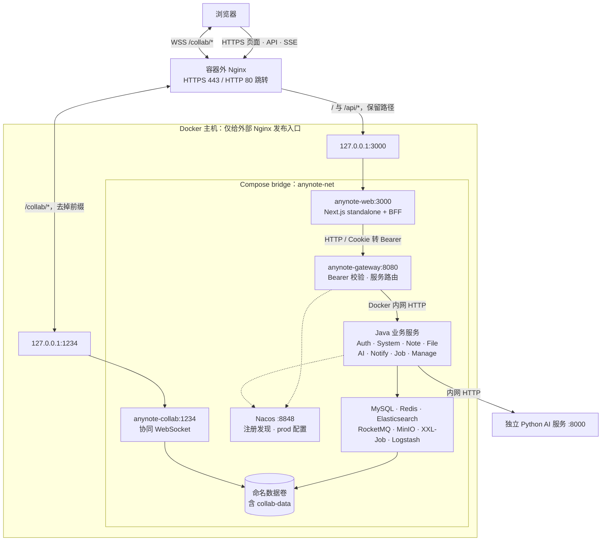
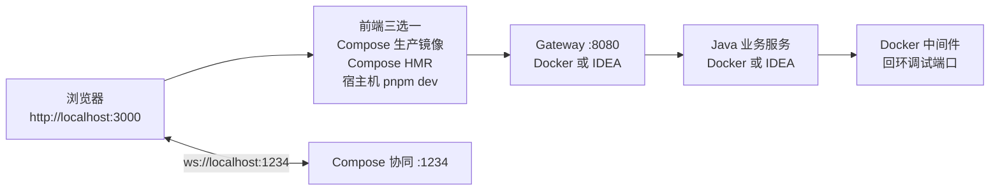

# Anynote 部署网络

生产使用 `infra/docker-compose.yaml` + `infra/docker-compose.prod.yaml`，启动命令及变量的单一来源是 [README 启动指南](../README.md#启动指南)。容器外 Nginx 与 Docker 默认在同一主机；跨主机时用 Docker 主机私网 IP 替换回环 upstream，并限制防火墙来源。

- 浏览器登录请求先到 Next `/api/auth/login`；BFF 调 Auth 并写 Secure、httpOnly Cookie。后续 `/api/proxy/*` 由 BFF 转换为 Gateway 的 Bearer 请求。
- SSE 同样经过 BFF，Nginx `/api/` 关闭缓冲和压缩，使用长读超时。静态资源缓存头由 Next 决定。
- BFF `/api/auth/collab-token` 签发短期协同令牌；浏览器携带该令牌连接同源 `/collab/<room>`。Nginx 保留 WebSocket Upgrade，协同容器核对签名及 Origin，握手查询串不写入访问日志。
- 生产只发布 web/collab；Gateway、业务服务、数据库、配置中心等没有宿主机端口。Nginx 配置和 TLS 证书均在 Compose 外。
- 这是单机可信 Docker 网络部署。它不提供跨主机中间件 TLS、集群容灾或滚动发布；已有业务缺口仍以 `docs/refactor/FRONTEND_MILESTONES.md` M7.6 为准。

## 本地调试

Docker 前端通过 `http://anynote-gateway:8080` 访问网关；宿主机前端使用 `http://localhost:8080`。IDEA 模式的 broker 广播回环地址，切回全容器模式恢复 `rocketmq-broker`。三种前端方式只启动一种，避免端口冲突。

镜像构建不需要运行中的后端，从 `openapi/specs/*.json` 派生类型。`NEXT_PUBLIC_APP_URL` 与 `NEXT_PUBLIC_COLLAB_WS_URL` 随构建内联，切换域名要重新 build；服务端密钥在运行时传入。参考 [Next.js 自托管文档](https://nextjs.org/docs/app/guides/self-hosting)、[Compose 合并规则](https://docs.docker.com/reference/compose-file/merge/)、[Nginx WebSocket 代理](https://nginx.org/en/docs/http/websocket.html)。
