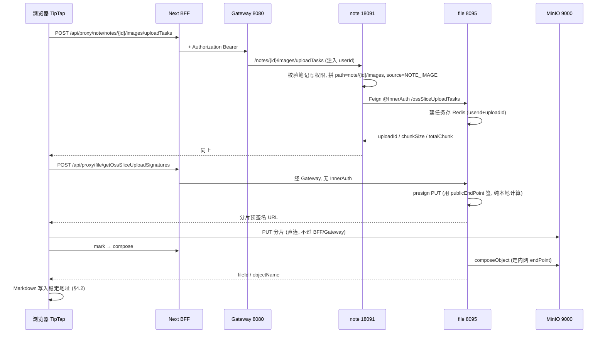

# Anynote MinIO 链路修复方案

> 文档版本：v1.0 | 创建 2026-09-12 | 状态：**待实施（§11 有 4 项待拍板）**
> 关联文档：[`CLAUDE.md`](../../CLAUDE.md) · [`README.md` 启动指南](../../README.md#启动指南) · [`docs/deployment-network.md`](../deployment-network.md) · [`docs/refactor/FRONTEND_MILESTONES.md`](../refactor/FRONTEND_MILESTONES.md)（M5.10 / M7.6 的上传缺口） · [`.claude/context/api-contracts.md`](../../.claude/context/api-contracts.md)
> 本文是**方案 + 代码骨架 + 部署片段**。实施顺序与验收在 §8 / §9。§2 的"既有事实"全部在 2026-09-12 的真实运行栈上核对过并附证据，实施时不必重新考古。

---

## 0. 一句话结论

`OSS_TYPE` 已经是 `MIN_IO`，但三层都缺东西：

| 层 | 缺什么 | 后果 |
|---|---|---|
| 业务层 | note 模块没有「笔记图片上传任务」端点（只有 mooc 有） | 新前端只能去敲 file 的内部端点，被 `@InnerAuth` 正确拒绝 |
| 部署层 | MinIO accessKey/secretKey 为空、endpoint 指向不可达的外部域名、bucket 不存在 | 任何 MinIO 调用必失败 |
| 网络层 | 没有浏览器可直连 MinIO 的入口，也没有 CORS | 预签名 URL 即使签出来，浏览器也 PUT 不上去 |

本方案按**既定设计**（后端颁发上传任务/签名 → 浏览器直连对象存储）补齐三层，**不动 `@InnerAuth` 边界**——该注解是这条设计的承重墙（§2.2）。

---

## 1. 目标与非目标

### 1.1 目标

1. 让「创建任务 → 换分片签名 → 浏览器直传 MinIO → 合并 → 渲染」这条链路在 dev 与 prod 两种部署下端到端可用，首个落地场景是**笔记/文档正文图片**。
2. 安全边界零退让：`path` / `source` 永远由业务侧决定，第 1 步保持内部调用。
3. MinIO 对浏览器有**稳定、可直连、签名 Host 一致**的入口；服务端内部调用走容器网络，不绕公网。
4. `OSS_TYPE=MIN_IO` 下**所有**上传路径可用，包括服务端中转（PDF 转存、Whisper、封面），而不只是分片直传。
5. 写进笔记正文的图片地址**不会过期**（现状是 7 天预签名 URL，§2.6）。
6. 服从仓库既有强制约束：contract-first（`pnpm openapi:generate` + baseline 入库）、改动必带单测、中文 commit、运行时配置只动 Nacos / `sys_config`。

### 1.2 非目标

| 不做 | 原因 |
|---|---|
| 给 `apps/web-legacy` 迁移图片上传 | 它走华为 OBS 的老路且删除条件已定义（`CLAUDE.md` Phase 5 表），不追加投入 |
| 华为 OBS 历史对象迁移到 MinIO | 独立数据工程议题，附录 A 只给思路 |
| 换 SDK / 引入 S3 多云抽象层 | `io.minio:8.5.12` 够用，换 SDK 会牵动 6 个方法签名 |
| CDN / 图片压缩转码 | 需要先有稳定 URL（本方案 §4.2）才谈得上 |
| 删除华为 OBS 插件 | 保留为可切换后端，`OSS_TYPE` 回滚路径依赖它（§10） |

---

## 2. 既有事实盘点（均已核对，附证据）

### 2.1 选型已经是 MinIO，但只有一条链路尊重它

运行栈核对（MySQL `anynote.sys_config` 与 Redis 缓存一致）：

```
OSS_TYPE      = MIN_IO
MIN_IO_CONFIG = {"endPoint":"https://api.minio.yypan.xyz","accessKey":"","secretKey":"",
                 "bucketName":"anynote","basePath":"anynote_Shanghai_one"}
```

| 上传路径 | 入口 | 实际落点 | 证据 |
|---|---|---|---|
| 分片直传（5 步） | `file /ossSliceUploadTasks` … | **按 `OSS_TYPE`** → MinIO | `FilePluginFactory.filePlugin()` |
| 服务端中转上传 | `file POST /`（内部） | **写死华为 OBS** | `FileServiceImpl.java:75` |
| 临时签名单文件直传 | `file /createHuaweiOBSTemporarySignature` | **写死华为 OBS** | `FileServiceImpl.java:120` |

`MinIOFilePlugin.multipartFileUpload` 是空实现 `return ""`（`MinIOFilePlugin.java:79`），所以即使把中转路径切到 `filePlugin()`，MinIO 侧也还没有实现。

中转路径有 4 处调用方（`remoteFileService.uploadFile`）：`ai/ChatServiceImpl`、`ai/WhisperServiceImpl`、`note/DocMessageListener`、`note/DocServiceImpl`（PDF 转存）。**这就是 M7.6 记的「PDF 上传转存失败」的真实根因**，不是 Feign 的问题。

### 2.2 `@InnerAuth` 是设计的承重墙，不能摘

- 浏览器侧 DTO `OssSliceUploadTaskCreatePublicDTO` 只有 `fileName` / `hash` / `fileSize` / `contentType`，**没有 `path`、没有 `source`**。
- 业务侧把它包成内部 DTO 时才补上路径与来源：`MoocServiceImpl.java:172` 用 `FileConstants.MOOC_COVER_PATH_TEMPLATE` + `loginUser.getUserId()` 拼 `path`，`source` 取 `FileSources.MOOC_COVER`。
- 任务信息按 `userId + uploadId` 存 Redis（`FileServiceImpl.java:213`），第 2–5 步每次都用 Gateway 注入的 `DETAILS_USER_ID` 重新取任务，`objectName` / 分片数只从任务里读，不信请求体。

**结论**：`uploadId` 就是后端颁发的那张临时凭据；第 1 步必须内部，否则客户端能自选对象前缀（越权写入他人 `note/{id}/images`）并伪造 `source`。后 4 步不带 `@InnerAuth` 是合理的。

### 2.3 笔记图片缺的就是那一个业务端点

| 场景 | 业务端点（外部，用户鉴权） | 状态 |
|---|---|---|
| mooc 封面 | `POST /api/note/moocs/cover/create` | ✅ |
| mooc 视频 | `POST /api/note/moocs/video/create` | ✅ |
| **笔记/文档图片** | — | ❌ **缺** |

常量已经就位，不需要新建：`FileConstants.NOTE_IMAGE_PATH_TEMPLATE = "note/{}/images"`、`FileSources.NOTE_IMAGE(0)`。

### 2.4 环境侧三处断点（2026-09-12 实测）

| 断点 | 实测结果 |
|---|---|
| 凭据 | `MIN_IO_CONFIG.accessKey` / `secretKey` 长度均为 **0**；华为 OBS 的也是 0（file 日志："Service has no Credential and is un-authenticated"） |
| endpoint 可达性 | 从 file 容器 `curl https://api.minio.yypan.xyz/minio/health/live` → **HTTP 000**；`curl http://minio:9000/minio/health/live` → **HTTP 200** |
| bucket | `anynote-minio` 容器健康，但 `/data` 下只有 `.minio.sys`，**没有 `anynote` 桶**；插件也不会自动建桶（全文无 `bucketExists` / `makeBucket`） |

### 2.5 endpoint 不能带路径 —— 这决定了反代必须是独立主机名

`io.minio:8.5.12` 的 `io.minio.http.HttpUtils` 里有字符串 **`no path allowed in endpoint`**（在 file 容器内解包 `/app/app.jar` → `BOOT-INF/lib/minio-8.5.12.jar` 核对）。

**所以「`https://域名/oss/` 子路径反代」方案直接出局**，MinIO 的 endpoint 只能是 `scheme://host[:port]`。§7 因此按独立 `server_name` 设计。

### 2.6 写进笔记正文的是 7 天预签名 URL

`FileServiceImpl.java:369` 的 `getObjectUrlByObjectName` 签的是 `3600*24*7`，并按同样时长缓存进 Redis；前端 `createNoteImageUploader` 直接把这个 URL 当图片 `src` 写进 Markdown（`apps/web/src/lib/editor/upload.ts:225`）。**7 天后所有图片集体裂图**，而 `lib/editor/upload.ts` 的注释本身就写了"不能当永久地址"。必须在本方案内一并解决（§4.2）。

### 2.7 `fileSize` 单位不一致（新前端现存 bug）

后端按 **MB** 理解 `fileSize`：`chunkSize = max(5, ceil(fileSize/1000))`、`chunkCount = ceil(fileSize/chunkSize)`（`MinIOFilePlugin.java:258`），legacy 也是按 MB 传的（`apps/web-legacy/src/components/mooc/VideoUpload/index.tsx:37` → `file.size / 1024 / 1024`）。

新前端传的是**字节**（`apps/web/src/lib/editor/upload.ts` 的 `fileSize: file.size`）。一张 1 MiB 图片会被算成 `chunkSize ≈ 1049 MB`、`totalChunk = 1000` —— 前端会去传 1000 个越过 EOF 的空分片。**即使上面全部修好，这个 bug 也会让上传必败**，修复时要连 `@Schema` 注释一起把单位写清。

### 2.8 配置生效方式：改库必须重启 system

`ConfigLoader`（`services/system/.../init/ConfigLoader.java`）是 `ApplicationRunner`，**只在 system 启动时**把 `sys_config` 全表灌进 Redis；增量同步靠 `CanalConfigListener`，而 `infra/docker-compose*.yaml` 里**没有 canal 容器**。所以本方案每次改 `sys_config` 都要 `restart anynote-modules-system`。

### 2.9 顺带记录的 3 个非阻塞缺陷（P2，§4.6）

1. `markOssUploadSlice` 校验了分片是否真的存在，但 `redisService.addToSet(setKey, chunkIndexList)` 写进去的是**请求里的全部 index**，不是校验通过的 `markedChunkIndexList`（`FileServiceImpl.java:298`）——校验形同虚设，最终在合并时才炸。
2. 任务 Redis key 与"已完成分片"集合**都没有 TTL**，放弃的上传会永久残留。
3. 合并后**不删分片对象** `{path}/{uploadId}/{fileName}_chunk_{n}`，bucket 里的垃圾只增不减。

---

## 3. 方案总览



核心设计决定：**MinIOConfig 拆成两个 endpoint**。

| 字段 | 用途 | dev 取值 | prod 取值 |
|---|---|---|---|
| `endPoint` | 服务端自己调用（stat / compose / get / put） | `http://minio:9000` | `http://minio:9000` |
| `publicEndPoint` | **只用于生成预签名 URL** | `http://localhost:9000` | `https://oss.YOUR_DOMAIN` |

这样：签名 Host 与浏览器实际请求的 Host 一致（SigV4 把 Host 计入签名）、内网流量不出 Docker 网络、不需要改 hosts、不需要 `extra_hosts` 回环。兼容性：`publicEndPoint` 为空时回落到 `endPoint`，旧配置不报错。

---

## 4. 后端接口补齐

### 4.1 P0-1｜note 新增「笔记图片上传任务」端点

**路径**：`POST /notes/{noteId}/images/uploadTasks`（外部地址 `POST /api/note/notes/{noteId}/images/uploadTasks`，Gateway `StripPrefix=2`）。

> **与规范的偏差（需确认，见 §11 D4）**：`CLAUDE.md` 写"新端点必须用 `/api/v1/*` 前缀"，但全仓 `services/**` 里 `/api/v1` 的实际用例为 **0**，note 的端点全在 `/notes/**`。本方案选择与既有路由段一致，把 v1 前缀留给整体迁移。

```java
// services/note/src/main/java/com/anynote/note/controller/NoteController.java
@Operation(summary = "创建笔记图片上传任务",
        description = "浏览器分片直传第 1 步。path 与 source 由服务端决定，"
                + "请求体只允许 fileName / hash / fileSize(MB) / contentType。"
                + "返回的 uploadId 即后续换签名、标记、合并的凭据")
@PostMapping("{noteId}/images/uploadTasks")
public ResData<OssSliceUploadTaskVO> createNoteImageUploadTask(
        @NotNull(message = "笔记id不能为空") @PathVariable Long noteId,
        @Validated @RequestBody OssSliceUploadTaskCreatePublicDTO createDTO) {
    return ResUtil.success(noteService.createNoteImageUploadTask(
            new NoteImageUploadTaskCreateParam(noteId, createDTO)));
}
```

```java
// services/note/src/main/java/com/anynote/note/service/impl/NoteServiceImpl.java
@RequiresPermissions(value = "n:note:update", paramIdName = "noteId", queryParamName = "param")
@Override
public OssSliceUploadTaskVO createNoteImageUploadTask(NoteImageUploadTaskCreateParam param) {
    Note note = noteMapper.selectById(param.getNoteId());
    if (StringUtils.isNull(note) || Objects.equals(note.getDeleted(), 1)) {
        throw new BusinessException("笔记不存在", ResCode.DATA_NOT_FOUND);
    }
    return RemoteResDataUtil.getResData(remoteFileService.createOssSliceUploadTask(
            new OssSliceUploadTaskCreateDTO(
                    param.getCreateDTO(),
                    StringUtils.format(FileConstants.NOTE_IMAGE_PATH_TEMPLATE, param.getNoteId()),
                    FileSources.NOTE_IMAGE.getValue())),
            "笔记图片上传任务创建失败");
}
```

要点：

- 权限**必须**用笔记写权限（与 `editNote` 同一把锁），不能只校验登录；否则任何登录用户都能往别人笔记目录写对象。
- `path` 用 `NOTE_IMAGE_PATH_TEMPLATE`（`note/{noteId}/images`），`source` 用 `FileSources.NOTE_IMAGE`，两者都不从请求体取。
- 返回类型复用 `OssSliceUploadTaskVO`，不新造 VO（前端第 2–5 步已按它实现）。

### 4.2 P0-2｜图片地址稳定化（否则 7 天后全部裂图）

采用 **方案 B（推荐）**，备选见 §11 D2：新增**重定向端点**，笔记正文只存这个稳定路径。

```java
// file 服务，外部可达，无 @InnerAuth
@Operation(summary = "按文件ID重定向到时效访问地址",
        description = "302 到新鲜的预签名 URL；笔记正文应存本路径而不是预签名 URL")
@GetMapping("objects/{fileId}/redirect")
public ResponseEntity<Void> redirectToObject(@PathVariable Long fileId) {
    ObjectURL url = fileService.getObjectUrlByFileId(fileId);   // 含归属校验，见 4.3
    return ResponseEntity.status(HttpStatus.FOUND)
            .location(URI.create(url.getUrl()))
            .cacheControl(CacheControl.maxAge(5, TimeUnit.MINUTES).cachePrivate())
            .build();
}
```

- 前端把 `src` 写成 `/api/proxy/file/objects/{fileId}/redirect`，永不失效。
- BFF 的 `[...path]/route.ts` 目前是 `redirect: "error"`，**需要为该路由放开 302 透传**：透传 `Location` 响应头，不要让 Node 去 follow（follow 等于让服务端再下载一遍对象）。这是本方案唯一的 BFF 改动，必须带单测。
- 已落库的 7 天 URL：正文是 Markdown 文本，按 §10 的一次性脚本把 `?X-Amz-*` 形式的 src 重写成 redirect 路径，或接受旧笔记裂图（当前库里多是 dev / E2E 账号数据）。

### 4.3 P0-3｜`public/byObjectName` 的越权收口

现状：任何登录用户拿任意 `objectName` 都能换到预签名 URL（`FileController` 的 `GET public/byObjectName` 无归属校验）。`objectName` 含 UUID 不易枚举，但这是"靠难猜"而不是靠鉴权。

动作：

1. 新增 `getObjectUrlByFileId(Long fileId)`：查 `FilePO` → 校验 `createBy == 当前 userId`（或该用户对所属业务对象有读权限）→ 再签。
2. `public/byObjectName` 保留给 mooc / legacy，但加一条"`objectName` 必须在 `file` 表存在且归属当前用户"的校验，不通过返回 `A0301`。
3. 两者复用既有 Redis URL 缓存；选了 §4.2 之后 7 天缓存没必要，TTL 改 1 小时。

### 4.4 P0-4｜MinIOConfig 双 endpoint + 显式 region

```java
// services/file/src/main/java/com/anynote/file/model/bo/MinIOConfig.java
private String endPoint;          // 服务端内网地址
private String publicEndPoint;    // 浏览器可达地址；空则回落 endPoint
private String region;            // 新增，默认 us-east-1
private String accessKey;
private String secretKey;
private String bucketName;
private String basePath;
```

```java
// MinIOFilePlugin：两个 client，预签名只用 presignClient
public MinIOFilePlugin(MinIOConfig config) {
    this.minIOConfig = config;
    String region = StringUtils.isEmpty(config.getRegion()) ? "us-east-1" : config.getRegion();
    this.minioClient = MinioClient.builder()
            .endpoint(config.getEndPoint())
            .region(region)                      // 不设 region 会触发 GetBucketLocation 网络调用
            .credentials(config.getAccessKey(), config.getSecretKey())
            .build();
    this.presignClient = StringUtils.isEmpty(config.getPublicEndPoint())
            ? this.minioClient
            : MinioClient.builder()
                    .endpoint(config.getPublicEndPoint())
                    .region(region)
                    .credentials(config.getAccessKey(), config.getSecretKey())
                    .build();
}
```

**`region` 必须显式设置**：minio-java 在 region 未知时会对 endpoint 发一次 `GetBucketLocation`。`presignClient` 指向公网地址，若触发该调用，就又变成"服务端必须能访问公网入口"——正是要避免的。设了 region 之后 `getPresignedObjectUrl` 是**纯本地计算，不发网络请求**。

服务端侧同时配 `MINIO_SITE_REGION=us-east-1`（§6.1），让两端的 credential scope 一致。

### 4.5 P1｜让服务端中转上传在 MIN_IO 下可用

1. `FileServiceImpl.upload(MultipartFile, …)`：`huaweiFilePlugin()` → `filePlugin()`（`FileServiceImpl.java:75`）。
2. 实现 `MinIOFilePlugin.multipartFileUpload`：`putObject` 到 `{basePath}/{path}/{fileName}`，返回 **`objectName`**（华为版返回永久 URL，MinIO 没有永久 URL，因此统一返回 objectName，`FilePO.url` 改存 objectName 并由 §4.2 的 redirect 端点消费）。
3. `createHuaweiOBSTemporarySignature` 在 `OSS_TYPE=MIN_IO` 时不应静默落华为：改为 `throw new NotImplementedException("MinIO 请走分片上传任务流程")`，并把 DocForm / 知识库封面迁到任务流程（M11.4）。

这 3 条一起关掉 M7.6「PDF 上传转存」与「资料保存」里属于存储侧的部分。

### 4.6 P2｜§2.9 的三个缺陷

- `addToSet(setKey, markedChunkIndexList)`；`markedChunkIndexList` 为空时返回业务错误而非静默成功。
- 任务 key 与分片集合设 TTL（建议 24h，与"断点续传最长窗口"对齐，并写进 `@Schema`）。
- 合并成功后 `removeObjects` 删分片；同时配 ILM 规则兜底（§6.2），防止崩在合并前的任务留垃圾。

### 4.7 契约与测试动作（强制）

1. 先写提案：`.claude/openspec/changes/2026-09-XX-minio-note-image-upload.md`（新端点 + 双 endpoint 配置 + 302 约定）。
2. 补 `@Tag` / `@Operation` / `@Schema`，**`fileSize` 的 `@Schema` 必须写明单位 MB**（§2.7）。
3. `pnpm openapi:generate` → `openapi/specs/*.json` 6 份 baseline 一并提交（CI `openapi-check.yml` 卡漂移）。
4. 单测（没有测试的改动不算完成）：

| 被测 | 用例要点 |
|---|---|
| `NoteServiceImpl.createNoteImageUploadTask` | 笔记不存在 → `DATA_NOT_FOUND`；无写权限 → 拒绝；正常 → 断言传给 Feign 的 `path` 是 `note/{id}/images`、`source=0`；Feign 返错 → 包成 `BusinessException` |
| `FileServiceImpl.getObjectUrlByFileId` | 文件不存在 / 非本人 → `A0301`；命中 Redis 缓存不重复签名 |
| `MinIOFilePlugin` | `publicEndPoint` 为空时回落 `endPoint`；预签名 URL 的 host 取 `publicEndPoint`；`multipartFileUpload` 返回 objectName |
| `markOssUploadSlice` | 伪造不存在的 index → 不进集合、已标记列表为空 |
| BFF `[...path]` | 302 透传 `Location` 且不 follow；非 302 行为不回归 |
| 前端 `lib/editor/upload.ts` | 第 1 步打到 note 端点、body 不含 `path`/`source`、`fileSize` 按 MB 传；秒传（`finishedChunks` 满）短路；分片失败抛 `ApiError` |

---

## 5. 前端改造（`apps/web`）

1. `src/lib/editor/upload.ts`
   - 第 1 步换成 `noteApi.POST("/notes/{noteId}/images/uploadTasks", …)`，删掉 body 里的 `path` / `source`；`noteId` 改为 `UploadOptions` 必填。
   - `fileSize: file.size / 1024 / 1024`（MB，§2.7），注释说明单位与后端 `chunkSize` 口径一致。
   - 第 2–5 步不变（仍打 `fileApi`）。
   - 返回值从"时效 URL"改成 `{ fileId, objectName }`，由调用方拼稳定地址。
2. `createNoteImageUploader(noteId)`：返回 `/api/proxy/file/objects/{fileId}/redirect`，不再返回预签名 URL。
3. `note-editor.tsx` / `mobile/note-editor-mobile.tsx`：继续传 `noteId`；`playground/editor` 没有 `noteId`，改为"未绑定笔记时不提供图片上传"并在工具栏提示。
4. 类型**只从** `@anynote/api-client` 来（`pnpm openapi:generate` 之后），不手写接口形状。
5. E2E：新增 `apps/web/e2e/notes-image-upload.spec.ts`——登录 → 建笔记 → 选择/粘贴一张小 PNG → 断言 `img[src^="/api/proxy/file/objects/"]` 出现且 `naturalWidth > 0`（证明真的加载成功）。计入 `pnpm --filter web test:e2e`（不进默认 `pnpm test`）。

---

## 6. MinIO 容器部署（docker compose）

### 6.1 中间件定义补齐

```yaml
# infra/docker-compose-middleware.yaml 的 minio 服务，新增 3 个环境变量
  minio:
    image: minio/minio:${MINIO_VERSION:-latest}
    container_name: anynote-minio
    command: server /data --console-address ":9001"
    environment:
      MINIO_ROOT_USER: ${MINIO_ROOT_USER:-anynote}
      MINIO_ROOT_PASSWORD: ${MINIO_ROOT_PASSWORD:-AnynoteMinio123}
      MINIO_BROWSER_REDIRECT_URL: http://localhost:${MINIO_CONSOLE_PORT:-9001}
      # 新增：与客户端 region 对齐（§4.4）
      MINIO_SITE_REGION: ${MINIO_SITE_REGION:-us-east-1}
      # 新增：浏览器直传需要 CORS。dev 用 *；prod 收敛成前端实际 Origin
      MINIO_API_CORS_ALLOW_ORIGIN: ${MINIO_CORS_ALLOW_ORIGIN:-*}
      TZ: Asia/Shanghai
```

**不要设置 `MINIO_DOMAIN`**：设了之后 MinIO 会对该域名的子域走 virtual-host 风格寻址，而 minio-java 对自建 endpoint 用 path-style（`/{bucket}/{object}`），两者会对不上。

**CORS 只能在服务端配**：MinIO 不实现 S3 的 `PutBucketCors`，`mc` 也没有对应命令，所以"给 bucket 配 CORS"这条路不存在（`FRONTEND_MILESTONES.md:821` 的措辞按本节更正）。部署后用 §7.3 的命令核对实际生效值。

### 6.2 新增一次性初始化容器（建桶 + 策略 + 生命周期）

```yaml
# infra/docker-compose-middleware.yaml 追加
  minio-init:
    image: minio/mc:${MINIO_MC_VERSION:-latest}
    container_name: anynote-minio-init
    depends_on:
      minio:
        condition: service_healthy
    environment:
      MINIO_ROOT_USER: ${MINIO_ROOT_USER:-anynote}
      MINIO_ROOT_PASSWORD: ${MINIO_ROOT_PASSWORD:-AnynoteMinio123}
      ANYNOTE_BUCKET: ${MINIO_BUCKET:-anynote}
    entrypoint:
      - /bin/sh
      - -c
      - |
        set -e
        mc alias set local http://minio:9000 "$$MINIO_ROOT_USER" "$$MINIO_ROOT_PASSWORD"
        mc mb --ignore-existing "local/$$ANYNOTE_BUCKET"
        mc anonymous set none "local/$$ANYNOTE_BUCKET"
        mc ilm rule add --expire-days 1 \
          --prefix "anynote_Shanghai_one/" "local/$$ANYNOTE_BUCKET" || true
        mc ilm rule ls "local/$$ANYNOTE_BUCKET" || true
        echo "minio-init done"
    restart: "no"
    networks:
      - anynote-net
```

- `mc anonymous set none`：显式保持**私有**——对象只能通过预签名 URL 读，与 §4.2 的 redirect 端点配套。
- ILM 规则是 §2.9-3 的兜底。**注意**：`--prefix` 要精确到分片目录，不能误伤正式对象；不同 `mc` RELEASE 的 `ilm` 子命令签名有差异，所以 `|| true` 不阻塞启动，但验收时必须人工看 `mc ilm rule ls` 的输出确认规则形状（这是本节唯一需要按实际 RELEASE 现场校准的地方）。
- 该服务要在 `infra/docker-compose.yaml` 用 `extends` 引一次（与 `minio` 同写法），`docker-compose.prod.yaml` 里加 `<<: *prod`。

### 6.3 端口暴露与控制台

| | API 9000 | 控制台 9001 |
|---|---|---|
| dev | `127.0.0.1:9000`（保持现状，浏览器直连用它） | `127.0.0.1:9001`，浏览器可开 |
| prod | `ports: !reset []`（保持现状），只经 §7 的 nginx 暴露 | **不对外暴露**，运维用 SSH 隧道 |

### 6.4 `sys_config.MIN_IO_CONFIG` 的取值

dev：

```json
{"endPoint":"http://minio:9000","publicEndPoint":"http://localhost:9000","region":"us-east-1",
 "accessKey":"anynote","secretKey":"<MINIO_ROOT_PASSWORD>",
 "bucketName":"anynote","basePath":"anynote_Shanghai_one"}
```

prod：

```json
{"endPoint":"http://minio:9000","publicEndPoint":"https://oss.YOUR_DOMAIN","region":"us-east-1",
 "accessKey":"<独立应用账号 AK>","secretKey":"<SK>",
 "bucketName":"anynote","basePath":"anynote_Shanghai_one"}
```

- prod **不要用 root 账号**：`mc admin user add` + 只给 `anynote` 桶读写的 policy。
- 改完必须 `restart anynote-modules-system`（§2.8），否则 Redis 里仍是旧值。
- `sys_config` 是库里的运行时配置、不进 git；但 `infra/sql/sys_config.sql` 的 seed 要改：`endPoint` 指 `http://minio:9000`、`publicEndPoint` 指 `http://localhost:9000`、凭据留空。当前 seed 指向 `https://api.minio.yypan.xyz` 是个人环境残留，新环境一上来就是坏的。

### 6.5 环境变量清单（`infra/.env.example` / `.env.idea.example` 同步）

| 变量 | dev 默认 | prod 要求 |
|---|---|---|
| `MINIO_ROOT_USER` | `anynote` | 改名，不用默认 |
| `MINIO_ROOT_PASSWORD` | YAML 默认值 | 必填强密码 |
| `MINIO_VERSION` | `latest` | 固定已验证 RELEASE |
| `MINIO_MC_VERSION` | `latest` | 固定 RELEASE |
| `MINIO_SITE_REGION` | `us-east-1` | 同 dev |
| `MINIO_CORS_ALLOW_ORIGIN` | `*` | 前端实际 Origin（如 `https://YOUR_DOMAIN`） |
| `MINIO_BUCKET` | `anynote` | 同 dev |

---

## 7. Nginx 反向代理（让浏览器直连）

### 7.1 形状约束

- **必须是独立 `server_name`**（如 `oss.YOUR_DOMAIN`），不能是 `https://YOUR_DOMAIN/oss/` 子路径——原因见 §2.5。
- **必须原样透传 Host**：SigV4 把 Host 计入签名，`proxy_set_header Host $http_host` 不能改成 `minio:9000`。
- **不需要透传 scheme**：SigV4 的 canonical request 不含 scheme，所以 nginx 终止 TLS、回源用 http 是安全的。
- dev **不需要 nginx**：`publicEndPoint` 直接用 `http://localhost:9000`（compose 已发布该端口）。

### 7.2 prod 片段（追加到 `infra/nginx/nginx.conf`）

```nginx
upstream anynote_oss {
    server 127.0.0.1:9000;
    keepalive 16;
}

# 预签名 URL 的签名在 query string 里，不能写进 access log（与 /collab/ 的短期令牌同理）
log_format anynote_oss '$remote_addr - [$time_local] "$request_method $uri" '
                       '$status $body_bytes_sent "$http_referer"';

server {
    listen 80;
    server_name oss.YOUR_DOMAIN;
    return 301 https://$host$request_uri;
}

server {
    listen 443 ssl;
    http2 on;
    server_name oss.YOUR_DOMAIN;

    ssl_certificate     /path/to/cert/fullchain.pem;
    ssl_certificate_key /path/to/cert/privkey.pem;
    ssl_protocols TLSv1.2 TLSv1.3;

    access_log /var/log/nginx/anynote-oss.log anynote_oss;

    # 分片大小 = max(5, ceil(fileSize_MB/1000)) MB，给足余量
    client_max_body_size 1024M;
    # 大 PUT 不要先落盘再转发
    proxy_request_buffering off;
    proxy_buffering off;

    proxy_http_version 1.1;
    proxy_set_header Host $http_host;          # ← 签名依赖，不可改写
    proxy_set_header X-Real-IP $remote_addr;
    proxy_set_header X-Forwarded-For $proxy_add_x_forwarded_for;
    proxy_set_header X-Forwarded-Proto $scheme;
    proxy_set_header Connection '';

    proxy_connect_timeout 10s;
    proxy_send_timeout 600s;
    proxy_read_timeout 600s;

    location = /minio/health/live {
        proxy_pass http://anynote_oss;
        access_log off;
    }

    # 只放通 bucket 路径（path-style 寻址），挡掉控制台与管理 API
    location ^~ /anynote/ {
        proxy_pass http://anynote_oss;
    }

    location / {
        return 404;
    }
}
```

要点：

- **不要在这里 `add_header Access-Control-Allow-Origin`**：CORS 由 MinIO 自己回（§6.1），nginx 再加一份变成重复头，浏览器直接判失败。
- `location ^~ /anynote/` 里的 `anynote` 是 **bucket 名**，改桶名要同步改这里。
- `/minio/ui`、`/minio/admin` 等落到 `return 404`：控制台与管理 API 不对外。
- 不要设 `proxy_cache`：响应带签名，缓存会串用户。

### 7.3 健康检查与排错命令

```bash
# 1. 容器内看 MinIO 活着
docker exec anynote-minio curl -fsS http://127.0.0.1:9000/minio/health/live && echo OK
# 2. file 服务能否走内网 endPoint
docker exec anynote-anynote-modules-file-1 curl -s -o /dev/null -w '%{http_code}\n' http://minio:9000/minio/health/live
# 3. 浏览器口径（dev）
curl -s -o /dev/null -w '%{http_code}\n' http://localhost:9000/minio/health/live
# 4. prod 反代口径
curl -s -o /dev/null -w '%{http_code}\n' https://oss.YOUR_DOMAIN/minio/health/live
# 5. 桶与策略（<PWD> 换成 MINIO_ROOT_PASSWORD）
docker run --rm --network anynote-net -e MC_HOST_local=http://anynote:<PWD>@minio:9000 minio/mc ls local/
# 6. 实际生效的 CORS / region
docker run --rm --network anynote-net -e MC_HOST_local=http://anynote:<PWD>@minio:9000 minio/mc admin config get local api
# 7. 预签名 PUT 的 CORS 预检（<URL> 换成后端签出来的分片地址）
curl -i -X OPTIONS '<URL>' -H 'Origin: http://localhost:3000' -H 'Access-Control-Request-Method: PUT'
```

---

## 8. 实施顺序（M11.0 – M11.5）

| 里程碑 | 内容 | 产出 | 验收 |
|---|---|---|---|
| **M11.0** | 环境打通：§6.1/§6.2 的 compose 改动 + 建桶 + `sys_config` 写真实值 + 重启 system | compose / `.env.example` / `infra/sql/sys_config.sql` | §7.3 的 1/2/3/5/6 全绿；`mc ls local/anynote` 有桶 |
| **M11.1** | 配置与插件：§4.4 双 endpoint + region；§4.5-2 `multipartFileUpload` 实现 | `MinIOConfig` / `MinIOFilePlugin` + 单测 | `mvn test -pl file` 通过，新增用例覆盖回落与 host 选择 |
| **M11.2** | 业务端点：§4.1 任务端点 + §4.3 归属校验 + §4.2 redirect；openspec 提案 + 生成 spec | note/file Controller+Service+单测、6 份 baseline | `pnpm openapi:check` 无漂移；`mvn test -pl note,file` 通过 |
| **M11.3** | 前端切换：§5 的 upload.ts / uploader / BFF 302 透传 + 单测 | `apps/web` 改动 | `pnpm --filter web test` 全绿；`bundle:budget` 不退化 |
| **M11.4** | 中转与单文件签名收口：§4.5-1/-3，DocForm 与封面迁任务流程 | note/file/ai 改动 | PDF 上传、知识库封面在 `OSS_TYPE=MIN_IO` 下端到端可用 |
| **M11.5** | 生产网络：§7.2 nginx server 块 + 证书 + `publicEndPoint` 切公网名 + §4.6 的 P2 清理 | `infra/nginx/nginx.conf`、`docs/deployment-network.md` 更新 | §7.3 的 4/7 全绿；E2E 在类生产环境跑通 |

每个里程碑一个 commit 粒度单元（跨语言不混，见 `README.md` Git 工作流）。

---

## 9. 验收标准

**自动化**

1. `cd services && mvn test -pl note,file`（新增单测全绿；不新增 `@SpringBootTest`，除非同时加 `@Tag("integration")`）。
2. `pnpm --filter web test` + `pnpm openapi:check`（baseline 无漂移）。
3. `pnpm --filter web test:e2e`：新增 `notes-image-upload.spec.ts` 通过，既有 49 条不回归。
4. `pnpm --filter web bundle:budget`（首屏 ≤300KB / `/m/*` ≤250KB / 编辑器 ≤250KB 不被顶出）。

**人工**

5. 桌面 + 移动端编辑器各走一遍：选择上传、粘贴上传、拖拽上传；刷新页面图片仍在。
6. 断点续传：上传中断网 → 恢复重试，`finishedChunks` 生效不重传已完成分片。
7. 越权：A 账号的 token 对 B 的笔记调 `uploadTasks` → 拒绝；拿 B 的 `fileId` 调 redirect → 拒绝。
8. "7 天问题"验证：删掉 Redis 的 URL 缓存 + 把预签名 TTL 临时改 60s，确认正文图片仍能加载（证明走 redirect 而非固化 URL）。
9. bucket 里合并后没有 `_chunk_` 残留，或 ILM 规则已挂上（`mc ilm rule ls`）。

---

## 10. 风险与回滚

| 症状 | 最可能的原因 | 处置 |
|---|---|---|
| `SignatureDoesNotMatch` | 浏览器请求的 Host 与签名 Host 不一致（nginx 改写了 Host，或 `publicEndPoint` 端口写错） | 对比签名 URL 的 host 与浏览器实际 Host；检查 `proxy_set_header Host $http_host` |
| 预检 403 / 浏览器报 CORS | `MINIO_API_CORS_ALLOW_ORIGIN` 不含前端 Origin，或 nginx 重复加了 CORS 头 | §7.3 的命令 6/7 核对；nginx 侧不加 CORS |
| 第 1 步 `A0301 没有内部访问权限` | 前端还在直接打 `file /ossSliceUploadTasks` | 这是注解在正常工作，应改前端（§5） |
| 1MB 图片被切成 1000 片 | `fileSize` 传了字节（§2.7） | 前端除以 1024²；后端 `@Schema` 写明单位 |
| `NoSuchBucket` | 没跑 `minio-init`，或桶名与 `MIN_IO_CONFIG.bucketName` 不一致 | 跑 §6.2；核对 nginx 的 `^~ /anynote/` 前缀 |
| 服务端 stat/compose 超时 | `endPoint` 被填成公网名 | `endPoint` 必须是 `http://minio:9000` |
| 改了 `sys_config` 没反应 | 没重启 system（§2.8） | `restart anynote-modules-system` |

**回滚**：把 `sys_config.OSS_TYPE` 改回 `HUAWEI_OBS` 并重启 system，即可退回华为 OBS 路径（前提是华为凭据可用）。本方案的后端改动都是"新增端点 + 插件内部实现"，不删既有端点，前端可灰度；唯一有破坏性的是 §4.5-3 把 `createHuaweiOBSTemporarySignature` 在 MIN_IO 下改抛异常——该项排在 M11.4，晚于前端切换。

---

## 11. 待拍板

| # | 决策 | 选项 | 建议 |
|---|---|---|---|
| **D1** | MinIO 对外入口形态 | (a) 独立子域 `oss.YOUR_DOMAIN` + 双 endpoint；(b) 单 endpoint + Docker 网络别名 `oss.localhost`；(c) 主域 + 独立端口 `https://YOUR_DOMAIN:9443` | **(a)**：子路径被 SDK 禁止（§2.5）；(b) 依赖浏览器对 `*.localhost` 的解析且内网流量绕公网；(c) 非标端口在部分企业网被拦 |
| **D2** | 图片地址持久化 | (a) 302 redirect 端点（§4.2）；(b) 给 `note/**` 前缀设匿名只读 + 存公开 URL；(c) 正文存 `objectName`，渲染时前端批量换签名 | **(a)**：保住私有性，正文可读，前端改动最小；(b) 会让所有笔记图片变公开可读 |
| **D3** | `/docs` 协同文档是否接图片上传 | (a) 本期不接；(b) 接，复用同链路但需要 doc 侧任务端点与权限 | **(a)** 先不接，M11.2 后单开工单（协同文档权限模型与笔记不同） |
| **D4** | 新端点路径前缀 | (a) `/notes/{id}/images/uploadTasks`（与既有段一致）；(b) `/api/v1/notes/...`（`CLAUDE.md` 规范） | **(a)**，并在 `CLAUDE.md` 注明 v1 迁移尚未开始；选 (b) 则要同步 Gateway 路由与全部 note 端点，工作量外溢 |

---

## 附录 A：华为 OBS 历史对象迁移（非本期）

思路：`file` 表按 `oss_type` 分组 → 对 `HUAWEI_OBS` 的对象用 OBS SDK 流式读 → `MinIOFilePlugin.upload` 写入同名 objectName → 校验大小/ETag → 更新 `file.oss_type`。正文里硬编码的 OBS URL 需一次性重写成 §4.2 的 redirect 路径。建议做成 XXL-Job 任务（job 服务已就位），分批 + 可重入 + 失败清单落表，不要写一次性脚本。

## 附录 B：dev 最小打通序列（M11.0 之后可单独复跑）

```bash
# 1. 起中间件（含 minio + minio-init）
docker compose --env-file=/dev/null -f infra/docker-compose-middleware.yaml up -d minio minio-init
```

```bash
# 2. 确认桶与 ILM 规则
docker logs anynote-minio-init
```

```bash
# 3. 让配置生效（改完 sys_config.MIN_IO_CONFIG 之后）
docker compose --env-file=/dev/null -f infra/docker-compose.yaml -f infra/docker-compose.dev.yaml restart anynote-modules-system
```

```bash
# 4. 两个口径都要通
docker exec anynote-anynote-modules-file-1 curl -s -o /dev/null -w 'internal %{http_code}\n' http://minio:9000/minio/health/live
curl -s -o /dev/null -w 'browser %{http_code}\n' http://localhost:9000/minio/health/live
```

> 第 3 步要改的 `sys_config.MIN_IO_CONFIG` 取值见 §6.4；`secretKey` 不要写进任何入库文件或脚本。
