# UI 补稿设计图

> 来源：设计画布「Anynote UI 补稿」2026-09-16 定稿版（发布版本 `1789492327-db0d`，共 10 个页面、40 块画板、662 条图例）。图片由已发布的画板逐块渲染，与画布一致
> 依据：[`Anynote 新前端 UI 重设计.pdf`](Anynote%20新前端%20UI%20重设计.pdf)（原设计稿：设计系统、已有 5 屏、加载体系）· `apps/web/src/app/globals.css`（Token 单一来源）
> 落地：[`UI补稿落地改造方案.md`](UI补稿落地改造方案.md)（前后端改造方案，逐项引用本文锚点）
> 图片目录：[`ui-supplement/`](ui-supplement/)，2 倍分辨率 PNG；屏幕类画板（D-xx / M-xx）另附深色版

---

## 0. 读图说明

### 0.1 编号

| 前缀 | 含义 | 数量 |
|------|------|------|
| `00` | 总览：画板索引、图例读法、补稿计划、拍板结果与发现的问题 | 1 |
| `F-xx` | 跳转流程：F-01 / F-02 是桌面与移动的路由地图，F-03–F-06 是每轮关键任务的分镜 | 6 |
| `D-xx` | 桌面端屏幕画板（含浮层与状态缩略） | 18 |
| `M-xx` | 移动端屏幕画板（390×844 手机框） | 13 |
| `Q-xx` | 规范核对：深色逐屏核对、空态与错误态汇总 | 2 |

### 0.2 屏幕画板上的标记

- **洋红色圆形编号** = 可交互元素（按钮、链接、输入、Tab、菜单项）。
- **洋红色方形编号** = 文本、徽标、状态、装饰。
- 编号与画板右侧图例一一对应。每条图例三行：名称 + 类型 / 灰字写尺寸、字阶与颜色 Token / 蓝字写点了之后去哪、发生什么。
- **橙字** = 相对现有实现的新增或改动，落地时要改代码。
- 每块屏幕画板下方的小图是同一屏的状态缩略：加载、空态、错误、浮层、边界情况。

### 0.3 跳转流程上的标记

- 蓝实线表示页面跳转，蓝虚线表示打开浮层或面板，灰线表示返回或取消。
- 橙色虚线表示旧前端未迁移的路径，点状线表示服务端重定向。
- 节点右上角的色块表示稿件状态：
  - 有稿（原设计稿 p03–p11）
  - 第 1–3 轮画板
  - 第 4 轮画板
  - AI · 暂不出稿
  - 建议重定向
  - 已拍板删除

### 0.4 已确定的范围

| 日期 | 决定 |
|------|------|
| 2026-09-15 | 慕课、任务只属于知识库：只在 `/notes/[baseId]/mooc`、`/notes/[baseId]/tasks` 下出现，跨库列表不再作为入口 |
| 2026-09-15 | 删除旧入口 `/wikis`、`/m/wikis*`，不出稿 |
| 2026-09-15 | 输入框圆角按规范 10（现实现 14） |
| 2026-09-15 | AI 相关页面（AI 对话 / 会话 / PDF 问答 / 工作流、设置 AI 分区）暂不出稿，入口保留 |
| 2026-09-15 | 笔记历史版本从知识库里的笔记页进入；任务详情、任务新建与编辑放在知识库的任务 Tab 下 |
| 2026-09-16 | **按目前方案确定**：图中标「建议」的路由、重定向与橙字改动全部采纳；AI 继续不画 |

定稿前逐条核对了后端代码，有 5 处图例的前提与后端实际行为不符，定稿版已按核对结果改正（D-07、D-12、D-16、D-17、M-04、M-11、M-12、M-13 下方有注明）。改正依据见[改造方案 §1.4](UI补稿落地改造方案.md#conflicts)。

### 0.5 不在本图集内

- **AI 相关页面**：`/ai/chat`、`/ai/chat/[id]`、`/ai/pdf`、`/ai/workflow`、`/settings/ai` 的内容区，以及移动端 `/m/ai/*`。入口在图中保留，页面本身沿用现实现。
- **原设计稿已有的 5 屏**：p03 知识库画廊、p04 笔记编辑器、p07 移动知识库列表、p08 移动知识库详情、p09 移动笔记编辑。以 PDF 为准，F-03–F-06 分镜里直接引用了这几页。
- **后端缺字段、已决定不做的元素**：
  - 编辑器的作者与阅读次数（p04）：后端没有返回，本轮不做。
  - 画廊卡片的多维计数（p03）：没有跨知识库的聚合端点，卡片副标题只显示单库已有字段。
  - 笔记目录分组（p04 侧栏）：不做，目录平铺。
  - 笔记列表摘要：不做，列表行固定为「图标 + 标题 + 相对时间」。

---

## 画板索引

| 编号 | 画板 | 分类 | 浅色 | 深色 |
|------|------|------|------|------|
| [00](#00) | 总览、图例与进度 | 总览 | [00-overview.png](ui-supplement/00-overview.png) | — |
| [F-01](#f-01) | 桌面端路由地图与跳转流程 | 跳转流程 · 路由地图 | [F-01-flow-desktop.png](ui-supplement/F-01-flow-desktop.png) | — |
| [F-02](#f-02) | 移动端路由地图与跳转流程 | 跳转流程 · 路由地图 | [F-02-flow-mobile.png](ui-supplement/F-02-flow-mobile.png) | — |
| [F-03](#f-03) | 关键任务流 · 分镜 | 跳转流程 · 关键任务分镜 | [F-03-storyboard-r1.png](ui-supplement/F-03-storyboard-r1.png) | — |
| [F-04](#f-04) | 第 2 轮关键任务流 · 分镜 | 跳转流程 · 关键任务分镜 | [F-04-storyboard-r2.png](ui-supplement/F-04-storyboard-r2.png) | — |
| [F-05](#f-05) | 第 3 轮关键任务流 · 分镜 | 跳转流程 · 关键任务分镜 | [F-05-storyboard-r3.png](ui-supplement/F-05-storyboard-r3.png) | — |
| [F-06](#f-06) | 第 4 轮关键任务流 · 分镜 | 跳转流程 · 关键任务分镜 | [F-06-storyboard-r4.png](ui-supplement/F-06-storyboard-r4.png) | — |
| [D-01](#d-01) | 知识库详情 · 笔记 Tab | 桌面端 · 知识库内 · 笔记与概览 | [D-01-kb-notes.png](ui-supplement/D-01-kb-notes.png) | [D-01-kb-notes-dark.png](ui-supplement/D-01-kb-notes-dark.png) |
| [D-02](#d-02) | 知识库详情 · 概览 Tab | 桌面端 · 知识库内 · 笔记与概览 | [D-02-kb-overview.png](ui-supplement/D-02-kb-overview.png) | [D-02-kb-overview-dark.png](ui-supplement/D-02-kb-overview-dark.png) |
| [D-05](#d-05) | 知识库详情 · 慕课 Tab | 桌面端 · 知识库内 · 慕课 | [D-05-kb-mooc.png](ui-supplement/D-05-kb-mooc.png) | [D-05-kb-mooc-dark.png](ui-supplement/D-05-kb-mooc-dark.png) |
| [D-06](#d-06) | 慕课详情 · 目录与播放 | 桌面端 · 知识库内 · 慕课 | [D-06-kb-mooc-detail.png](ui-supplement/D-06-kb-mooc-detail.png) | [D-06-kb-mooc-detail-dark.png](ui-supplement/D-06-kb-mooc-detail-dark.png) |
| [D-07](#d-07) | 知识库详情 · 任务 Tab | 桌面端 · 知识库内 · 任务 | [D-07-kb-tasks.png](ui-supplement/D-07-kb-tasks.png) | [D-07-kb-tasks-dark.png](ui-supplement/D-07-kb-tasks-dark.png) |
| [D-17](#d-17) | 任务详情 | 桌面端 · 知识库内 · 任务 | [D-17-task-detail.png](ui-supplement/D-17-task-detail.png) | [D-17-task-detail-dark.png](ui-supplement/D-17-task-detail-dark.png) |
| [D-18](#d-18) | 任务新建 / 编辑 | 桌面端 · 知识库内 · 任务 | [D-18-task-form.png](ui-supplement/D-18-task-form.png) | [D-18-task-form-dark.png](ui-supplement/D-18-task-form-dark.png) |
| [D-08](#d-08) | 知识库详情 · 资料 Tab | 桌面端 · 知识库内 · 资料与成员 | [D-08-kb-docs.png](ui-supplement/D-08-kb-docs.png) | [D-08-kb-docs-dark.png](ui-supplement/D-08-kb-docs-dark.png) |
| [D-09](#d-09) | 知识库详情 · 成员 Tab | 桌面端 · 知识库内 · 资料与成员 | [D-09-kb-members.png](ui-supplement/D-09-kb-members.png) | [D-09-kb-members-dark.png](ui-supplement/D-09-kb-members-dark.png) |
| [D-03](#d-03) | 新建笔记 · 选择知识库 | 桌面端 · 笔记 · 新建与历史版本 | [D-03-note-new.png](ui-supplement/D-03-note-new.png) | [D-03-note-new-dark.png](ui-supplement/D-03-note-new-dark.png) |
| [D-16](#d-16) | 笔记历史版本 | 桌面端 · 笔记 · 新建与历史版本 | [D-16-note-history.png](ui-supplement/D-16-note-history.png) | [D-16-note-history-dark.png](ui-supplement/D-16-note-history-dark.png) |
| [D-04](#d-04) | 对话框与命令面板 | 桌面端 · 通用浮层 | [D-04-dialogs.png](ui-supplement/D-04-dialogs.png) | [D-04-dialogs-dark.png](ui-supplement/D-04-dialogs-dark.png) |
| [D-10](#d-10) | 协同文档库 | 桌面端 · 协同文档 | [D-10-collab-library.png](ui-supplement/D-10-collab-library.png) | [D-10-collab-library-dark.png](ui-supplement/D-10-collab-library-dark.png) |
| [D-11](#d-11) | 协同文档工作区 | 桌面端 · 协同文档 | [D-11-collab-workspace.png](ui-supplement/D-11-collab-workspace.png) | [D-11-collab-workspace-dark.png](ui-supplement/D-11-collab-workspace-dark.png) |
| [D-12](#d-12) | 设置 · 账号 | 桌面端 · 设置 | [D-12-settings-account.png](ui-supplement/D-12-settings-account.png) | [D-12-settings-account-dark.png](ui-supplement/D-12-settings-account-dark.png) |
| [D-13](#d-13) | 设置 · 外观 / 集成 / AI 入口 | 桌面端 · 设置 | [D-13-settings-appearance.png](ui-supplement/D-13-settings-appearance.png) | [D-13-settings-appearance-dark.png](ui-supplement/D-13-settings-appearance-dark.png) |
| [D-14](#d-14) | 登录与注册 | 桌面端 · 登录、注册与 CLI 授权 | [D-14-auth-login.png](ui-supplement/D-14-auth-login.png) | [D-14-auth-login-dark.png](ui-supplement/D-14-auth-login-dark.png) |
| [D-15](#d-15) | CLI 授权 | 桌面端 · 登录、注册与 CLI 授权 | [D-15-auth-cli.png](ui-supplement/D-15-auth-cli.png) | [D-15-auth-cli-dark.png](ui-supplement/D-15-auth-cli-dark.png) |
| [M-01](#m-01) | 工作台 | 移动端 · 工作台与我的 | [M-01-dashboard.png](ui-supplement/M-01-dashboard.png) | [M-01-dashboard-dark.png](ui-supplement/M-01-dashboard-dark.png) |
| [M-02](#m-02) | 我的 | 移动端 · 工作台与我的 | [M-02-me.png](ui-supplement/M-02-me.png) | [M-02-me-dark.png](ui-supplement/M-02-me-dark.png) |
| [M-03](#m-03) | 知识库详情 · 慕课 Tab | 移动端 · 知识库内 Tab | [M-03-kb-mooc.png](ui-supplement/M-03-kb-mooc.png) | [M-03-kb-mooc-dark.png](ui-supplement/M-03-kb-mooc-dark.png) |
| [M-04](#m-04) | 知识库详情 · 任务 Tab | 移动端 · 知识库内 Tab | [M-04-kb-tasks.png](ui-supplement/M-04-kb-tasks.png) | [M-04-kb-tasks-dark.png](ui-supplement/M-04-kb-tasks-dark.png) |
| [M-05](#m-05) | 知识库详情 · 资料 Tab | 移动端 · 知识库内 Tab | [M-05-kb-docs.png](ui-supplement/M-05-kb-docs.png) | [M-05-kb-docs-dark.png](ui-supplement/M-05-kb-docs-dark.png) |
| [M-06](#m-06) | 慕课详情 · 目录与内容 | 移动端 · 慕课与任务详情 | [M-06-mooc-detail.png](ui-supplement/M-06-mooc-detail.png) | [M-06-mooc-detail-dark.png](ui-supplement/M-06-mooc-detail-dark.png) |
| [M-12](#m-12) | 任务详情 | 移动端 · 慕课与任务详情 | [M-12-task-detail.png](ui-supplement/M-12-task-detail.png) | [M-12-task-detail-dark.png](ui-supplement/M-12-task-detail-dark.png) |
| [M-07](#m-07) | 新建笔记 | 移动端 · 笔记 · 新建与历史版本 | [M-07-note-new.png](ui-supplement/M-07-note-new.png) | [M-07-note-new-dark.png](ui-supplement/M-07-note-new-dark.png) |
| [M-13](#m-13) | 笔记历史版本 | 移动端 · 笔记 · 新建与历史版本 | [M-13-note-history.png](ui-supplement/M-13-note-history.png) | [M-13-note-history-dark.png](ui-supplement/M-13-note-history-dark.png) |
| [M-08](#m-08) | 协同文档库 | 移动端 · 协同文档 | [M-08-doc-library.png](ui-supplement/M-08-doc-library.png) | [M-08-doc-library-dark.png](ui-supplement/M-08-doc-library-dark.png) |
| [M-09](#m-09) | 协同文档 | 移动端 · 协同文档 | [M-09-doc-workspace.png](ui-supplement/M-09-doc-workspace.png) | [M-09-doc-workspace-dark.png](ui-supplement/M-09-doc-workspace-dark.png) |
| [M-10](#m-10) | 搜索 | 移动端 · 搜索与设置 | [M-10-search.png](ui-supplement/M-10-search.png) | [M-10-search-dark.png](ui-supplement/M-10-search-dark.png) |
| [M-11](#m-11) | 设置分节 | 移动端 · 搜索与设置 | [M-11-settings.png](ui-supplement/M-11-settings.png) | [M-11-settings-dark.png](ui-supplement/M-11-settings-dark.png) |
| [Q-01](#q-01) | 深色逐屏核对 | 规范核对 · 深色模式与状态 | [Q-01-dark-review.png](ui-supplement/Q-01-dark-review.png) | — |
| [Q-02](#q-02) | 空态与错误态汇总 | 规范核对 · 深色模式与状态 | [Q-02-states-catalog.png](ui-supplement/Q-02-states-catalog.png) | — |

---

## 1. 总览

### 00 总览、图例与进度

- **尺寸**：2040×1440（导出 4080×2880）

> 封面第一段提到的 `docs/ui/UI设计稿覆盖清单.md` 是补稿前的盘点，内容已过时，文件已删除；补稿后的覆盖情况以本图集为准。

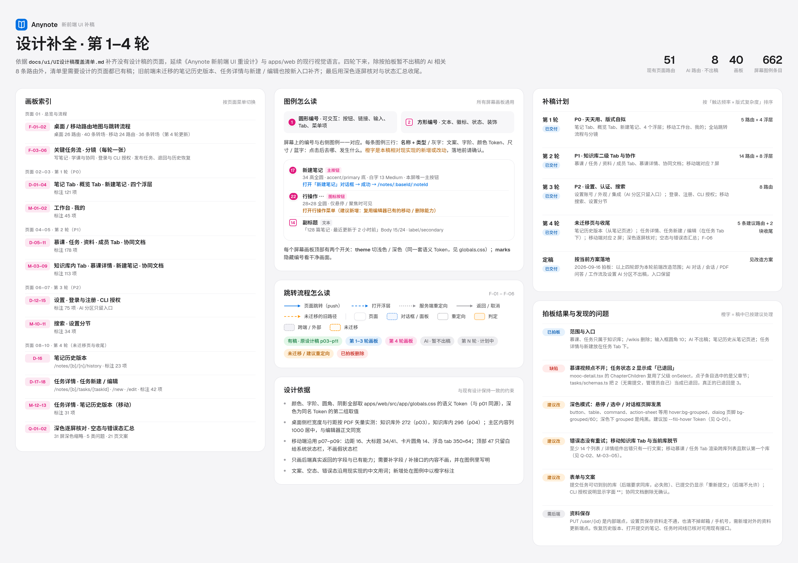

## 2. 跳转流程

### 2.1 路由地图

#### F-01 桌面端路由地图与跳转流程

- **范围**：apps/web (workspace)
- **标注**：第 1 轮 / 第 2–3 轮 / 第 4 轮更新 / 覆盖桌面全部 26 条路由
- **尺寸**：2688×2420（导出 5376×4840）

从进入站点到每一个页面的全部转场。节点右上角标注设计稿状态（有稿 / 第 1–3 轮 / AI 暂不出稿 / 未迁移 / 建议重定向 / 已拍板删除）；连线编号与下方转场表一一对应。侧栏、⌘K、401 这类「任意页都成立」的入口不连线，统一列在右下「全局可达」。/playground/editor 仅开发环境暴露，不画。

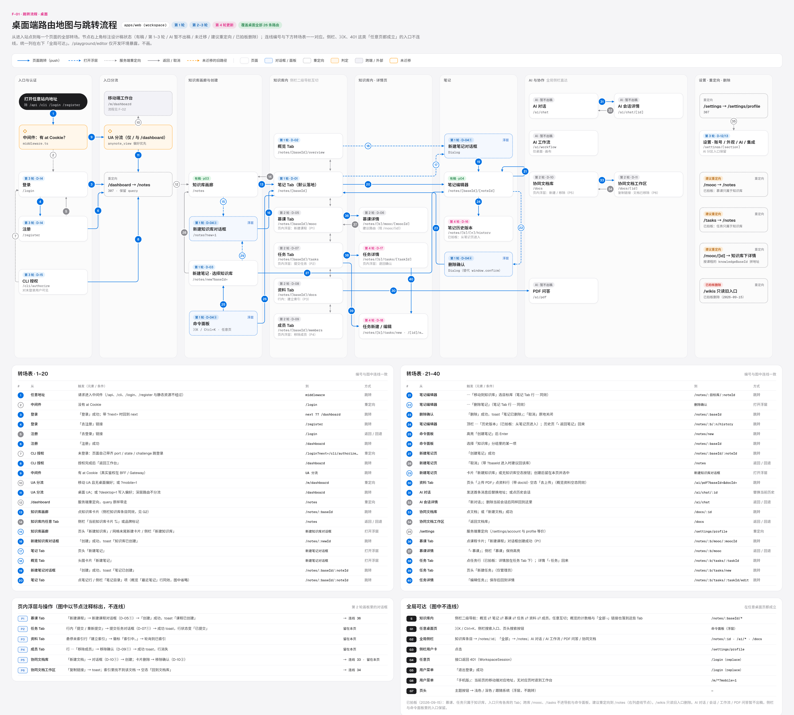

#### F-02 移动端路由地图与跳转流程

- **范围**：apps/web (mobile) /m/*
- **标注**：第 1 轮 / 第 2–3 轮 / 第 4 轮更新 / 覆盖移动端全部 24 条路由
- **尺寸**：2144×2950（导出 4288×5900）

按底部 4 个 tab 分成 4 行。一个根页出口多时，用竖向「总线」扇出，跨行目标用虚线小卡「→ 第 N 行」指过去，避免连线横穿整图。返回键、tab 互切、401 这类通用行为不连线，见右下「通用规则」。

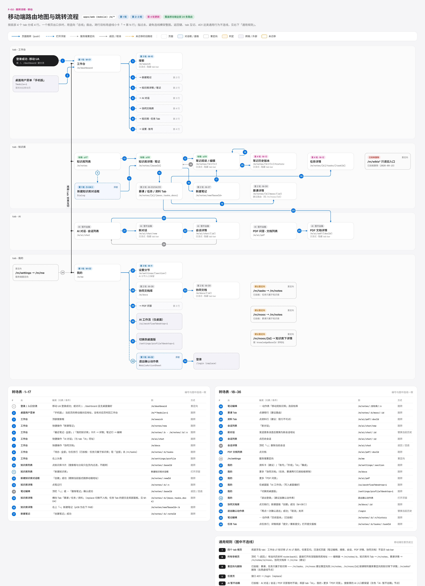

### 2.2 关键任务分镜

#### F-03 关键任务流 · 分镜

- **范围**：P0 主路径
- **标注**：第 1 轮 / 第 2 轮流程见 F-04
- **尺寸**：2360×3040（导出 4720×6080）

把 F-01 / F-02 里最常走的几条路径按屏排成分镜：缩略图就是本轮画板与原设计稿（p03 / p04 / p09）本身，箭头上方是用户动作，下方是系统反馈。蓝实线 = 跳转，蓝虚线 = 打开浮层，灰线 = 返回，拐角箭头 = 分支。

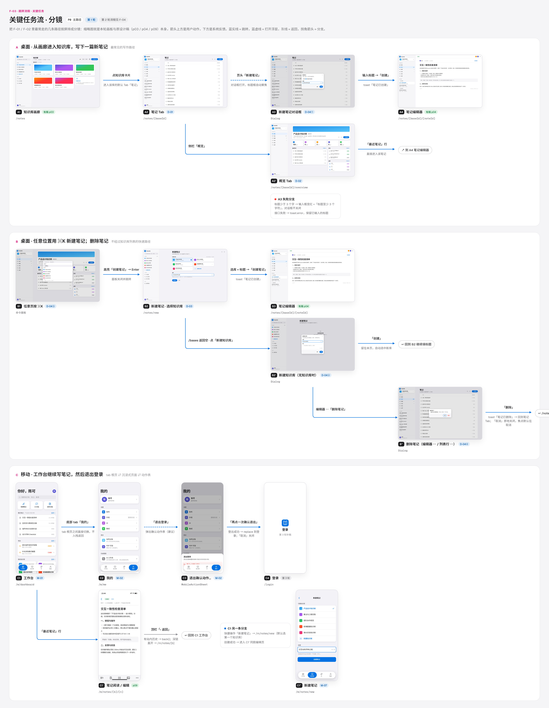

#### F-04 第 2 轮关键任务流 · 分镜

- **范围**：慕课 · 任务 · 成员 · 协同文档
- **标注**：第 2 轮
- **尺寸**：2360×4000（导出 4720×8000）

把本轮新增的页面串成真实任务：缩略图就是 D-05–D-11、M-03–M-09 画板本身。蓝实线 = 跳转，蓝虚线 = 打开浮层 / 面板，灰线 = 返回，拐角箭头 = 分支。页内浮层在 F-01 / F-02 路由图里只以节点注释出现，完整的进出路径以本页为准。

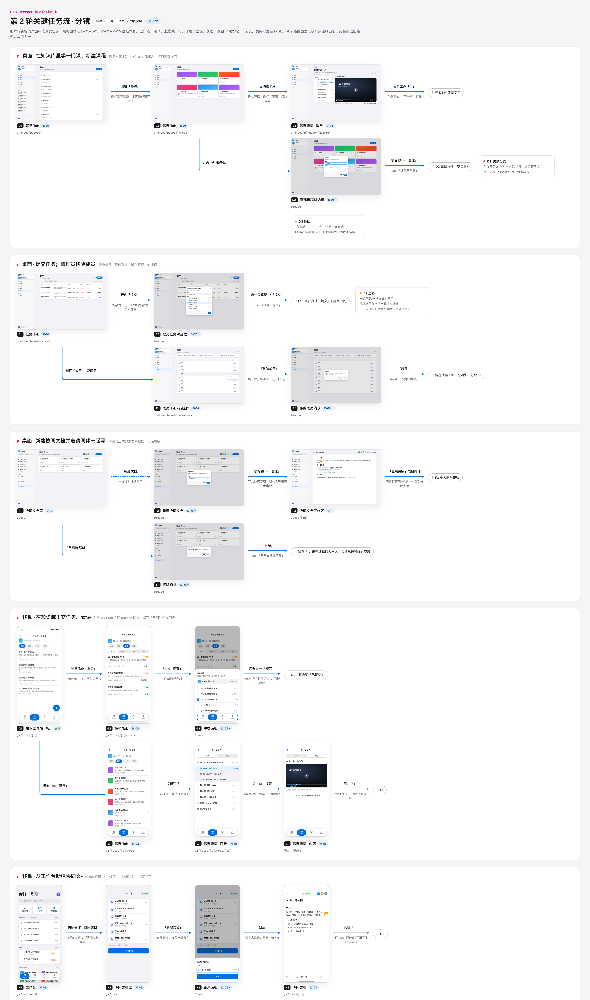

#### F-05 第 3 轮关键任务流 · 分镜

- **范围**：登录 · 注册 · CLI 授权 · 设置 · 搜索
- **标注**：第 3 轮 / AI 暂不出稿
- **尺寸**：2360×3320（导出 4720×6640）

把本轮的认证、设置与搜索串成真实任务：缩略图取自 D-12–D-15、M-10–M-11 画板，终端画面只示意 CLI 输出。蓝实线 = 跳转，灰线 = 返回，拐角箭头 = 分支。AI 相关页面按拍板不出稿，流程里只标注入口位置。

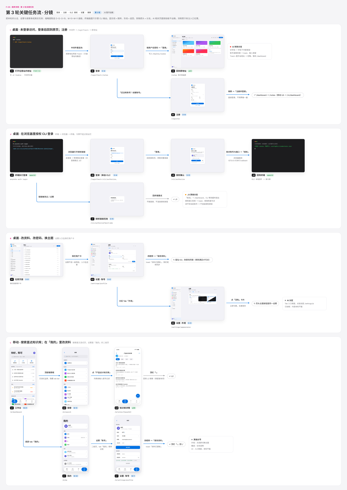

#### F-06 第 4 轮关键任务流 · 分镜

- **范围**：任务发布 · 提交与退回 · 笔记历史与恢复
- **标注**：第 4 轮 / 已拍板：历史从笔记页进；任务详情 / 新建在任务 Tab 下
- **尺寸**：2360×2350（导出 4720×4700）

把本轮补上的 3 个未迁移页串成完整闭环：管理员发布任务 → 成员提交 → 管理员退回 → 成员重新提交；以及从笔记页进入历史版本并恢复。缩略图取自 D-16–D-18、M-12–M-13 画板。蓝实线 = 跳转，蓝虚线 = 打开浮层 / 面板，拐角箭头 = 分支。

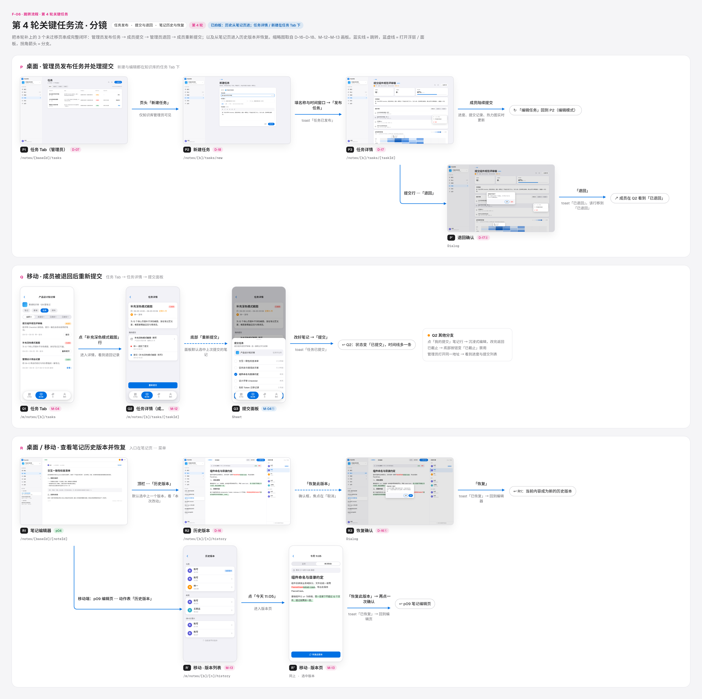

## 3. 桌面端

### 3.1 知识库内 · 笔记与概览

#### D-01 知识库详情 · 笔记 Tab

- **路由**：`/notes/[baseId]`
- **图例**：33 条（其中橙字建议改动 3 条）
- **标注**：第 1 轮补稿 / 侧栏沿用 p04
- **实现**：`apps/web/src/features/notes/components/note-list.tsx`
- **尺寸**：2600×1480（导出 5200×2960）

知识库的默认落地页。侧栏回答「我在哪个库、库里有什么」，主区只做一件事：快速扫过全部笔记并进入其中一篇。数据只用列表端点真实返回的字段（标题 + 最近操作时间）；摘要 / 作者 / 字数需要后端补字段，本稿不画。

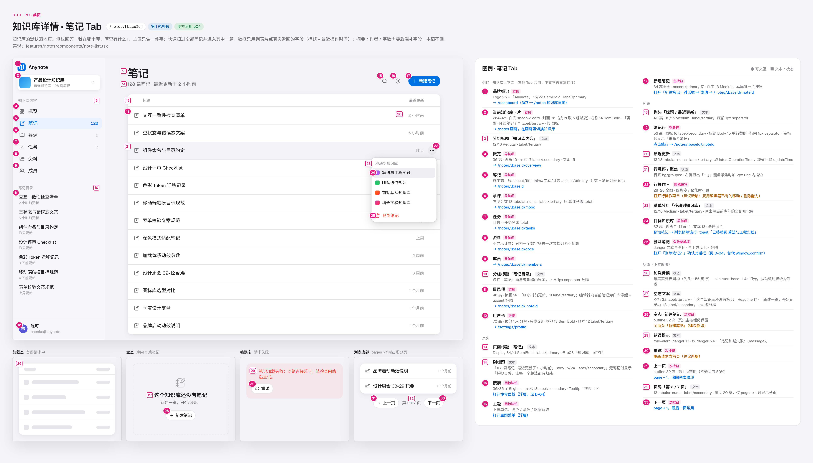

深色版：[D-01-kb-notes-dark.png](ui-supplement/D-01-kb-notes-dark.png)

#### D-02 知识库详情 · 概览 Tab

- **路由**：`/notes/[baseId]/overview`
- **图例**：32 条（其中橙字建议改动 0 条）
- **标注**：第 1 轮补稿
- **实现**：`apps/web/src/features/notes/components/knowledge-base-detail.tsx`
- **尺寸**：2600×1480（导出 5200×2960）

「这个库是什么、里面有什么」的一眼判断：头图卡片说明身份与我的权限，5 格计数与侧栏二级导航一一对应（点哪格去哪个 Tab），下方三块只做预览、每块都能直达对应 Tab。不画统计图表——后端没有聚合端点，前端拼出来的图会和真实列表越走越偏。

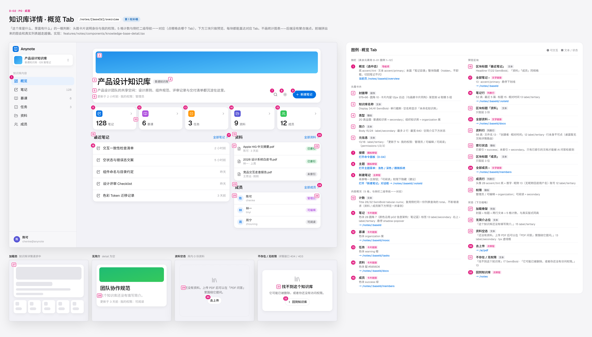

深色版：[D-02-kb-overview-dark.png](ui-supplement/D-02-kb-overview-dark.png)

### 3.2 知识库内 · 慕课

#### D-05 知识库详情 · 慕课 Tab

- **路由**：`/notes/[baseId]/mooc`
- **图例**：29 条（其中橙字建议改动 8 条）
- **标注**：第 2 轮补稿 / 已拍板：慕课只属于知识库
- **实现**：`apps/web/src/features/mooc/components/mooc-page.tsx`
- **尺寸**：2600×1960（导出 5200×3920）

课程挂在知识库下，所以这里没有知识库选择器；卡片与画廊同一套封面语言，点进课程详情。跨库的 /mooc 不再作为入口（建议重定向到 /notes）。只画 MoocListVO 真实返回的字段：标题、简介、更新时间。

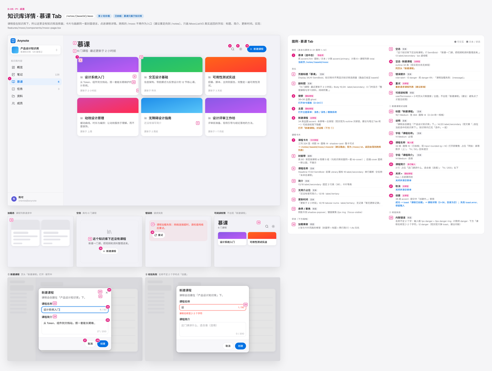

深色版：[D-05-kb-mooc-dark.png](ui-supplement/D-05-kb-mooc-dark.png)

#### D-06 慕课详情 · 目录与播放

- **路由**：`/notes/[baseId]/mooc/[moocId]`（建议） · 现 `/mooc/[id]`
- **图例**：25 条（其中橙字建议改动 7 条）
- **标注**：第 2 轮补稿 / 含 1 个缺陷修复
- **实现**：`apps/web/src/features/mooc/components/mooc-detail.tsx` · `apps/web/src/features/mooc/components/video-player.tsx`
- **尺寸**：2600×1480（导出 5200×2960）

左目录右内容：目录是「章节 → 视频 / 文档」两级树，右侧按条目类型切换视频播放器或只读文档。建议把路由挪到知识库下，侧栏保持「慕课」高亮、返回回到本库慕课 Tab；页头补上课程名（现页面看不出在哪门课里）

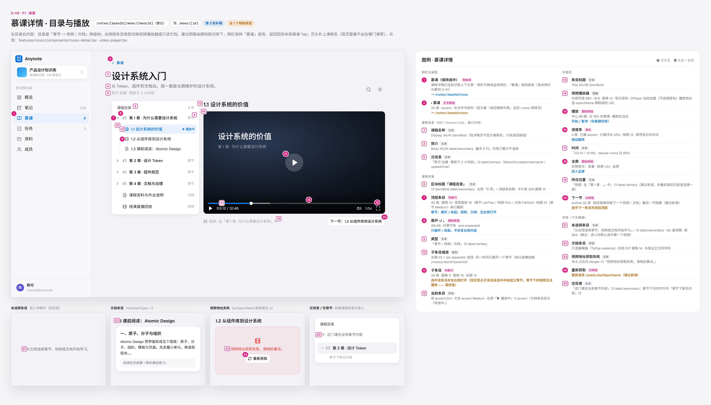

深色版：[D-06-kb-mooc-detail-dark.png](ui-supplement/D-06-kb-mooc-detail-dark.png)

### 3.3 知识库内 · 任务

#### D-07 知识库详情 · 任务 Tab

- **路由**：`/notes/[baseId]/tasks`
- **图例**：35 条（其中橙字建议改动 10 条）
- **标注**：第 2 轮补稿 / 已拍板：任务只属于知识库
- **实现**：`apps/web/src/features/tasks/components/tasks-page.tsx` · `apps/web/src/features/tasks/components/task-table.tsx` · `apps/web/src/features/tasks/components/submit-task-dialog.tsx`
- **尺寸**：2600×1840（导出 5200×3680）

「我的任务」：看清每个任务的时间窗口和我交没交，然后把一篇笔记交上去；点行进入任务详情（D-17）。管理员额外看到「新建任务」（D-18）。跨库的 /tasks 不再作为入口（建议重定向到 /notes）

> 图例已按后端核对结果修正：已提交只出「查看」、提交对话框的知识库固定为任务所在库、状态值 2 = 无需提交 / 3 = 已退回。依据见[改造方案 §1.4](UI补稿落地改造方案.md#conflicts) 第 1–3 条。

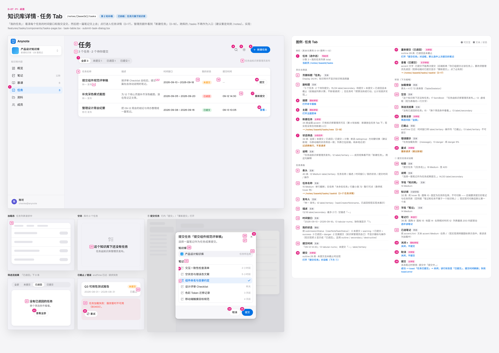

深色版：[D-07-kb-tasks-dark.png](ui-supplement/D-07-kb-tasks-dark.png)

#### D-17 任务详情

- **路由**：`/notes/[baseId]/tasks/[taskId]`（建议） · 旧 `/dashboard/task/[id]`
- **图例**：27 条（其中橙字建议改动 2 条）
- **标注**：第 4 轮补稿 / 已拍板：放在知识库的任务 Tab 下
- **实现参考**：`apps/web-legacy/src/app/dashboard/task/[id]`
- **尺寸**：2600×2000（导出 5200×4000）

管理员视角：先看进度（应交几人、交了几人），再逐份处理提交（打开、退回），最后用热力图看谁在认真改。成员视角只看自己的提交与时间线。数据：GET /admin/noteTasks/{id} · /admin/noteTasks/submissions · /noteTasks/{id}/charts（仅管理员）· /noteTasks/{id}/history · POST /admin/noteTasks/submissions/return/{id}。

> 图例已按后端核对结果修正：提交行用任务所在知识库拼笔记地址，「已退回」的状态值是 3。热力图数据改用新增的按天聚合端点，见[改造方案 B-1](UI补稿落地改造方案.md#b-1)。

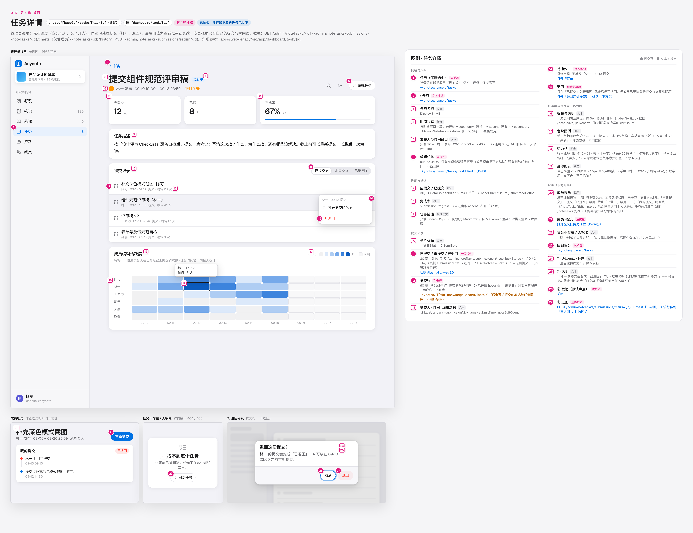

深色版：[D-17-task-detail-dark.png](ui-supplement/D-17-task-detail-dark.png)

#### D-18 任务新建 / 编辑

- **路由**：`/notes/[baseId]/tasks/new`（建议） · `/notes/[baseId]/tasks/[taskId]/edit`（建议） · 旧 `/dashboard/task/new` · `/dashboard/task/[id]/edit`
- **图例**：15 条（其中橙字建议改动 3 条）
- **标注**：第 4 轮补稿 / 已拍板：放在知识库的任务 Tab 下
- **实现参考**：`apps/web-legacy/src/components/task/TaskForm`
- **尺寸**：2600×1640（导出 5200×3280）

一张表单，三件事：叫什么、什么时候交、要交什么。知识库由路由给定，时间窗口给出常用时长的快捷选择，描述用 TipTap 精简工具条。入口：任务 Tab 页头「新建任务」（仅管理员）、任务详情「编辑任务」。数据：POST /admin/noteTasks（taskName · startTime · endTime · knowledgeBaseId · taskDescribe）· PATCH /admin/noteTasks/{id}。

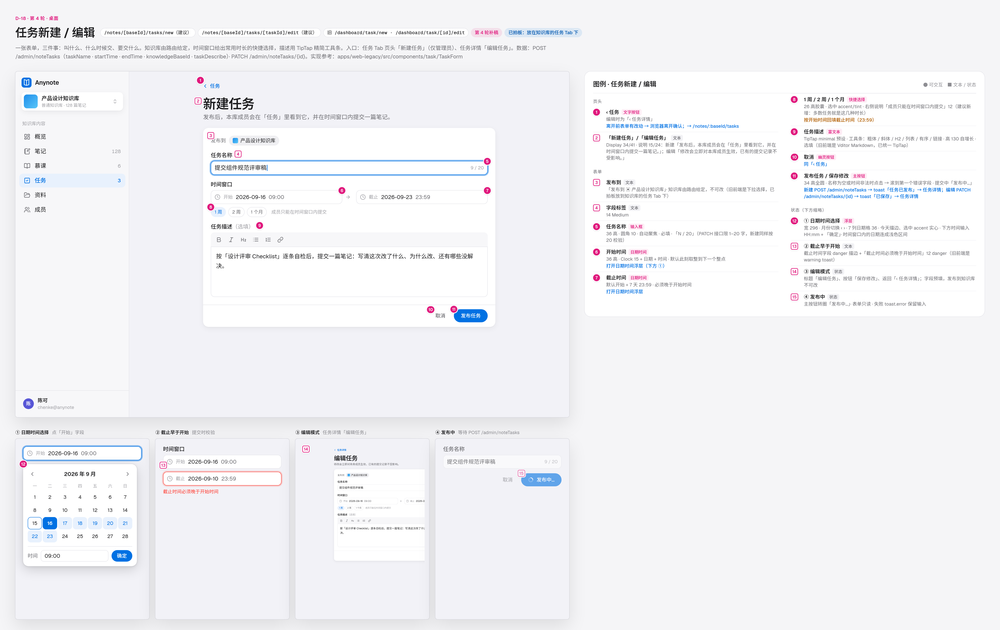

深色版：[D-18-task-form-dark.png](ui-supplement/D-18-task-form-dark.png)

### 3.4 知识库内 · 资料与成员

#### D-08 知识库详情 · 资料 Tab

- **路由**：`/notes/[baseId]/docs`
- **图例**：22 条（其中橙字建议改动 4 条）
- **标注**：第 2 轮补稿
- **实现**：`apps/web/src/features/notes/components/knowledge-base-detail.tsx`（KnowledgeBaseDocs）
- **尺寸**：2600×1480（导出 5200×2960）

这个知识库下的 PDF 资料，以及它们能不能被 AI 问答检索到。上传与预览都交给 PDF 问答（第 3 轮），这里只负责「看全、看清状态、点进去」，避免出现第二条上传实现。

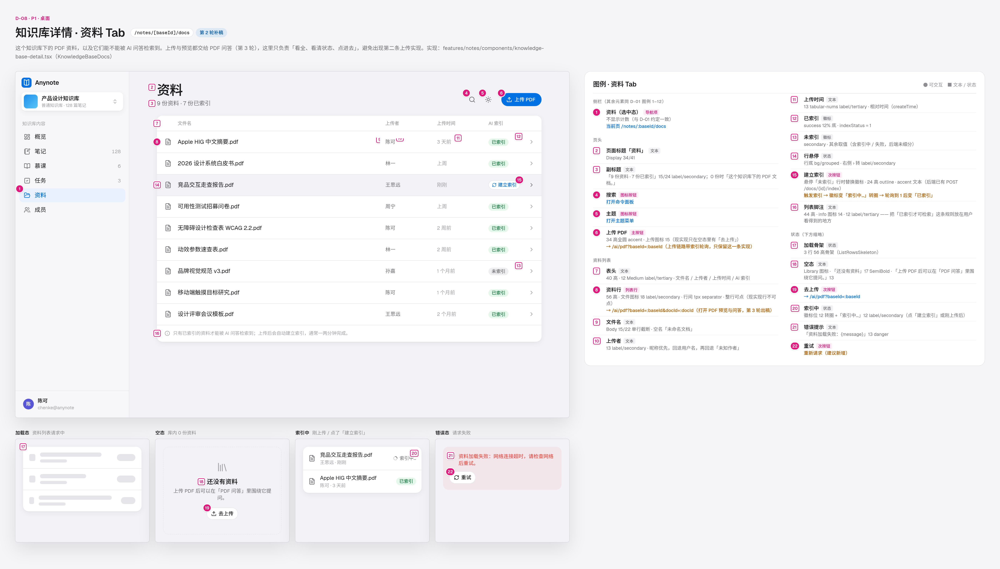

深色版：[D-08-kb-docs-dark.png](ui-supplement/D-08-kb-docs-dark.png)

#### D-09 知识库详情 · 成员 Tab

- **路由**：`/notes/[baseId]/members`
- **图例**：24 条（其中橙字建议改动 4 条）
- **标注**：第 2 轮补稿 / 添加成员需后端确认
- **实现**：`apps/web/src/features/notes/components/knowledge-base-detail.tsx`（KnowledgeBaseMembers）
- **尺寸**：2600×1480（导出 5200×2960）

谁能进这个库、能做什么。现实现是只读列表；本稿补上三档权限说明、按用户名搜索和管理员移除成员——这三件后端都已有接口。添加成员只有管理后台端点 /manage/bases/addUser，普通管理员能否调用待后端确认，本稿不画入口。

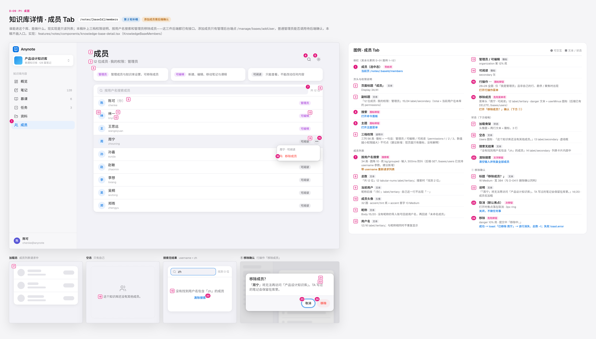

深色版：[D-09-kb-members-dark.png](ui-supplement/D-09-kb-members-dark.png)

### 3.5 笔记 · 新建与历史版本

#### D-03 新建笔记 · 选择知识库

- **路由**：`/notes/new` · `/notes/new?baseId=`
- **图例**：29 条（其中橙字建议改动 1 条）
- **标注**：第 1 轮补稿
- **实现**：`apps/web/src/features/notes/components/create-note-page.tsx`
- **尺寸**：2600×1480（导出 5200×2960）

命令面板「创建笔记」与移动端深链的落点。这一步只有一个决策——放进哪个库，所以选库用可选卡片占视觉重心，而不是下拉框；标题只有一行，提交后直接进编辑器。入口：⌘K「创建笔记」、/notes/new?baseId= 深链。

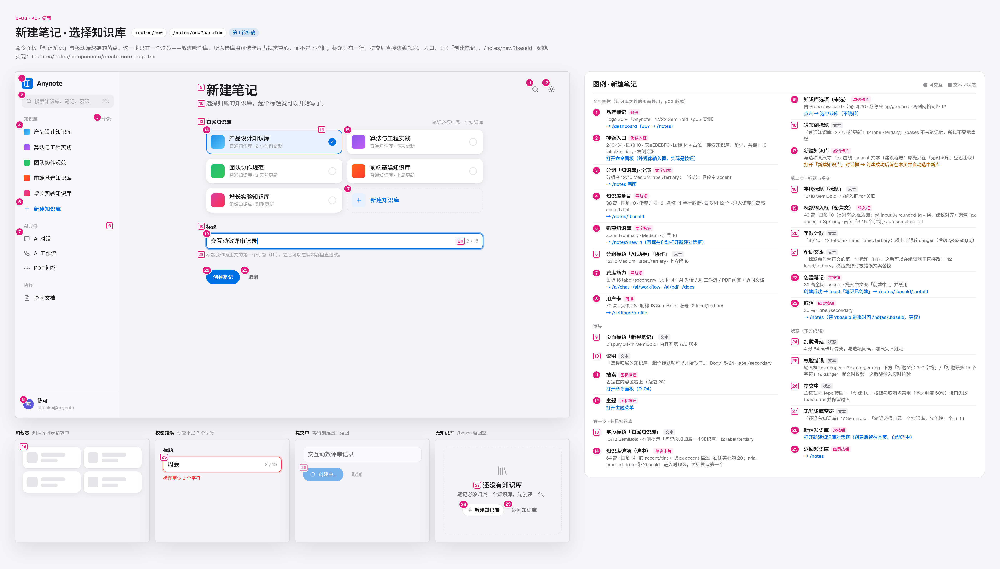

深色版：[D-03-note-new-dark.png](ui-supplement/D-03-note-new-dark.png)

#### D-16 笔记历史版本

- **路由**：`/notes/[baseId]/[noteId]/history`（建议） · 旧 `/note/[id]/history`
- **图例**：23 条（其中橙字建议改动 4 条）
- **标注**：第 4 轮补稿 / 已拍板：从知识库里的笔记页进入
- **实现参考**：`apps/web-legacy/src/app/note/[id]/history`
- **尺寸**：2600×1860（导出 5200×3720）

从编辑器 ⋯ 菜单进入，仍在知识库上下文里（侧栏笔记目录保持当前笔记高亮）。左边读版本，右边挑版本：版本按日期分组，默认选中上一个版本；「本次改动」直接标出这次保存改了什么，再决定要不要恢复。数据：GET /notes/historyList（列表）· GET /notes/history?operationId（内容 + 编辑记录）；恢复 = 用该版本内容调 PATCH /notes/{noteId} 写回。

> 图例已按后端核对结果修正：恢复走现有保存接口，写回会生成新的历史版本。落地时「本次改动」本期按行高亮，见[改造方案 §1.4](UI补稿落地改造方案.md#conflicts) 第 4 条。

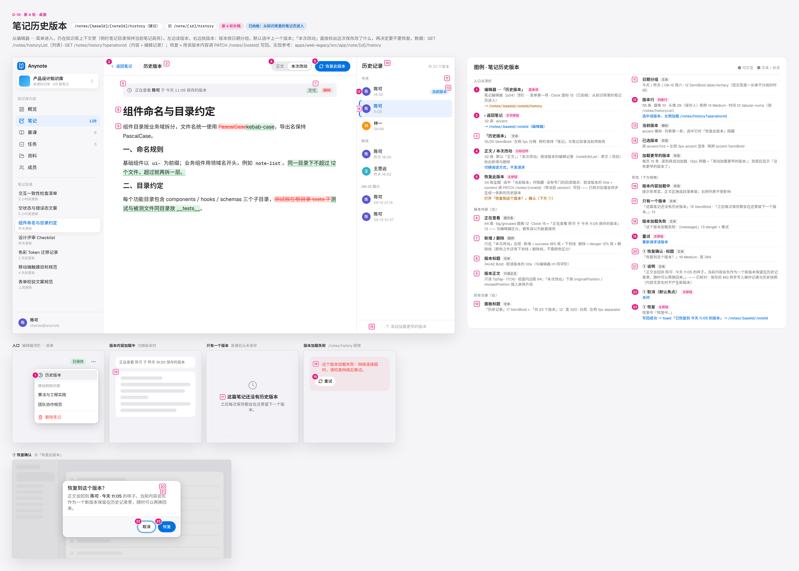

深色版：[D-16-note-history-dark.png](ui-supplement/D-16-note-history-dark.png)

### 3.6 通用浮层

#### D-04 对话框与命令面板

- **范围**：Dialog · ⌘K
- **图例**：27 条（其中橙字建议改动 1 条）
- **标注**：第 1 轮补稿
- **实现**：`apps/web/src/features/notes/components/create-note-dialog.tsx` · `apps/web/src/features/notes/components/create-base-dialog.tsx` · `apps/web/src/components/layout/command-palette.tsx`
- **尺寸**：2640×1400（导出 5280×2800）

P0 流程里用到的四个浮层。统一规格：宽 384（命令面板 512）· 圆角 14 · 内边距 16 · 遮罩 10% 黑 + 轻微模糊 · 页脚 1px 分隔 + bg/grouped 60% 底 · 按钮右对齐、主按钮在最右。

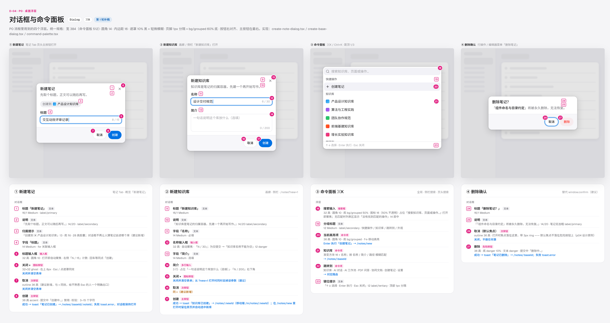

深色版：[D-04-dialogs-dark.png](ui-supplement/D-04-dialogs-dark.png)

### 3.7 协同文档

#### D-10 协同文档库

- **路由**：`/docs`
- **图例**：29 条（其中橙字建议改动 8 条）
- **标注**：第 2 轮补稿
- **实现**：`apps/web/src/features/collab/components/doc-library.tsx`
- **尺寸**：2600×1880（导出 5200×3760）

跨知识库的协作能力，入口在全局侧栏「协作」。列表本身就存在协同索引房间里：别人新建、改名、删除都会实时出现在这里，没有任何后端接口与轮询。所以本页比别处多两个元素——在线成员与连接状态，它们决定「现在能不能写」

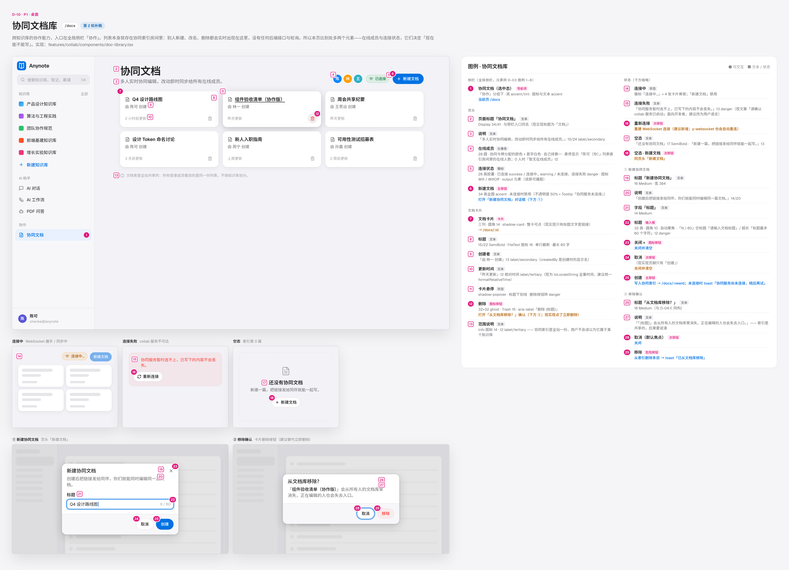

深色版：[D-10-collab-library-dark.png](ui-supplement/D-10-collab-library-dark.png)

#### D-11 协同文档工作区

- **路由**：`/docs/[id]`
- **图例**：14 条（其中橙字建议改动 4 条）
- **标注**：第 2 轮补稿
- **实现**：`apps/web/src/features/collab/components/doc-workspace.tsx`
- **尺寸**：2600×1480（导出 5200×2960）

同时连两个房间：doc:{id} 装正文，index 装标题与更新时间。版式与笔记编辑器同源（p04 全幅纸面、无常驻工具条），差别只在顶部：多了在线成员、连接状态和「复制链接」，以及正文里看得见别人的光标。

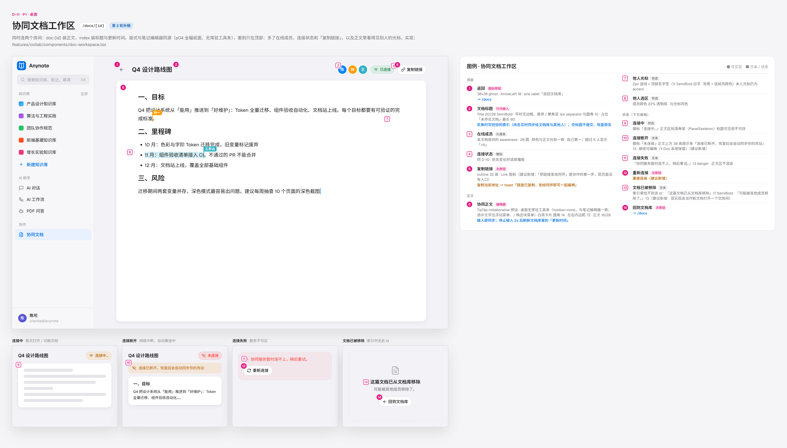

深色版：[D-11-collab-workspace-dark.png](ui-supplement/D-11-collab-workspace-dark.png)

### 3.8 设置

#### D-12 设置 · 账号

- **路由**：`/settings/profile` · `/settings/account`（别名） · `/settings` → 重定向
- **图例**：30 条（其中橙字建议改动 8 条）
- **标注**：第 3 轮补稿 / AI 分区：入口保留，暂不出稿
- **实现**：`apps/web/src/features/settings/components/settings-page.tsx` · `apps/web/src/features/settings/components/account-settings.tsx`
- **尺寸**：2600×1480（导出 5200×2960）

设置不进一级导航，从侧栏底部用户卡进入；四个分区用页内 Tab 切换（账号 / 外观 / AI / 集成）。账号分区只有两件事：改资料、改密码，各占一张卡片，主操作放在卡片页脚。字段只画 /user/mine 真实返回的：昵称、性别、邮箱、手机号。

> 落地依赖：保存资料需要后端新增对外资料更新端点（现 `PUT /user/{userId}` 是内部端点），见[改造方案 B-3](UI补稿落地改造方案.md#b-3)。

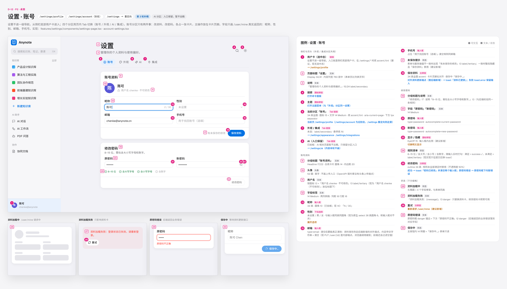

深色版：[D-12-settings-account-dark.png](ui-supplement/D-12-settings-account-dark.png)

#### D-13 设置 · 外观 / 集成 / AI 入口

- **路由**：`/settings/appearance` · `/settings/integrations` · `/settings/ai`
- **图例**：9 条（其中橙字建议改动 3 条）
- **标注**：第 3 轮补稿 / AI 分区：入口保留，暂不出稿
- **实现**：`apps/web/src/features/settings/components/appearance-settings.tsx` · `apps/web/src/features/settings/components/integrations-settings.tsx` · `apps/web/src/features/settings/components/ai-settings.tsx`
- **尺寸**：2600×1700（导出 5200×3400）

外观只有一个决定——主题，所以用带预览的单选卡片占满一行，点了立即生效；集成目前没有可连接的服务，给一个说明清楚的空态；AI 分区按拍板保留入口、内容区留空。

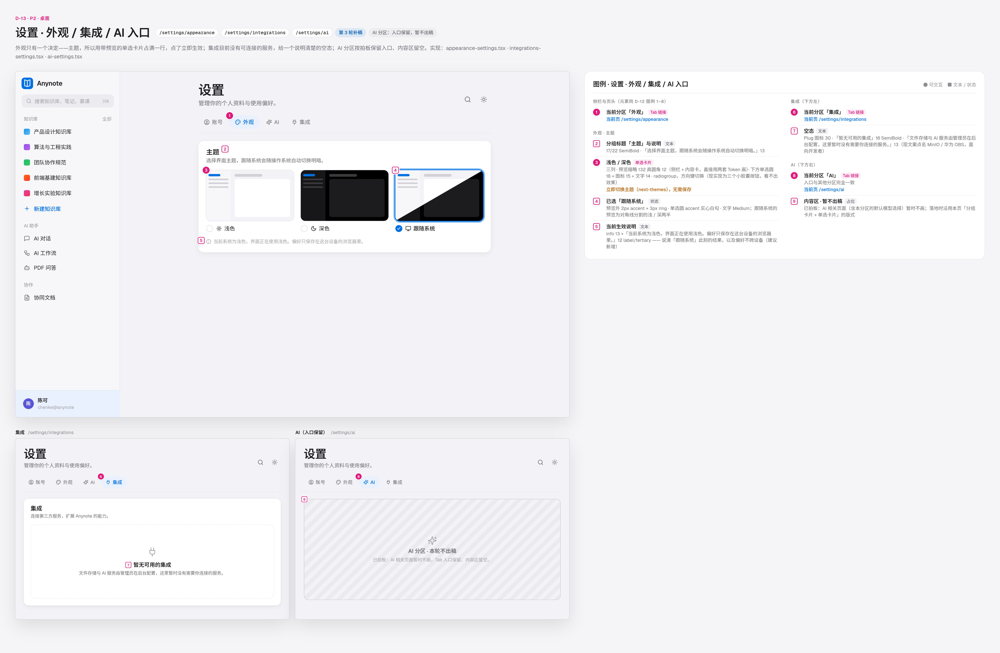

深色版：[D-13-settings-appearance-dark.png](ui-supplement/D-13-settings-appearance-dark.png)

### 3.9 登录、注册与 CLI 授权

#### D-14 登录与注册

- **路由**：`/login` · `/login?next=` · `/register`
- **图例**：22 条（其中橙字建议改动 6 条）
- **标注**：第 3 轮补稿
- **实现**：`apps/web/src/app/(auth)/layout.tsx` · `apps/web/src/features/auth/components/login-form.tsx` · `apps/web/src/features/auth/components/register-form.tsx`
- **尺寸**：2600×2300（导出 5200×4600）

全站唯一不在侧栏外壳里的页面：整屏分组底色上一张居中卡片，桌面与手机同一路由、同一版式。卡片顶部用品牌标记替代文字小标签，主按钮全宽、全圆，次要去向（注册 / 登录互跳）放在卡片底部。登录后的去向由 ?next= 决定（只接受站内路径）

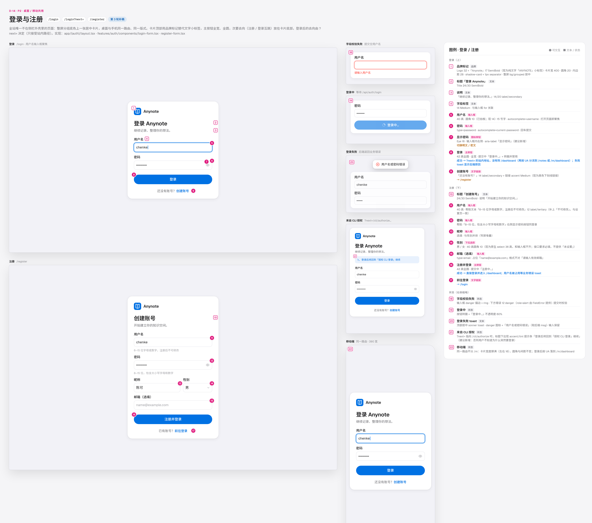

深色版：[D-14-auth-login-dark.png](ui-supplement/D-14-auth-login-dark.png)

#### D-15 CLI 授权

- **路由**：`/cli/authorize?port&state&challenge`
- **图例**：14 条（其中橙字建议改动 4 条）
- **标注**：第 3 轮补稿
- **实现**：`apps/web/src/app/(auth)/cli/authorize/page.tsx` · `apps/web/src/features/auth/components/cli-authorize.tsx`
- **尺寸**：2600×1780（导出 5200×3560）

终端执行 anynote auth login 后浏览器打开本页。它被中间件放行，所以自己处理三种入口：参数非法 → 直接说明链接无效；未登录 → 带着完整参数去登录再回来；已登录 → 显示账号与回调地址，必须由用户点「授权」。授权成功后浏览器跳到 CLI 的本机回环地址，由 CLI 自己换令牌。

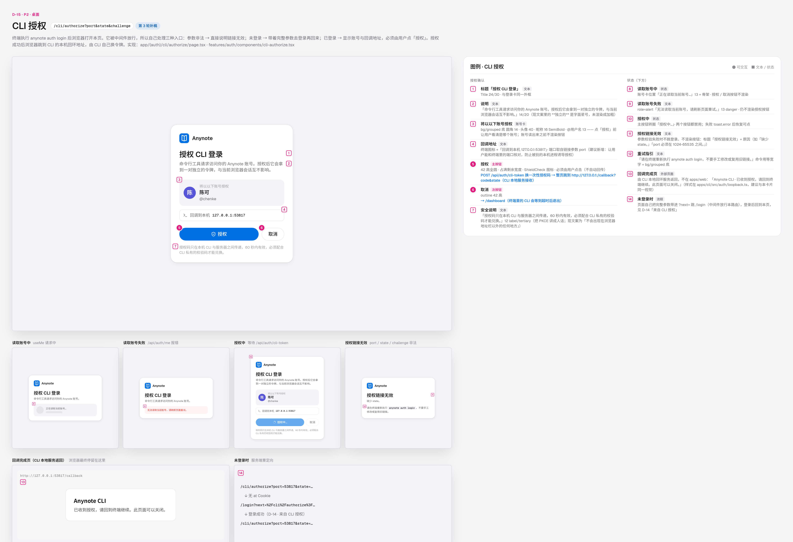

深色版：[D-15-auth-cli-dark.png](ui-supplement/D-15-auth-cli-dark.png)

## 4. 移动端

### 4.1 工作台与我的

#### M-01 工作台

- **路由**：`/m/dashboard`
- **图例**：24 条（其中橙字建议改动 2 条）
- **标注**：第 1 轮补稿 / Lighthouse 81–83 / 85 未达标
- **实现**：`apps/web/src/features/dashboard/components/mobile-dashboard.tsx`
- **尺寸**：1940×1240（导出 3880×2480）

移动端登录后的落地页，回答「接下来做什么」。版式换成与 p07 一致的大标题 + 搜索框语言；三段内容都带上下文（写明是哪个库）。只用已有查询：知识库列表、第一个库的笔记与任务；协同文档不进本页（要建 WebSocket）

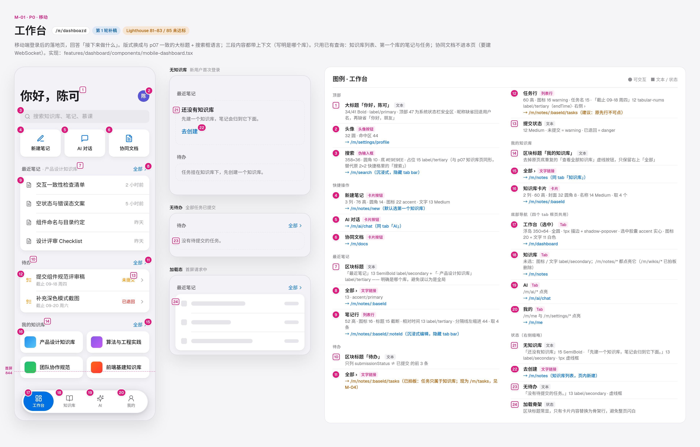

深色版：[M-01-dashboard-dark.png](ui-supplement/M-01-dashboard-dark.png)

#### M-02 我的

- **路由**：`/m/me`
- **图例**：21 条（其中橙字建议改动 3 条）
- **标注**：第 1 轮补稿
- **实现**：`apps/web/src/features/settings/components/mobile-me.tsx`
- **尺寸**：1940×1380（导出 3880×2760）

移动端第 4 格 tab，同时承担三件事：设置入口、tab 放不下的页面入口、版式互切与退出登录。一列分组列表 + 彩色图标块，组与组之间 24 间距；危险操作单独成卡并二次确认。

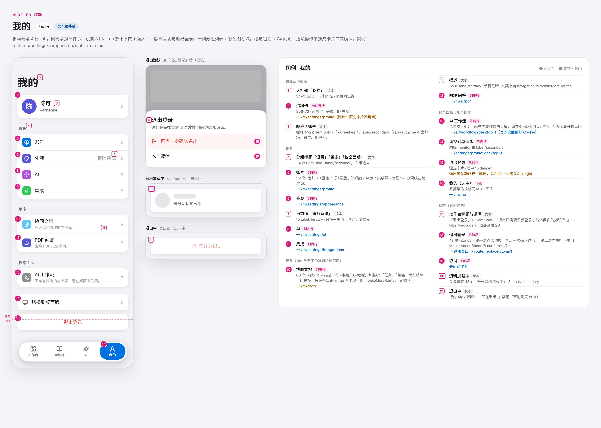

深色版：[M-02-me-dark.png](ui-supplement/M-02-me-dark.png)

### 4.2 知识库内 Tab

#### M-03 知识库详情 · 慕课 Tab

- **路由**：`/m/notes/[baseId]/mooc`
- **图例**：16 条（其中橙字建议改动 5 条）
- **标注**：第 2 轮补稿 / 已拍板：慕课只属于知识库
- **实现**：`apps/web/src/features/mooc/components/mobile/mooc-list-mobile.tsx`
- **尺寸**：1940×1400（导出 3880×2800）

沿用 p08 的知识库详情骨架（顶栏 · 库头 · 横向 Tab），只替换列表区。现实现这个路由直接复用了跨库课程列表（带知识库选择器、返回回「我的」），用户从「笔记」切过来会以为跳出了当前知识库——本稿把它收回到知识库里。/m/mooc 建议重定向到 /m/notes。

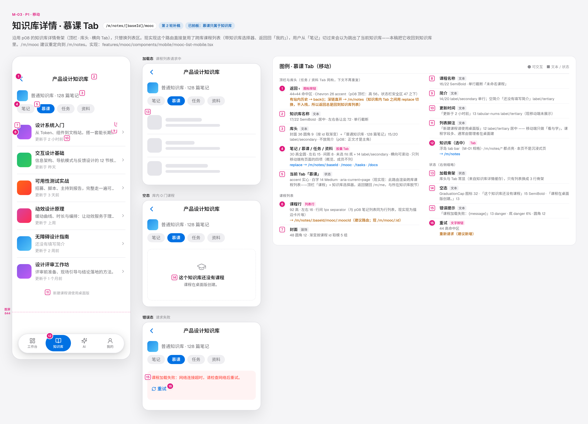

深色版：[M-03-kb-mooc-dark.png](ui-supplement/M-03-kb-mooc-dark.png)

#### M-04 知识库详情 · 任务 Tab

- **路由**：`/m/notes/[baseId]/tasks`
- **图例**：19 条（其中橙字建议改动 8 条）
- **标注**：第 2 轮补稿 / 已拍板：任务只属于知识库
- **实现**：`apps/web/src/features/tasks/components/mobile/task-cards-mobile.tsx`
- **尺寸**：2380×1100（导出 4760×2200）

与桌面 D-07 同一份数据与状态语义，换成单列行布局：筛选平铺在列表上方，提交按钮收窄到行尾，提交走底部面板。/m/tasks 与工作台「待办 · 全部」建议都落到这里（/m/tasks 重定向到 /m/notes）

> 图例已按后端核对结果修正，同 D-07。依据见[改造方案 §1.4](UI补稿落地改造方案.md#conflicts) 第 1–3 条。

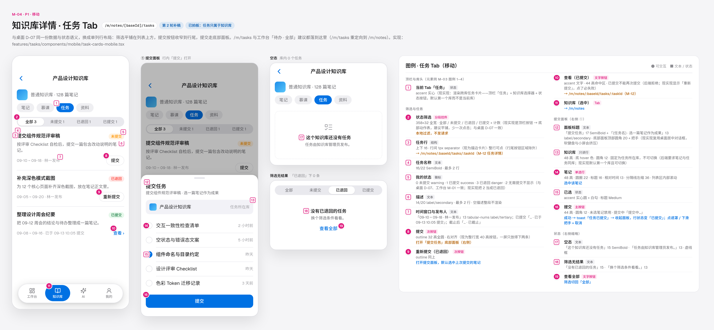

深色版：[M-04-kb-tasks-dark.png](ui-supplement/M-04-kb-tasks-dark.png)

#### M-05 知识库详情 · 资料 Tab

- **路由**：`/m/notes/[baseId]/docs`
- **图例**：13 条（其中橙字建议改动 3 条）
- **标注**：第 2 轮补稿
- **实现**：`apps/web/src/features/notes/components/mobile/base-docs-mobile.tsx`
- **尺寸**：1940×1340（导出 3880×2680）

本库的 PDF 资料与索引状态。点行进入已有的移动端 PDF 详情（/m/ai/pdf/[docId]），上传仍只走「PDF 问答」一条链路（它带索引状态轮询）

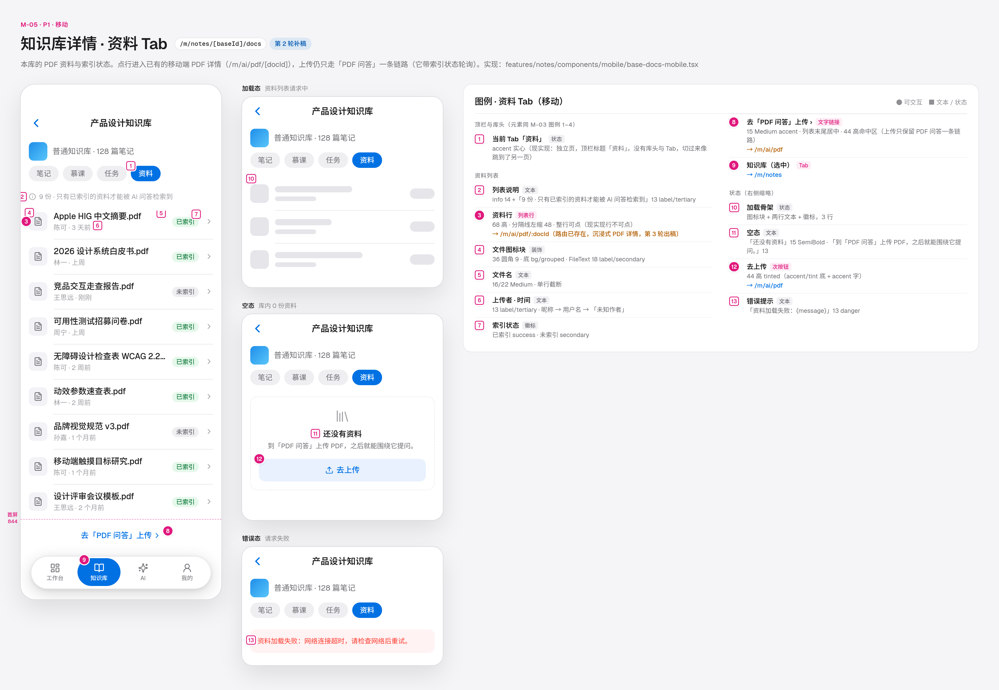

深色版：[M-05-kb-docs-dark.png](ui-supplement/M-05-kb-docs-dark.png)

### 4.3 慕课与任务详情

#### M-06 慕课详情 · 目录与内容

- **路由**：`/m/notes/[baseId]/mooc/[moocId]`（建议） · 现 `/m/mooc/[id]`
- **图例**：18 条（其中橙字建议改动 6 条）
- **标注**：第 2 轮补稿
- **实现**：`apps/web/src/features/mooc/components/mobile/mooc-detail-mobile.tsx`
- **尺寸**：2380×1280（导出 4760×2560）

桌面 D-06 的目录 + 内容双栏，在手机上拆成「目录 / 内容」两屏，用分段控件切换；选中视频或文档后自动切到内容。顶栏固定显示课程名，内容区给出「下一节」，看课不必来回切。

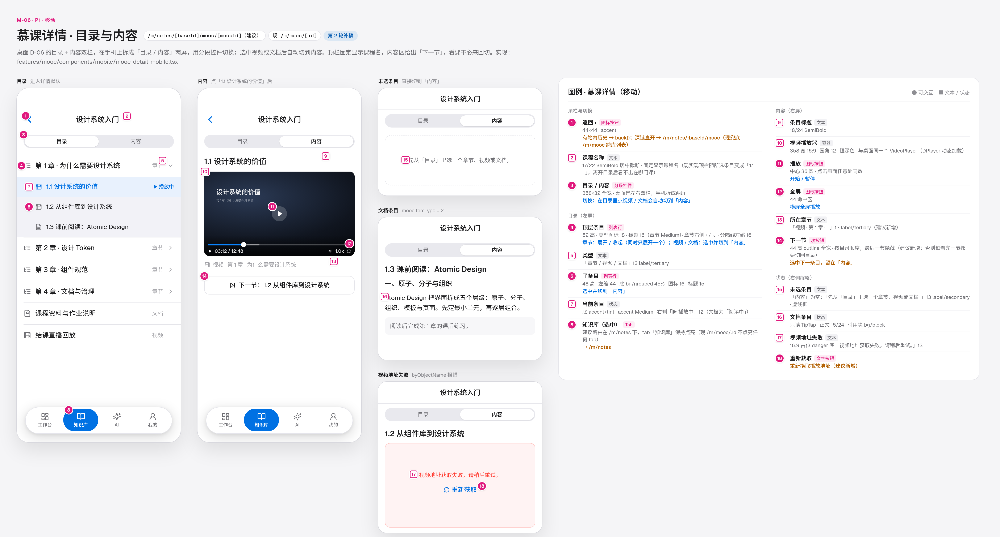

深色版：[M-06-mooc-detail-dark.png](ui-supplement/M-06-mooc-detail-dark.png)

#### M-12 任务详情

- **路由**：`/m/notes/[baseId]/tasks/[taskId]`（建议）
- **图例**：18 条（其中橙字建议改动 1 条）
- **标注**：第 4 轮补稿 / 已拍板：在知识库的任务 Tab 下
- **尺寸**：2380×1080（导出 4760×2160）

从 M-04 任务行点进来。成员看任务要求、自己的提交与退回原因，底部一个按钮去（重新）提交；管理员看进度并处理提交。新建与编辑任务只在桌面版（D-18），与慕课「移动端只看与学」一致。

> 图例已按后端核对结果修正，同 D-17。见[改造方案 §1.4](UI补稿落地改造方案.md#conflicts)。

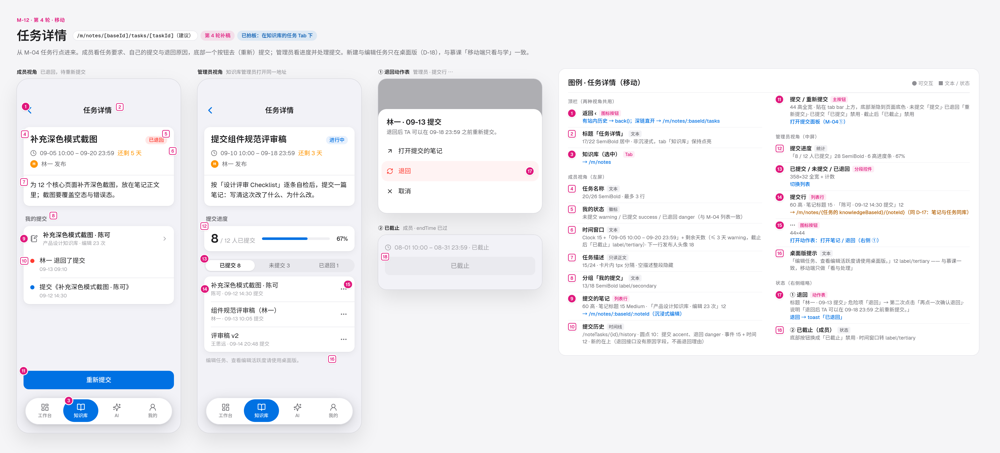

深色版：[M-12-task-detail-dark.png](ui-supplement/M-12-task-detail-dark.png)

### 4.4 笔记 · 新建与历史版本

#### M-07 新建笔记

- **路由**：`/m/notes/new` · `/m/notes/new?baseId=`
- **图例**：16 条（其中橙字建议改动 5 条）
- **标注**：第 2 轮补稿
- **实现**：`apps/web/src/features/notes/components/mobile/create-note-mobile.tsx`
- **尺寸**：1940×1080（导出 3880×2160）

与桌面 D-03 同一套 hooks 与校验，换成 iOS 设置式的分组列表：先选库（单选行 + ✓），再写标题，一个全宽主按钮收尾。入口：工作台快捷操作、知识库详情右上「+」（带 ?baseId= 预选）

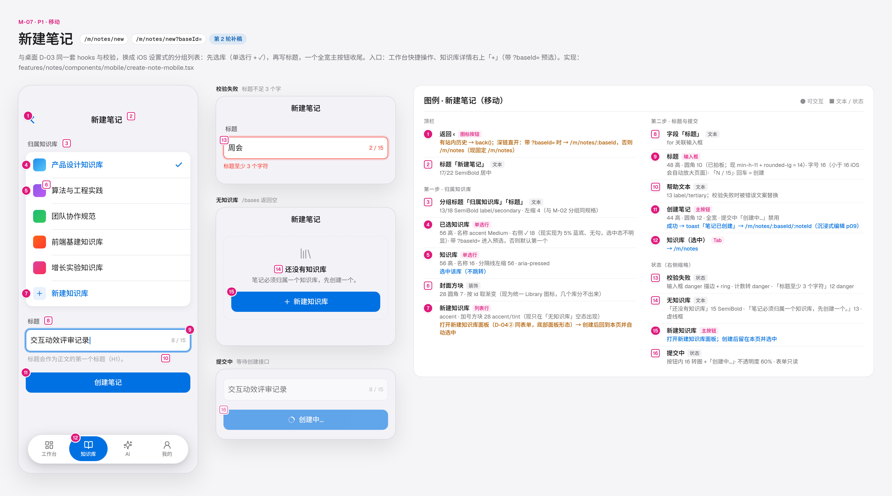

深色版：[M-07-note-new-dark.png](ui-supplement/M-07-note-new-dark.png)

#### M-13 笔记历史版本

- **路由**：`/m/notes/[baseId]/[noteId]/history`（建议）
- **图例**：13 条（其中橙字建议改动 1 条）
- **标注**：第 4 轮补稿 / 已拍板：从笔记页进入
- **尺寸**：2380×1080（导出 4760×2160）

桌面 D-16 的左右两栏在手机上拆成两级：先选版本（按日期分组），再看版本内容并决定是否恢复。两级都是沉浸式页，恢复走动作表二次确认。

> 同 D-16，见[改造方案 §1.4](UI补稿落地改造方案.md#conflicts) 第 4 条。

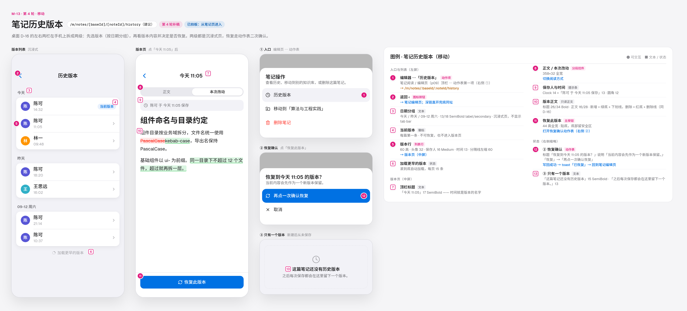

深色版：[M-13-note-history-dark.png](ui-supplement/M-13-note-history-dark.png)

### 4.5 协同文档

#### M-08 协同文档库

- **路由**：`/m/docs`
- **图例**：17 条（其中橙字建议改动 4 条）
- **标注**：第 2 轮补稿
- **实现**：`apps/web/src/features/collab/components/mobile/doc-library-mobile.tsx`
- **尺寸**：2380×1100（导出 4760×2200）

与桌面 D-10 同一个协同索引。移动端差异：单列分组列表、删除收进「⋯」动作表并二次确认、新建用底部面板。入口：工作台快捷操作「协同文档」、我的 › 更多「协同文档」

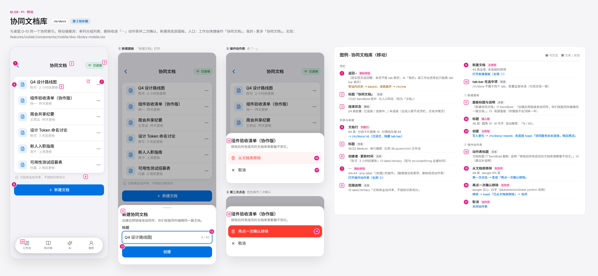

深色版：[M-08-doc-library-dark.png](ui-supplement/M-08-doc-library-dark.png)

#### M-09 协同文档

- **路由**：`/m/docs/[id]`
- **图例**：14 条（其中橙字建议改动 3 条）
- **标注**：第 2 轮补稿 / 沉浸式 · 隐藏 tab bar
- **实现**：`apps/web/src/features/collab/components/mobile/doc-workspace-mobile.tsx`
- **尺寸**：1940×1080（导出 3880×2160）

与 p09 笔记编辑页同一套移动编辑形态：标题在正文顶部、工具条贴底随键盘上移。顶栏把「能不能写」（连接状态）放在中间、「谁在写」（在线头像）放在右侧。

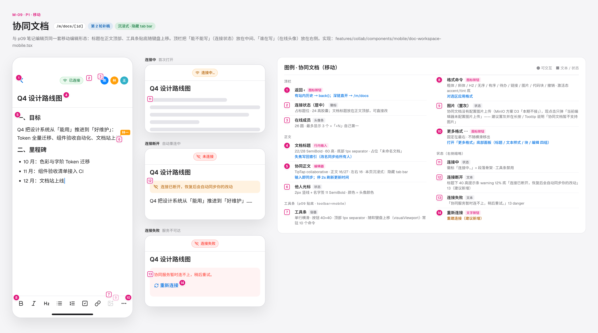

深色版：[M-09-doc-workspace-dark.png](ui-supplement/M-09-doc-workspace-dark.png)

### 4.6 搜索与设置

#### M-10 搜索

- **路由**：`/m/search`
- **图例**：13 条（其中橙字建议改动 8 条）
- **标注**：第 3 轮补稿 / 沉浸式 · 隐藏 tab bar
- **实现**：`apps/web/src/features/search/components/mobile-search.tsx` · `apps/web/src/lib/mobile/search.ts`
- **尺寸**：1940×1320（导出 3880×2640）

桌面 ⌘K 命令面板的移动端替代：全屏页而不是弹层（软键盘会把弹层挤得选不动）。空查询时就是分组的入口清单，输入后逐字过滤并高亮。与 ⌘K 同口径——搜页面、入口与知识库名称，不搜笔记正文。入口：工作台顶部搜索框。

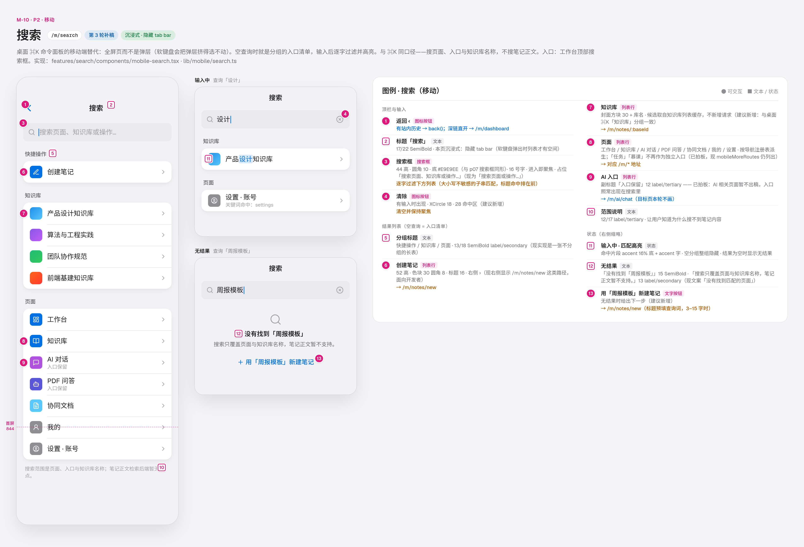

深色版：[M-10-search-dark.png](ui-supplement/M-10-search-dark.png)

#### M-11 设置分节

- **路由**：`/m/settings/[section]` · `/m/settings` → /m/me
- **图例**：21 条（其中橙字建议改动 6 条）
- **标注**：第 3 轮补稿 / AI 分节：入口保留，暂不出稿
- **实现**：`apps/web/src/features/settings/components/mobile-settings.tsx`（现直接复用桌面表单组件）
- **尺寸**：2380×1260（导出 4760×2520）

「我的」列出四个分节，点进来是二级页。与桌面 D-12 / D-13 同一套数据与校验，但版式换成 iOS 设置式的行表单：标签在左、值在右，选择类字段走动作表，主按钮全宽。

> 落地依赖：同 D-12，见[改造方案 B-3](UI补稿落地改造方案.md#b-3)。

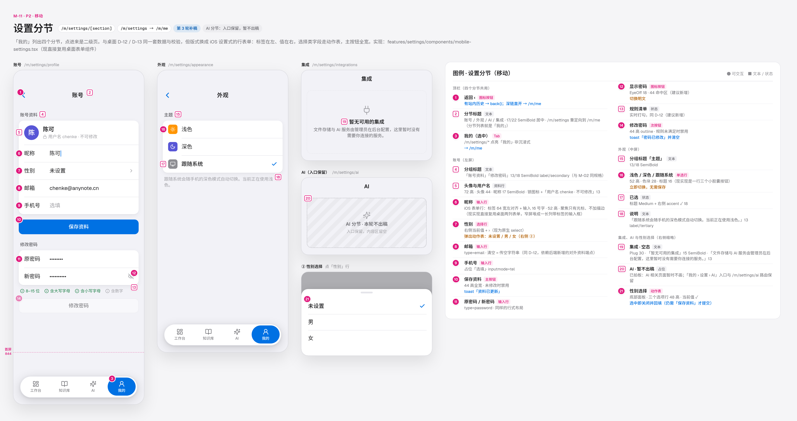

深色版：[M-11-settings-dark.png](ui-supplement/M-11-settings-dark.png)

## 5. 规范核对

### 5.1 深色模式与状态

#### Q-01 深色逐屏核对

- **范围**：全部 31 个屏幕画板 · theme = 深色
- **标注**：第 4 轮 / 发现 5 类问题 · 稿中已修正
- **尺寸**：2600×2100（导出 5200×4200）

每个屏幕画板都用同一套语义 Token 渲染深色，这里把它们缩成一张表逐屏过一遍：先按 6 条口径看，再把发现的问题归成 5 类，写明影响哪些画板、现实现是否同样存在、怎么改。前两类在 apps/web 里同样存在，是实现侧也要改的。缩略图就是画板本身的深色渲染，点进各画板把 theme 切到「深色」可看原尺寸。

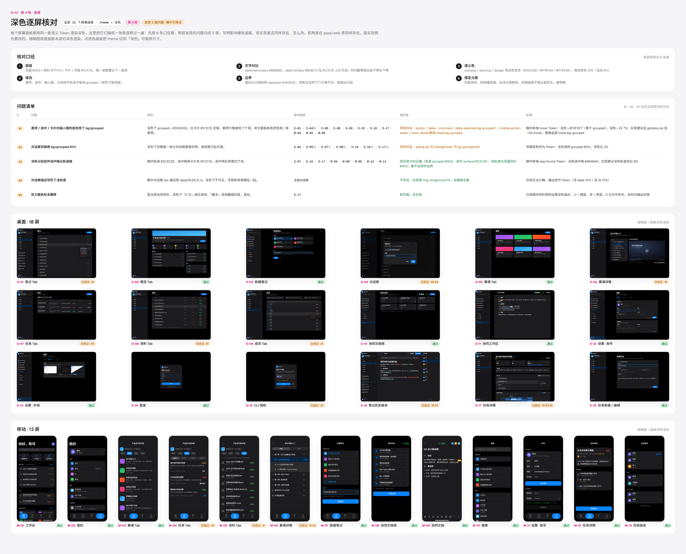

#### Q-02 空态与错误态汇总

- **范围**：全部画板的加载 / 空 / 错误 / 不存在 / 连接中断
- **标注**：第 4 轮
- **尺寸**：2600×1900（导出 5200×3800）

四轮画板里散落的状态收成一页：上面是 5 种通用形态的规格（各画板的状态缩略都按它画），中间是逐页文案总表（落地时直接照抄），下面是写文案的 5 条规则和现实现里发现的不一致。AI 相关页面按拍板暂不出稿，不在表内。

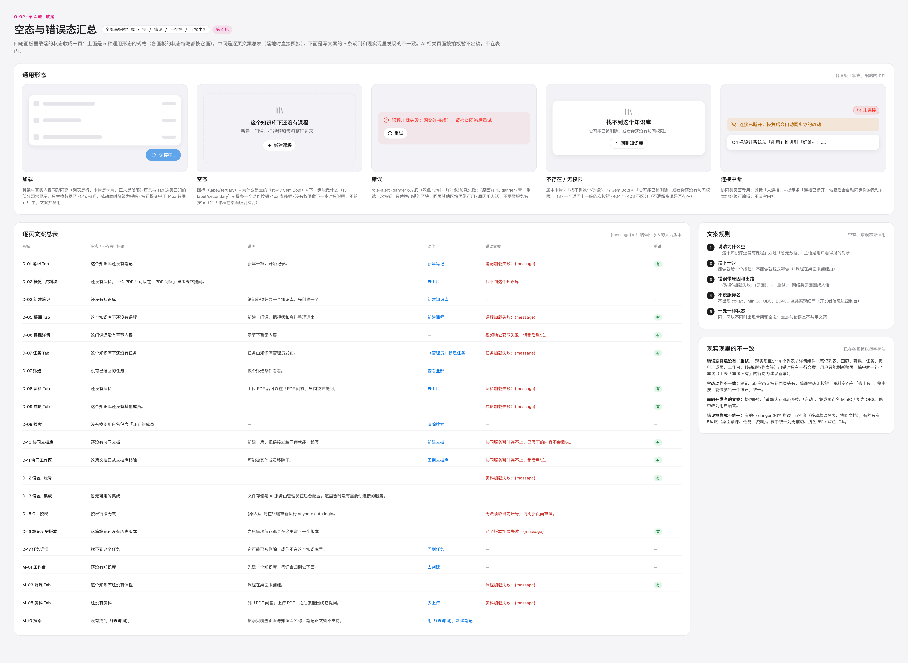
